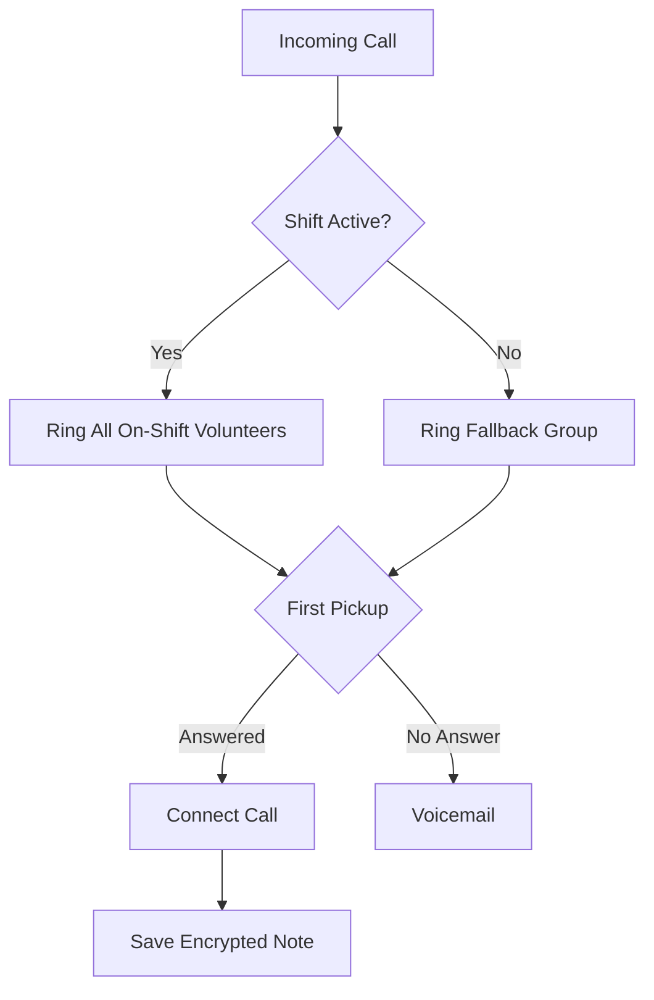

# Llámenos

A secure, self-hosted crisis response platform. Supports voice calls, SMS, WhatsApp, and Signal — all routed to on-shift volunteers. Volunteers log encrypted notes and manage conversations in a native desktop app. Admins manage shifts, volunteers, channels, and ban lists. Reporters can submit encrypted reports through a dedicated portal.

Built for organizations that need to protect the identity of callers, reporters, and volunteers against well-funded adversaries.

## Screenshots

<p align="center">
  
</p>

<p align="center">
  <em>Admin dashboard with real-time volunteer presence and active calls</em>
</p>

<details>
<summary><strong>More screenshots</strong></summary>

### Conversations
<p align="center">
  
</p>
<p align="center"><em>Unified messaging view for SMS, WhatsApp, and Signal</em></p>

### Volunteers
<p align="center">
  
</p>
<p align="center"><em>Manage volunteer accounts and permissions</em></p>

### Shifts
<p align="center">
  
</p>
<p align="center"><em>Create recurring shift schedules</em></p>

</details>

## How it works



## Installation

Download the latest release for your platform:

- **Windows**: [llamenos-desktop-setup.exe](https://github.com/your-org/llamenos/releases/latest)
- **macOS**: [llamenos-desktop.dmg](https://github.com/your-org/llamenos/releases/latest)
- **Linux**: [llamenos-desktop.AppImage](https://github.com/your-org/llamenos/releases/latest)

The app auto-updates when new versions are available.

## Features

### Desktop App
- **Native desktop app** — Windows, macOS, and Linux via Tauri v2
- **Hardware-backed crypto** — secret key never enters the webview; all crypto runs in Rust
- **System tray** — status indicator, quick actions
- **Auto-updates** — Tauri updater with SLSA provenance verification
- **Desktop notifications** — native OS notifications for incoming calls and messages

### Voice Calling
- **Multi-provider telephony** — Twilio, SignalWire, Vonage, Plivo, or self-hosted Asterisk
- **Parallel ringing** — all on-shift volunteers ring at once; first pickup wins
- **WebRTC calling** — volunteers answer calls directly in the app
- **Automated shift scheduling** — recurring schedules with fallback ring groups
- **Call spam mitigation** — real-time ban lists, voice CAPTCHA, rate limiting
- **AI transcription** — Cloudflare Workers AI (Whisper), E2EE with dual-key encryption
- **Voicemail** — automatic fallback when no volunteers are available

### Multi-Channel Messaging
- **SMS** — inbound/outbound SMS via Twilio, SignalWire, Vonage, or Plivo
- **WhatsApp Business** — Meta Cloud API with template messages and media support
- **Signal** — via signal-cli-rest-api bridge with voice message transcription
- **Threaded conversations** — all channels flow into a unified conversation view
- **Real-time updates** — new messages appear instantly via Nostr relay

### Encrypted Notes & Reports
- **End-to-end encrypted notes** — the server never sees plaintext
- **Custom note fields** — admin-configurable fields (text, number, select, checkbox)
- **Reporter role** — dedicated portal for submitting encrypted reports with file attachments
- **Report workflow** — categories, status tracking, threaded replies

### Volunteer Experience
- **Command palette** — Ctrl/Cmd+K for quick navigation and one-click note creation
- **Note draft auto-save** — encrypted drafts preserved across reloads
- **Real-time presence** — online/offline/on-break status visible to admins
- **Keyboard shortcuts** — press `?` for a full shortcut reference
- **Dark/light/system themes** — toggle in sidebar

### Administration
- **Setup wizard** — guided multi-step setup on first admin login
- **In-app help** — FAQ, role-specific guides, getting started checklist
- **Custom IVR voice prompts** — record greetings per language
- **Audit log** — every call, note, message, and admin action tracked
- **Encrypted data export** — GDPR-compliant notes export encrypted with user's key
- **13 languages** — English, Spanish, Chinese, Tagalog, Vietnamese, Arabic, French, Haitian Creole, Korean, Russian, Hindi, Portuguese, German
- **Accessibility** — skip nav, ARIA labels, RTL support, screen reader friendly

## Quick Start

### Prerequisites

- [Bun](https://bun.sh/) (v1.0+)
- [Rust](https://rustup.rs/) (for Tauri desktop builds)
- A [Cloudflare](https://cloudflare.com/) account (free tier works for development)
- A telephony provider account (see [Telephony Providers](#telephony-providers))

### 1. Clone and install

```bash
git clone https://github.com/your-org/llamenos.git
cd llamenos
bun install
```

### 2. Generate an admin keypair

Authentication uses [Nostr](https://nostr.com/) keypairs. Generate the first admin:

```bash
bun run bootstrap-admin
```

This outputs:
- An **nsec** (secret key) — give this to the admin, store it securely
- A **hex public key** — you'll need this in the next step

### 3. Configure environment

```bash
cp .dev.vars.example .dev.vars
```

Edit `.dev.vars` with your admin public key and telephony credentials:

```env
ADMIN_PUBKEY=hex_public_key_from_step_2
ENVIRONMENT=development

# Twilio (default voice provider — optional if configuring via admin UI)
TWILIO_ACCOUNT_SID=ACxxxxxxxxxxxxxxxxxxxxxxxxxxxxxxxx
TWILIO_AUTH_TOKEN=your_auth_token_here
TWILIO_PHONE_NUMBER=+1234567890
```

### 4. Run locally

```bash
bun run dev             # Launch Tauri desktop app (Vite + Rust)
bun run dev:worker      # Backend dev server (Wrangler)
```

The desktop app launches automatically. The backend runs at `http://localhost:8787`.

### 5. Set up webhooks

Point your telephony provider's webhooks to your API URL:

```
https://your-domain.com/api/telephony/incoming    (incoming calls)
https://your-domain.com/api/telephony/status       (call status updates)
```

For local development with telephony webhooks:

```bash
bun run dev:tunnel
```

## Deployment

The API backend supports two deployment targets. Desktop clients download the app separately and connect to the API.

### Option A: Cloudflare Workers (managed)

```bash
# Set required secrets
bunx wrangler secret put ADMIN_PUBKEY

# Deploy API
bun run deploy:api
```

### Option B: Self-Hosted (Docker Compose)

Run the API on your own server with Docker Compose. Includes Caddy (automatic HTTPS), PostgreSQL, RustFS (file storage), strfry (Nostr relay), and optional Whisper transcription.

```bash
cd deploy/docker
cp .env.example .env
# Edit .env with your ADMIN_PUBKEY, DOMAIN, and provider credentials

docker compose up -d
```

Desktop clients connect to the API. Browsers visiting the server URL see a download page.

Optional service profiles:

```bash
docker compose --profile transcription up -d   # + Whisper
docker compose --profile asterisk up -d         # + Asterisk PBX
docker compose --profile signal up -d           # + Signal messaging
```

### Option C: Kubernetes (Helm)

```bash
helm install llamenos deploy/helm/llamenos/ \
  --set secrets.adminPubkey=YOUR_HEX_PUBLIC_KEY \
  --set secrets.storageAccessKey=your-access-key \
  --set secrets.storageSecretKey=your-secret-key \
  --set ingress.hosts[0].host=hotline.yourdomain.com
```

See the full [self-hosting documentation](https://llamenos-hotline.com/docs/self-hosting) for detailed guides.

## Telephony Providers

| Provider | Type | Voice | SMS | Best For |
|----------|------|-------|-----|----------|
| **Twilio** | Cloud | Yes | Yes | Getting started quickly |
| **SignalWire** | Cloud | Yes | Yes | Cost-conscious orgs |
| **Vonage** | Cloud | Yes | Yes | International coverage |
| **Plivo** | Cloud | Yes | Yes | Budget cloud option |
| **Asterisk** | Self-hosted | Yes | No | Maximum privacy |

## Messaging Channels

| Channel | Provider | Setup |
|---------|----------|-------|
| **SMS** | Twilio, SignalWire, Vonage, or Plivo | Configure in admin settings |
| **WhatsApp** | Meta WhatsApp Business Cloud API | Requires Meta Business account |
| **Signal** | signal-cli-rest-api bridge | Self-hosted bridge service |

All messaging channels flow into a unified **Conversations** view. Enable/disable channels from Admin Settings or the setup wizard.

## Architecture

```
src/
  client/          # Desktop frontend (Vite + React + TanStack Router)
    routes/        # File-based routing
    components/    # shadcn/ui components
    locales/       # Translation files (13 locales)
    lib/           # Auth, platform (Tauri IPC), WebRTC, API client
      platform.ts  # All crypto routes through Rust via Tauri IPC
  worker/          # Backend (Cloudflare Workers or Node.js)
    durable-objects/
    telephony/     # Voice provider adapters
    messaging/     # Messaging channel adapters
    routes/        # API route handlers
  shared/          # Types shared between client and worker
src-tauri/         # Tauri v2 desktop shell (Rust)
  src/crypto.rs    # IPC commands delegating to llamenos-core
tests/
  mocks/           # Tauri IPC mock layer for Playwright E2E tests
deploy/
  docker/          # Docker Compose (API-only — desktop clients connect to this)
  helm/            # Kubernetes Helm chart
site/              # Marketing site (Astro, Cloudflare Pages)
```

### Security model

- **Tauri desktop** — secret key (nsec) lives exclusively in the Rust process; the webview never receives it
- **Nostr keypairs** — BIP-340 Schnorr signatures for authentication + WebAuthn passkeys
- **PIN-encrypted key store** — PBKDF2 600K iterations + XChaCha20-Poly1305, stored in Tauri Store
- **Per-note forward secrecy** — unique random key per note, ECIES-wrapped for each authorized reader
- **Zero-knowledge server** — the API never sees plaintext notes, transcriptions, or encryption keys
- **Hash-chained audit log** — SHA-256 chain for tamper detection
- **Device linking** — Signal-style QR provisioning via ephemeral ECDH key exchange

## CI/CD

Every push to `main` triggers the CI pipeline:

1. **Build & validate** — typecheck, Vite build (with Tauri IPC mocks), esbuild, site build
2. **E2E tests** — Playwright against CF Workers and Docker Compose
3. **Auto-version** — conventional commit-based `major`/`minor`/`patch` bumps
4. **Deploy** — API Worker to Cloudflare Workers, marketing site to Pages
5. **Release** — GitHub Release with changelog and build attestation
6. **Docker** — Docker image published to GHCR
7. **Desktop** — Tauri binaries for Windows, macOS, Linux (via `tauri-release.yml`)

## Development

```bash
bun run dev              # Launch Tauri desktop dev (Vite + Rust)
bun run dev:vite         # Vite-only for quick frontend iteration
bun run dev:worker       # Backend dev server
bun run test             # Playwright E2E tests (with Tauri IPC mocks)
bun run test:desktop     # Desktop integration tests (WebdriverIO)
bun run typecheck        # TypeScript type checking
cd ../llamenos-core && cargo test  # Rust crypto tests
```

## License

MIT
