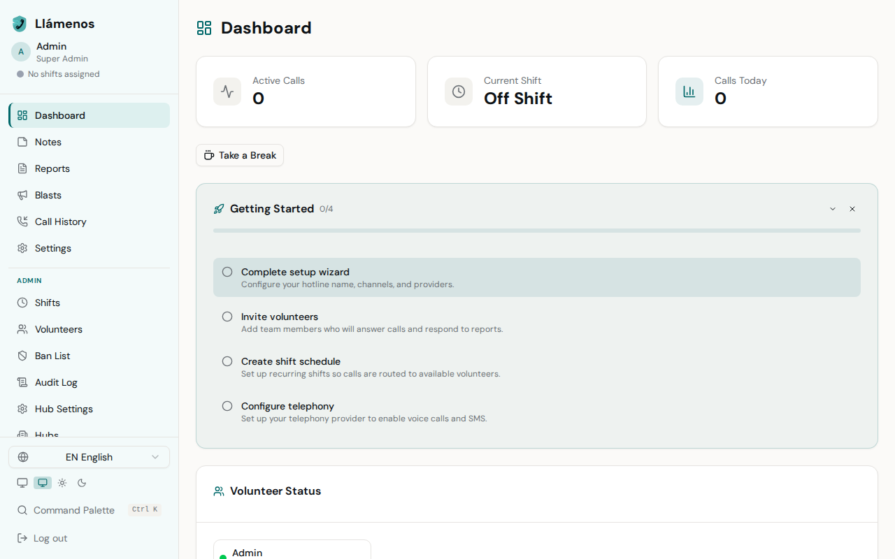
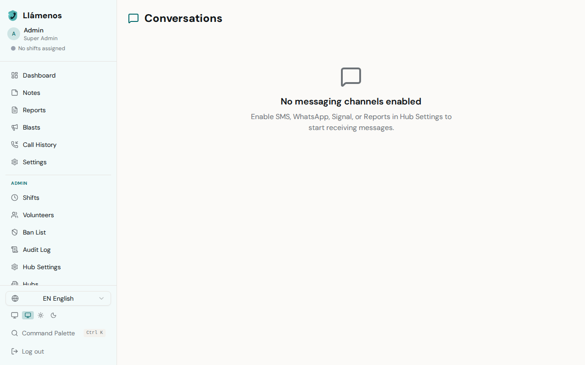
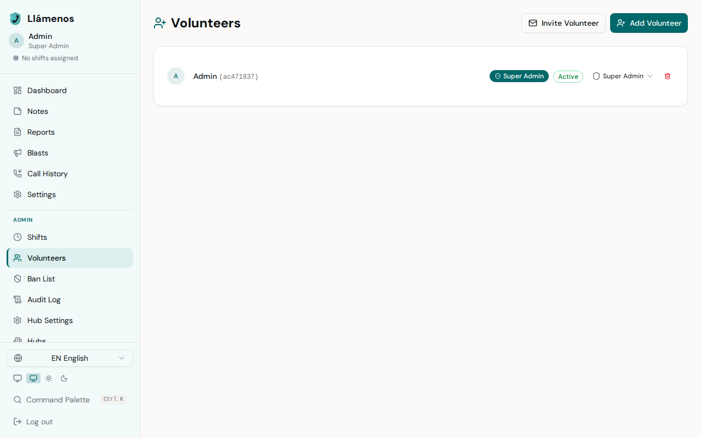
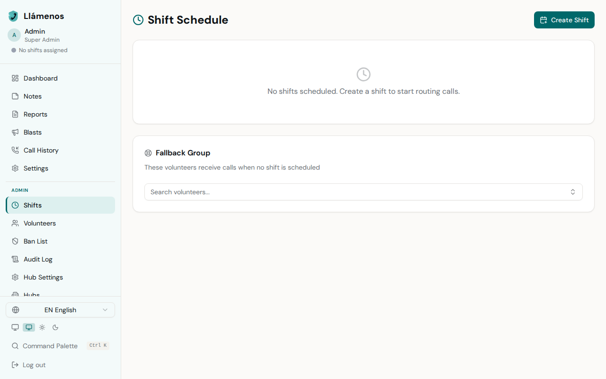
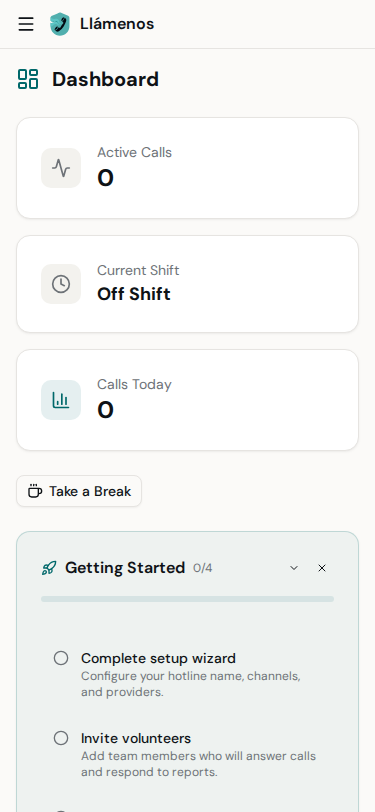
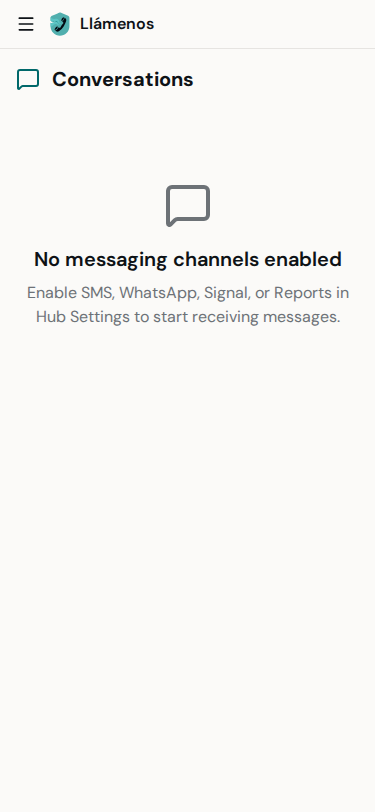
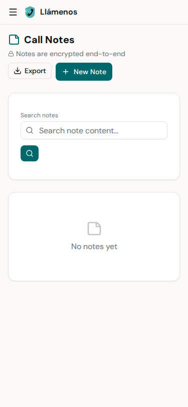
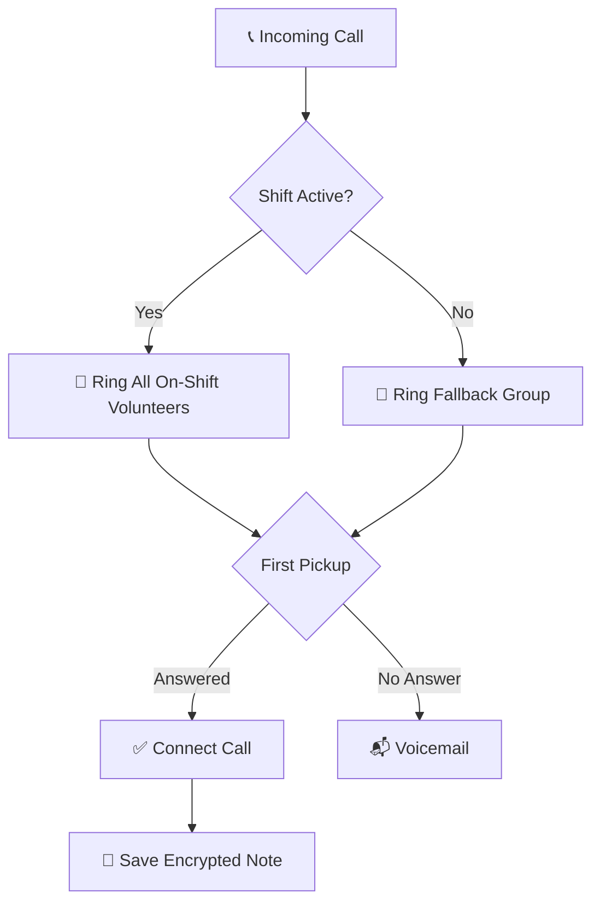

# Llámenos

A secure, self-hosted crisis response platform. Supports voice calls, SMS, WhatsApp, and Signal — all routed to on-shift volunteers. Volunteers log encrypted notes and manage conversations in a webapp. Admins manage shifts, volunteers, channels, and ban lists. Reporters can submit encrypted reports through a dedicated portal.

Built for organizations that need to protect the identity of callers, reporters, and volunteers against well-funded adversaries.

## Screenshots

<p align="center">
  
</p>

<p align="center">
  <em>Admin dashboard with real-time volunteer presence and active calls</em>
</p>

<details>
<summary><strong>More screenshots</strong></summary>

### Conversations
<p align="center">
  
</p>
<p align="center"><em>Unified messaging view for SMS, WhatsApp, and Signal</em></p>

### Volunteers
<p align="center">
  
</p>
<p align="center"><em>Manage volunteer accounts and permissions</em></p>

### Shifts
<p align="center">
  
</p>
<p align="center"><em>Create recurring shift schedules</em></p>

### Mobile
<p align="center">
  
  
  
</p>
<p align="center"><em>Fully responsive mobile interface</em></p>

</details>

## How it works



## Features

### Voice Calling
- **Multi-provider telephony** — Twilio, SignalWire, Vonage, Plivo, or self-hosted Asterisk
- **Parallel ringing** — all on-shift volunteers ring at once; first pickup wins
- **WebRTC browser calling** — volunteers can answer calls directly in the browser
- **Automated shift scheduling** — recurring schedules with fallback ring groups
- **Call spam mitigation** — real-time ban lists, voice CAPTCHA, rate limiting
- **AI transcription** — Cloudflare Workers AI (Whisper), E2EE with dual-key encryption
- **Voicemail** — automatic fallback when no volunteers are available

### Multi-Channel Messaging
- **SMS** — inbound/outbound SMS via Twilio, SignalWire, Vonage, or Plivo
- **WhatsApp Business** — Meta Cloud API with template messages, media support, and 24-hour window handling
- **Signal** — via signal-cli-rest-api bridge with voice message transcription
- **Threaded conversations** — all messaging channels flow into a unified conversation view with message bubbles, timestamps, and direction indicators
- **Real-time updates** — new messages and conversations appear instantly via WebSocket

### Encrypted Notes & Reports
- **End-to-end encrypted notes** — the server never sees plaintext
- **Custom note fields** — admin-configurable fields (text, number, select, checkbox)
- **Reporter role** — dedicated portal for submitting encrypted reports with file attachments
- **Report workflow** — categories, status tracking (open/claimed/resolved), threaded replies

### Volunteer Experience
- **Command palette** — Ctrl/Cmd+K for quick navigation, search, and one-click note creation
- **Real-time notifications** — ringtone, browser push notifications, and tab title flash on incoming calls
- **Volunteer presence** — real-time online/offline/on-break status visible to admins
- **Note draft auto-save** — encrypted drafts preserved in the browser across reloads
- **Keyboard shortcuts** — press `?` for a full shortcut reference dialog
- **Dark/light/system themes** — toggle in sidebar, persisted per session

### Administration
- **Setup wizard** — guided multi-step setup on first admin login (name, channels, providers)
- **In-app help** — FAQ, role-specific guides, getting started checklist
- **Custom IVR voice prompts** — record greetings per language via MediaRecorder; falls back to TTS
- **Configurable call settings** — queue timeout and voicemail duration (30–300s each)
- **Audit log** — every call, note, message, and admin action tracked with hashed IP metadata
- **Encrypted data export** — GDPR-compliant notes export encrypted with user's key (.enc format)
- **Session management** — idle timeout warnings, auto-renewal, and forced re-auth on expiry
- **13 languages** — English, Spanish, Chinese, Tagalog, Vietnamese, Arabic, French, Haitian Creole, Korean, Russian, Hindi, Portuguese, German
- **Mobile responsive PWA** — installable on any device with push notifications
- **Accessibility** — skip nav, ARIA labels, RTL support, screen reader friendly
- **GDPR compliant** — designed for EU-based organizations

## Quick Start

### Prerequisites

- [Bun](https://bun.sh/) (v1.0+)
- A [Cloudflare](https://cloudflare.com/) account (free tier works for development)
- A telephony provider account (see [Telephony Providers](#telephony-providers))

### 1. Clone and install

```bash
git clone https://github.com/your-org/llamenos.git
cd llamenos
bun install
```

### 2. Generate an admin keypair

Authentication uses [Nostr](https://nostr.com/) keypairs. Generate the first admin:

```bash
bun run bootstrap-admin
```

This outputs:
- An **nsec** (secret key) — give this to the admin, store it securely
- A **hex public key** — you'll need this in the next step

### 3. Configure environment

Copy the example env file and fill in your values:

```bash
cp .dev.vars.example .dev.vars
```

Edit `.dev.vars` with your admin public key and telephony credentials:

```env
ADMIN_PUBKEY=hex_public_key_from_step_2
ENVIRONMENT=development

# Twilio (default voice provider — optional if configuring via admin UI)
TWILIO_ACCOUNT_SID=ACxxxxxxxxxxxxxxxxxxxxxxxxxxxxxxxx
TWILIO_AUTH_TOKEN=your_auth_token_here
TWILIO_PHONE_NUMBER=+1234567890
```

> **Note:** Twilio env vars are the default fallback for voice. You can configure any voice provider, plus SMS, WhatsApp, and Signal channels from the admin settings UI after deploying. The setup wizard will guide you through channel configuration on first login.

### 4. Run locally

```bash
bun run dev          # Frontend dev server (Vite)
bun run dev:worker   # Backend dev server (Wrangler)
```

The app runs at `http://localhost:8787`. Log in with the admin nsec from step 2.

### 5. Set up webhooks

Point your telephony provider's webhooks to your Worker URL:

**Voice:**
```
https://your-domain.com/api/telephony/incoming    (incoming calls)
https://your-domain.com/api/telephony/status       (call status updates)
```

**SMS** (if enabled):
```
https://your-domain.com/api/messaging/sms/webhook
```

**WhatsApp** (if enabled):
```
https://your-domain.com/api/messaging/whatsapp/webhook
```

**Signal** (if using signal-cli bridge):
```
Configure the bridge to forward to: https://your-domain.com/api/messaging/signal/webhook
```

For local development, use [Cloudflare Tunnel](https://developers.cloudflare.com/cloudflare-one/connections/connect-networks/):

```bash
cloudflared tunnel --url http://localhost:8787
```

## Deployment

Llamenos supports two deployment targets. Both run the exact same application code.

### Option A: Cloudflare Workers (managed)

```bash
# Set required secrets
bunx wrangler secret put ADMIN_PUBKEY

# Set voice provider secrets (if using Twilio env vars as default)
bunx wrangler secret put TWILIO_ACCOUNT_SID
bunx wrangler secret put TWILIO_AUTH_TOKEN
bunx wrangler secret put TWILIO_PHONE_NUMBER

# Deploy
bun run deploy
```

After deploying, update your telephony provider webhook URLs to point to your Workers URL. Messaging channel credentials can also be configured through the admin Settings UI.

### Option B: Self-Hosted (Docker Compose)

Run Llamenos on your own server with Docker Compose. Includes Caddy (automatic HTTPS), MinIO (file storage), and optional Whisper transcription.

```bash
cd deploy/docker
cp .env.example .env
# Edit .env with your ADMIN_PUBKEY, DOMAIN, and provider credentials

docker compose up -d
```

Core services: app + Caddy + MinIO. Optional profiles for transcription, Asterisk, and Signal:

```bash
# Enable transcription
docker compose --profile transcription up -d

# Enable self-hosted Asterisk
docker compose --profile asterisk up -d

# Enable Signal messaging
docker compose --profile signal up -d
```

### Option C: Kubernetes (Helm)

```bash
helm install llamenos deploy/helm/llamenos/ \
  --set secrets.adminPubkey=YOUR_HEX_PUBLIC_KEY \
  --set secrets.minioAccessKey=your-access-key \
  --set secrets.minioSecretKey=your-secret-key \
  --set ingress.hosts[0].host=hotline.yourdomain.com
```

See the full [self-hosting documentation](https://llamenos-hotline.com/docs/self-hosting) for detailed guides.

## Telephony Providers

Llámenos supports 5 voice telephony providers. Configure your provider in **Admin Settings > Telephony Provider** or during the setup wizard.

| Provider | Type | Voice | SMS | Pricing | Setup | Best For |
|----------|------|-------|-----|---------|-------|----------|
| **Twilio** | Cloud | Yes | Yes | Per-minute/msg | Easy | Getting started quickly |
| **SignalWire** | Cloud | Yes | Yes | Per-minute/msg | Easy | Cost-conscious orgs |
| **Vonage** | Cloud | Yes | Yes | Per-minute/msg | Medium | International coverage |
| **Plivo** | Cloud | Yes | Yes | Per-minute/msg | Medium | Budget cloud option |
| **Asterisk** | Self-hosted | Yes | No | SIP trunk only | Advanced | Maximum privacy, at-scale |

## Messaging Channels

In addition to voice, Llámenos supports text-based messaging channels:

| Channel | Provider | Setup |
|---------|----------|-------|
| **SMS** | Twilio, SignalWire, Vonage, or Plivo | Configure in admin settings; point inbound webhook to `/api/messaging/sms/webhook` |
| **WhatsApp** | Meta WhatsApp Business Cloud API | Requires Meta Business account; configure webhook at `/api/messaging/whatsapp/webhook` |
| **Signal** | signal-cli-rest-api bridge | Self-hosted bridge service; configure bridge URL in admin settings |

All messaging channels flow into a unified **Conversations** view. Enable/disable channels from Admin Settings or the setup wizard.

See the [setup guides](https://llamenos-hotline.com/docs) for detailed instructions per provider and channel.

## Customization

### Hotline name

Set `HOTLINE_NAME` in `wrangler.jsonc`:

```jsonc
"vars": {
    "HOTLINE_NAME": "Your Hotline Name"
}
```

### Languages

Translation files are in `src/client/locales/`. Language config is centralized in `src/shared/languages.ts`.

## Architecture

```
src/
  client/          # React SPA (Vite + TanStack Router)
    routes/        # File-based routing (/setup, /conversations, /reports, /help, etc.)
    components/    # shadcn/ui components
    locales/       # Translation files (13 locales)
    lib/           # Auth, crypto, WebRTC, API client
  worker/          # Backend (Cloudflare Workers or Node.js)
    durable-objects/
      identity-do.ts       # Auth, WebSocket, presence, device provisioning
      settings-do.ts       # Settings, custom fields, IVR audio, messaging config
      records-do.ts        # Audit log, call history, recordings
      shift-manager.ts     # Shift scheduling, volunteer management
      call-router.ts       # Call routing, notes, active calls
      conversation-do.ts   # Threaded messaging conversations
    telephony/     # Voice provider adapters (Twilio, SignalWire, Vonage, Plivo, Asterisk)
    messaging/     # Messaging channel adapters (SMS, WhatsApp, Signal)
    routes/        # API route handlers
  platform/        # Platform abstraction layer
    cloudflare.ts  # Cloudflare Workers implementation
    node/          # Node.js implementation (SQLite, MinIO, Whisper HTTP)
  shared/          # Code shared between client and worker
    types.ts       # Shared types (roles, conversations, reports, etc.)
    languages.ts   # Centralized language config
deploy/
  docker/          # Docker Compose deployment (Dockerfile, Caddyfile, .env.example)
  helm/            # Kubernetes Helm chart
asterisk-bridge/   # Standalone ARI bridge for self-hosted Asterisk
site/              # Marketing site (Astro + Tailwind, Cloudflare Pages)
```

### Security model

- **Durable Objects**: 6 singletons — IdentityDO, SettingsDO, RecordsDO, ShiftManagerDO, CallRouterDO, ConversationDO
- **Authentication**: Nostr keypairs (BIP-340 Schnorr) + WebAuthn passkeys
- **Local key protection**: PIN-encrypted key store (PBKDF2 600K iterations + XChaCha20-Poly1305); raw nsec never in sessionStorage — in-memory closure only, zeroed on lock
- **Note encryption**: Per-note forward secrecy — each note encrypted with a unique random key, wrapped via ECIES for each authorized reader
- **Transcription encryption**: ECIES (ephemeral ECDH + XChaCha20-Poly1305) dual-key
- **Report encryption**: ECIES encrypted body + encrypted file attachments
- **Device linking**: Signal-style QR provisioning via ephemeral ECDH key exchange; 5-minute single-use relay rooms
- **Recovery keys**: 128-bit Base32 recovery keys with mandatory encrypted backup download
- **Zero-knowledge server**: the Worker never sees plaintext notes, transcriptions, report content, or per-note encryption keys
- **Volunteer privacy**: personal info visible only to admins

### Roles

| Role | Can see | Can do |
|------|---------|--------|
| Caller | Nothing (GSM/SMS/WhatsApp/Signal) | Call or message the hotline |
| Volunteer | Own notes, assigned conversations | Answer calls, write notes, respond to messages |
| Reporter | Own reports only | Submit encrypted reports with file attachments |
| Admin | All notes, reports, audit logs, conversations | Manage everything |

## CI/CD

Every push to `main` triggers the CI pipeline (`.github/workflows/ci.yml`):

1. **Build & validate** — typecheck, Vite build, esbuild (Node.js), Astro site build
2. **Auto-version** — determines `major`/`minor`/`patch` bump from conventional commit messages
3. **Changelog** — generates via [git-cliff](https://git-cliff.org) from commit history
4. **Deploy** — app Worker to Cloudflare Workers, marketing site to Cloudflare Pages (parallel)
5. **Release** — creates GitHub Release with changelog notes
6. **Docker** — the created tag triggers `docker.yml` to build + push images to GHCR

### Required GitHub Secrets

| Secret | Description |
|--------|-------------|
| `CLOUDFLARE_API_TOKEN` | Cloudflare API token with Workers + Pages deploy permissions |
| `CLOUDFLARE_ACCOUNT_ID` | Cloudflare account ID |

`GITHUB_TOKEN` is provided automatically by GitHub Actions.

### Versioning

Uses [conventional commits](https://www.conventionalcommits.org/) to determine the version bump:

- `feat:` → minor bump (0.x.0)
- `fix:`, `docs:`, `chore:`, etc. → patch bump (0.0.x)
- `feat!:` or `BREAKING CHANGE` → major bump (x.0.0)

Manual versioning: `bun run version:bump <major|minor|patch> [description]`

## Development

See [DEVELOPMENT.md](DEVELOPMENT.md) for the full development guide.

```bash
bun run dev          # Vite dev server
bun run dev:worker   # Wrangler dev server
bun run build        # Build frontend
bun run deploy       # Build + deploy to Cloudflare
bun run typecheck    # TypeScript type checking
bunx playwright test # Run E2E tests
```

## License

MIT
