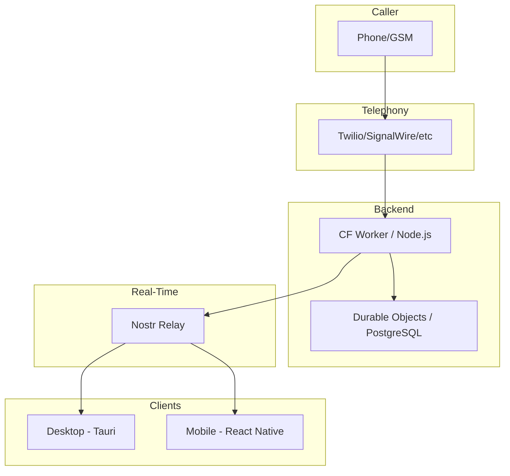

# Epic 114: Docs Site — Mobile Content & Missing Pages

**Status: PENDING**
**Repo**: llamenos (site/)
**Priority**: High — mobile app exists but docs don't reference it
**Depends on**: None
**Blocks**: Epic 115 (i18n for new pages)

## Summary

Add 4 new pages to the Astro documentation site: mobile guide, architecture overview, troubleshooting, and changelog. Update the download page to link mobile downloads. Update the sidebar to include new pages.

## Current Site Structure

### Existing Sidebar Sections (from `DocsLayout.astro`)

1. **Setup & Deployment** — Overview, Getting Started, Self-Hosting, Deploy: Docker, Deploy: Kubernetes
2. **User Guides** — Admin Guide, Volunteer Guide, Reporter Guide
3. **Voice Providers** — Telephony Providers, Setup: Twilio/SignalWire/Vonage/Plivo/Asterisk, WebRTC Calling
4. **Messaging Channels** — Setup: SMS/WhatsApp/Signal

### Frontmatter Format

```yaml
---
title: Page Title
description: One-line description for meta tags and overview cards.
---
```

### Translation Keys (from `common.ts`)

Sidebar labels are in `common.ts` under the `docs` namespace. Each language has the same keys.

## New Pages

### 1. `site/src/content/docs/en/mobile-guide.md`

**Sidebar section**: User Guides (after Reporter Guide)
**Translation key**: `docs.mobileGuide`

Content outline:
- **Overview** — What the mobile app provides (encrypted notes, calls, messaging, push notifications)
- **Download & Install** — APK from GitHub Releases, iOS TestFlight (future), F-Droid (future)
- **Initial Setup** — Import nsec OR create new identity, PIN setup, hub configuration
- **Feature Comparison Table** — Desktop vs Mobile capabilities
  - Both: Notes, calls, messaging, shifts, admin, i18n
  - Desktop only: Transcription (WASM Whisper), tray icon, system notifications
  - Mobile only: Push notifications, CallKit/ConnectionService, haptic feedback
- **Security Notes** — Jailbreak/root detection, HTTPS enforcement, PIN auto-lock, biometric unlock
- **Known Limitations** — No client-side transcription on mobile, SIP calling requires good network

### 2. `site/src/content/docs/en/architecture.md`

**Sidebar section**: New section "Architecture" (after Messaging Channels)
**Translation key**: `docs.architecture`

Content outline:
- **Three-Repo Architecture** — Diagram showing llamenos, llamenos-core, llamenos-mobile relationships
- **Data Flow** — Caller → Telephony → Worker → Nostr Relay → Client
- **Encryption Matrix** — What's encrypted where (notes, messages, call records, transcriptions)
- **Technology Stack** — Table of technologies per layer
- **Durable Objects** — 6 DOs and their responsibilities
- **Real-Time Sync** — Nostr relay architecture (strfry/Nosflare)

Mermaid diagrams:


### 3. `site/src/content/docs/en/troubleshooting.md`

**Sidebar section**: Architecture (with architecture.md)
**Translation key**: `docs.troubleshooting`

Content outline:
- **Docker Issues**
  - Container won't start → check `.env` required vars (`PG_PASSWORD`, `HMAC_SECRET`, etc.)
  - PostgreSQL connection refused → check service health, volume permissions
  - Caddy certificate errors → ensure domain DNS points to server
- **Cloudflare Issues**
  - Worker deployment fails → check wrangler.jsonc bindings, KV namespace IDs
  - Durable Object not found → ensure DO bindings match class names
  - CORS errors → check Worker security headers configuration
- **Desktop App Issues**
  - "Failed to create webview" → install WebKitGTK (Linux) or update macOS
  - IPC timeout → check if Rust backend panicked (logs in `~/.local/share/llamenos/logs/`)
  - Auto-updater fails → check internet, Ed25519 key mismatch
- **Mobile App Issues**
  - Push notifications not arriving → check APNs/FCM configuration, background restrictions
  - Crypto operations failing → check if llamenos-core native module loaded (falls back to JS)
  - SIP call quality → check network, try Wi-Fi instead of cellular
- **Telephony Issues**
  - No calls coming through → verify TwiML app URL, check webhook logs
  - CAPTCHA not playing → check IVR audio endpoint accessibility
  - Parallel ring not working → ensure volunteers are on-shift and not on break

### 4. `site/src/pages/changelog.astro`

**Not in docs sidebar** — standalone page linked from footer and header.

This page renders a changelog from the project's release history. Since no `CHANGELOG.md` exists yet, the page will be created with a structure that works with `git-cliff` output or manual entries.

Content:
- Version sections with dates
- Categorized entries (Features, Fixes, Security, Breaking Changes)
- Deep links per version (`#v0-18-0`)
- Pull from a `CHANGELOG.md` file in the repo root

Also create `site/src/pages/[lang]/changelog.astro` for i18n URL routing (content stays in English — changelogs are typically not translated).

## Sidebar Updates

### File: `site/src/layouts/DocsLayout.astro`

Add new items to the sidebar structure:

```
Setup & Deployment (existing)
User Guides (existing)
  + Mobile Guide (new)
Voice Providers (existing)
Messaging Channels (existing)
Architecture (new section)
  Architecture Overview (new)
  Troubleshooting (new)
```

### File: `site/src/i18n/translations/common.ts`

Add translation keys for all 13 languages:

```typescript
docs: {
  // ... existing keys ...
  mobileGuide: 'Mobile Guide',      // en
  architecture: 'Architecture',      // en section heading
  architectureOverview: 'Architecture Overview', // en
  troubleshooting: 'Troubleshooting', // en
}
```

Provide translations for all 13 languages:
- es: "Guía Móvil", "Arquitectura", "Descripción de la Arquitectura", "Solución de Problemas"
- zh: "移动端指南", "架构", "架构概述", "故障排除"
- etc. for all languages

## Download Page Updates

### File: `site/src/pages/download.astro` (and `[lang]/download.astro`)

Change the mobile card from "Coming soon" (opacity-60, disabled) to an active card with APK download link:

```html
<!-- Mobile (Android APK available) -->
<div class="rounded-xl border border-border/50 bg-bg-card/50 p-5 flex flex-col">
  <div class="flex items-center gap-3 mb-3">
    <svg class="h-8 w-8 text-fg" ...></svg>
    <div>
      <h3 class="font-semibold text-fg">{t.platforms.mobile.name}</h3>
      <p class="text-xs text-fg-muted">{t.platforms.mobile.description}</p>
    </div>
  </div>
  <a href="https://github.com/rhonda-rodododo/llamenos-hotline/releases/latest"
     class="mt-auto inline-flex items-center justify-center rounded-lg bg-primary px-4 py-2 text-sm font-medium text-white hover:bg-primary/90 transition-colors"
     target="_blank" rel="noopener">
    Download APK
  </a>
  <p class="text-xs text-fg-muted mt-2 text-center">iOS coming soon</p>
</div>
```

Remove `opacity-60` and `cursor-default`. Keep iOS as "coming soon" subtitle.

## Files to Create/Modify

### New Files
- `site/src/content/docs/en/mobile-guide.md`
- `site/src/content/docs/en/architecture.md`
- `site/src/content/docs/en/troubleshooting.md`
- `site/src/pages/changelog.astro`
- `site/src/pages/[lang]/changelog.astro`
- `CHANGELOG.md` (repo root — initial version)

### Modified Files
- `site/src/layouts/DocsLayout.astro` — add new sidebar items + Architecture section
- `site/src/i18n/translations/common.ts` — add sidebar labels in all 13 languages
- `site/src/pages/download.astro` — update mobile card
- `site/src/pages/[lang]/download.astro` — update mobile card

## Verification

1. `cd site && bun run build` — site builds without errors
2. Mobile guide, architecture, and troubleshooting pages render in docs sidebar
3. Changelog page accessible at `/changelog` and `/es/changelog`, etc.
4. Download page mobile card is active (not grayed out) with APK link
5. Mermaid diagrams render on architecture page
6. All new sidebar labels appear correctly in all 13 languages
