# Cryptographic Architecture

**Version:** 1.4
**Date:** 2026-05-18

Authoritative reference for all cryptographic primitives, key hierarchies, and protocols used in Llamenos. All crypto operations are implemented once in `packages/crypto/` (Rust), compiled to native (Tauri desktop), WASM (browser testing), and UniFFI (iOS/Android). There is no separate JS crypto implementation for production use.

**Related Documents**:
- [Protocol Specification](../protocol/PROTOCOL.md) — Wire formats and API contracts
- [Threat Model](THREAT_MODEL.md) — Adversary profiles and trust boundaries
- [Data Classification](DATA_CLASSIFICATION.md) — What data is encrypted and how
- [Key Revocation Runbook](KEY_REVOCATION_RUNBOOK.md) — Operational key management
- [Security Gaps and Roadmap](SECURITY_GAPS_AND_ROADMAP.md) — Known gaps and planned improvements

---

## Primitive Inventory

| Primitive | Implementation | Usage |
|-----------|---------------|-------|
| **HPKE** (RFC 9180) | `hpke` crate 0.13 — DHKEM(X25519, HKDF-SHA256) + AES-256-GCM | All key wrapping (notes, messages, files, hub key, PUK, audit keys, recovery shares) |
| **Ed25519** | `ed25519-dalek` v2 | Device signing keys, auth tokens, sigchain signatures, device wipe authorizations |
| **X25519** | `x25519-dalek` v2 | Device encryption keys, HPKE decapsulation |
| **AES-256-GCM** | `aes-gcm` 0.10 | Symmetric encryption (items_key, CLKR chain links, HPKE AEAD, audit log details) |
| **XChaCha20-Poly1305** | `chacha20poly1305` 0.10 | Hub event encryption (WebSocket events, `hub-event-crypto.ts`) |
| **HKDF-SHA256** | `hkdf` 0.12 | Key derivation with domain separation, SAS emoji derivation |
| **Argon2id** | `argon2` crate — 64MB memory, 3 iterations, 4 parallelism | PIN/passphrase-to-KEK derivation for device key storage (replaces PBKDF2) |
| **HMAC-SHA256** | `hmac` 0.12 | Phone/IP hashing, blind index generation, PUK subkey derivation |
| **SHA-256** | `sha2` 0.10 | Hashing, hash-chained audit logs, User-Agent hashing in audit, Shamir share commitments |
| **Shamir Secret Sharing** | `packages/crypto/src/shamir.rs` — GF(2^8) polynomial, AES irreducible polynomial 0x11B | Recovery group key splitting (EP09): splits recovery PUK seed into N shares, K-of-N threshold reconstruct |
| **BIP-340 Schnorr** | `k256` 0.13 (legacy) | WebSocket event signing only — being phased out for non-WebSocket auth |

### New Modules (EP01–EP09)

| Module | File | Purpose |
|--------|------|---------|
| **Shamir Secret Sharing** | `packages/crypto/src/shamir.rs` | GF(2^8) threshold secret sharing for recovery groups (K-of-N, K∈[2,5], N∈[3,5]). Constraints: `threshold ≤ total`. Random coefficients from OS CSPRNG; evaluation points 1-indexed (x=0 is the secret). SHA-256 commitments for tamper detection. Secret bytes zeroized after splitting. |
| **Audit Key** | `packages/crypto/src/audit_key.rs` | Per-user symmetric key (32 bytes, AES-256-GCM) encrypting the `details` JSONB field in audit log entries. HPKE-wrapped to each admin's X25519 pubkey (`LABEL_AUDIT_USER_KEY_WRAP`). On account erasure, the `audit_user_keys` row is deleted — crypto-shredding renders all associated audit details permanently undecryptable. |
| **SAS Emoji Verification** | `packages/crypto/src/sas.rs` | Seven emoji indices (0-63) derived from two Ed25519 device pubkeys and a session nonce via HKDF-SHA256 (`LABEL_SAS_DERIVE`). Used for out-of-band device identity verification (EP02). Canonical ordering `min(pk_a, pk_b) ∥ max(pk_a, pk_b) ∥ nonce` prevents role-confusion attacks. |
| **Erasure** | `packages/crypto/src/erasure.rs` | Crypto-shredding helpers: wipes key material on account erasure and device wipe. `LABEL_ERASURE_OVERRIDE_SIG` and `LABEL_DEVICE_WIPE_SIG` authenticate emergency override and wipe authorization signatures respectively. |

### Legacy Primitives (Scheduled for Removal)

| Primitive | File | Replacement | Status |
|-----------|------|-------------|--------|
| secp256k1 ECIES | `ecies.rs` | HPKE (RFC 9180) | Phase 6 removal planned |
| PBKDF2-SHA256 (device key storage) | `encryption_legacy.rs` | Argon2id | Superseded; legacy blobs migrate on next PIN unlock |
| Schnorr auth tokens (secp256k1) | `auth_legacy.rs` | Ed25519 auth tokens | Legacy path retained for migration |
| secp256k1 keypairs / bech32 nsec | `keys_legacy.rs` | Ed25519/X25519 device keys | Legacy path retained for migration |

---

## Key Hierarchy

```mermaid
flowchart TD
    DeviceKeys["Device Keys (per-device, generated on first use)"]
    EdSign["Ed25519 Signing Key"]
    X25519Enc["X25519 Encryption Key"]

    DeviceKeys --- EdSign
    DeviceKeys --- X25519Enc

    EdSign -->|used for| AuthTokens["auth tokens, sigchain entries"]
    X25519Enc -->|used for| HpkeDecap["HPKE decapsulation (notes, messages, hub key, PUK seed)"]

    Sigchain["Sigchain (append-only log of device authorizations)"]
    SigchainEntry["Each entry: Ed25519-signed, hash-chained, references device pubkey"]
    Sigchain --- SigchainEntry

    PUK["PUK (Per-User Key) — user-level key hierarchy"]
    PukSeed["PUK Seed (32 bytes, random)"]
    PukSign["PUK Signing Subkey (HMAC derive, LABEL_PUK_SIGN)"]
    PukDh["PUK DH Subkey (HMAC derive, LABEL_PUK_DH)"]
    PukSecretbox["PUK Secretbox Key (HMAC derive, LABEL_PUK_SECRETBOX)"]

    PUK --- PukSeed
    PukSeed --- PukSign
    PukSeed --- PukDh
    PukSeed --- PukSecretbox

    ItemsKey["Items Key (HKDF export from PUK, LABEL_ITEMS_KEY_EXPORT)"]
    NoteEpoch["Per-Note Epoch Key (HKDF derive, LABEL_NOTE_EPOCH_KEY)"]
    PukSeed --- ItemsKey
    ItemsKey --- NoteEpoch

    Clkr["CLKR Chain (Cascading Lazy Key Rotation)"]
    ClkrLink["Each link: AES-256-GCM encrypted previous-gen seed (key: secretbox_key, LABEL_PUK_PREVIOUS_GEN)"]
    PUK --- Clkr
    Clkr --- ClkrLink

    HubKey["Hub Key (per-hub, random 32 bytes)"]
    HubWrap["HPKE-wrapped per member (LABEL_HUB_KEY_WRAP)"]
    HubEvent["Hub Event Key (HKDF from hub key, LABEL_HUB_EVENT) — WebSocket event encryption"]
    HubPtk["Hub PTK (derived via MLS export or HKDF, LABEL_HUB_PTK)"]

    HubKey --- HubWrap
    HubKey --- HubEvent
    HubKey --- HubPtk

    Sframe["SFrame Call Secrets (per-call, LABEL_SFRAME_CALL_SECRET)"]
    SframeBase["SFrame Base Key (LABEL_SFRAME_BASE_KEY)"]
    SframeSend["Per-participant Send Keys (HKDF with participant index)"]

    HubPtk --- Sframe
    Sframe --- SframeBase
    SframeBase --- SframeSend

    RecoveryGroup["Recovery Group (EP09) — K-of-N Shamir threshold"]
    RecoveryShares["N shares of PUK seed, each HPKE-wrapped to a holder (LABEL_RECOVERY_GROUP_SHARE_WRAP)"]
    RecoveryPukWrap["Reconstructed PUK seed HPKE-wrapped to recovering user (LABEL_RECOVERY_PUK_SEED_WRAP)"]
    RecoveryLiveness["Holder liveness proof (Ed25519-signed, LABEL_RECOVERY_LIVENESS_PROOF)"]
    RecoveryContribute["Share contribution in session (Ed25519-signed, LABEL_RECOVERY_SHARE_CONTRIBUTE)"]

    PUK --- RecoveryGroup
    RecoveryGroup --- RecoveryShares
    RecoveryGroup --- RecoveryPukWrap
    RecoveryGroup --- RecoveryLiveness
    RecoveryGroup --- RecoveryContribute

    AuditKey["Audit User Key (per-user, 32 bytes, AES-256-GCM)"]
    AuditKeyWrap["HPKE-wrapped to each admin (LABEL_AUDIT_USER_KEY_WRAP)"]
    AuditDetails["Audit log details JSONB (LABEL_AUDIT_DETAILS) — crypto-shredded on erasure"]

    DeviceKeys --- AuditKey
    AuditKey --- AuditKeyWrap
    AuditKey --- AuditDetails
```



### PIN-Protected Device Key Storage

Device private keys are stored encrypted at rest on each platform:

| Platform | Storage | Encryption |
|----------|---------|------------|
| Desktop (Tauri) | Tauri Store (plugin-store) | Argon2id (64MB/3/4) → AES-256-GCM |
| iOS | Keychain (kSecAttrAccessibleWhenUnlockedThisDeviceOnly) | Argon2id → AES-256-GCM + Secure Enclave |
| Android | EncryptedSharedPreferences (Keystore-backed) | Argon2id → AES-256-GCM + Android Keystore |

> **Note on Tauri Stronghold**: The Tauri Stronghold plugin (`tauri-plugin-stronghold`) is initialized in `apps/desktop/src/lib.rs` but the **actual device key storage uses `tauri-plugin-store`** (`keys.json`). Stronghold is loaded as a plugin but device keys are currently stored via the Store plugin. See [Security Gaps](SECURITY_GAPS_AND_ROADMAP.md#12-tauri-stronghold-vs-store-medium).

PIN/passphrase requirements: minimum 8 decimal digits (numeric PIN) or alphanumeric passphrase (8+ characters with at least one letter). Old 6-digit PINs are no longer accepted by `is_valid_credential()` in `packages/crypto/src/device_keys.rs`.

KDF: Argon2id (64MB memory cost, 3 iterations, 4 parallelism) — GPU/ASIC resistant. Stored format:

```json
{
  "v": 2,
  "salt": "<hex, 32 chars>",
  "argon2_m_cost": 65536,
  "argon2_t_cost": 3,
  "argon2_p_cost": 4,
  "nonce": "<hex, 24 chars>",
  "ciphertext": "<hex>",
  "state": {
    "deviceId": "...",
    "signingPubkeyHex": "...",
    "encryptionPubkeyHex": "..."
  }
}
```

The `state` field contains only public values. Private key material is inside the `ciphertext` blob.

---

## HPKE Envelope Format (Version 3)

All new key wrapping uses HPKE (RFC 9180) with the following suite:

- **KEM**: DHKEM(X25519, HKDF-SHA256)
- **KDF**: HKDF-SHA256
- **AEAD**: AES-256-GCM

### Wire Format

```json
{
  "v": 3,
  "labelId": 0,
  "enc": "<base64url — 32-byte HPKE encapsulated key>",
  "ct": "<base64url — AEAD ciphertext>"
}
```

- `v`: Always `3` for HPKE envelopes
- `labelId`: Numeric ID from the label registry (compact wire representation)
- `enc`: HPKE encapsulated shared secret (KEM output)
- `ct`: AES-256-GCM ciphertext with authentication tag

### Label Enforcement (Albrecht Defense)

Every HPKE operation requires a domain separation label. At decryption:

1. Parse envelope, resolve `labelId` → label string via registry
2. Compare resolved label to caller's expected label
3. **If mismatch → reject immediately** (no decryption attempted)
4. Pass label as HPKE `info` parameter for cryptographic binding

This prevents cross-context key reuse attacks (e.g., using a note key envelope to decrypt a message).

---

## Domain Separation Labels

All domain separation labels are defined in `packages/protocol/crypto-labels.json` (source of truth) and generated to TypeScript, Swift, Kotlin, and Rust via codegen. Labels are registered in `packages/crypto/src/labels.rs` with stable numeric IDs (never reordered). Index 53 is a tombstone (removed `LABEL_ECIES_V2_SALT`). Some newer labels in the JSON source use string-based lookup only. See the JSON file for the current count.

| Range | Category | Examples |
|-------|----------|----------|
| 0–3 | Key wrapping | `LABEL_NOTE_KEY`, `LABEL_FILE_KEY`, `LABEL_HUB_KEY_WRAP`, `LABEL_FILE_METADATA` |
| 4–7 | Content encryption | `LABEL_MESSAGE`, `LABEL_CALL_META`, `LABEL_TRANSCRIPTION`, `LABEL_SHIFT_SCHEDULE` |
| 8–12 | HKDF/KDF | `HKDF_SALT`, `HKDF_CONTEXT_NOTES`, `LABEL_HUB_EVENT`, `LABEL_DRAFTS`, `LABEL_EXPORT` |
| 13 | Key agreement | `LABEL_DEVICE_PROVISION` |
| 14–16 | SAS/Auth | `SAS_SALT`, `AUTH_PREFIX`, `LABEL_DEVICE_AUTH` |
| 17–21 | HMAC prefixes | `HMAC_PHONE_PREFIX`, `HMAC_IP_PREFIX`, `HMAC_KEYID_PREFIX`, `HMAC_SUBSCRIBER`, `HMAC_PREFERENCE_TOKEN` |
| 22–23 | Recovery/Backup | `RECOVERY_SALT`, `LABEL_BACKUP` |
| 24–25 | Server identity | `LABEL_SERVER_NOSTR_KEY`, `LABEL_SERVER_NOSTR_KEY_INFO` |
| 26–27 | Push notifications | `LABEL_PUSH_WAKE`, `LABEL_PUSH_FULL` |
| 28–34 | CMS | `LABEL_CONTACT_ID`, `LABEL_CASE_FIELDS`, `LABEL_BLIND_INDEX_KEY`, etc. |
| 35–40 | CMS HMAC | `HMAC_CONTACT_NAME`, `HMAC_CASE_STATUS`, etc. |
| 41–45 | PUK | `LABEL_PUK_SIGN`, `LABEL_PUK_DH`, `LABEL_PUK_SECRETBOX`, `LABEL_PUK_WRAP_TO_DEVICE`, `LABEL_PUK_PREVIOUS_GEN` |
| 46 | Device auth | `LABEL_DEVICE_AUTH` |
| 47–48 | Items key/epoch | `LABEL_ITEMS_KEY_EXPORT`, `LABEL_NOTE_EPOCH_KEY` |
| 49 | Hub PTK | `LABEL_HUB_PTK_PREV_GEN` |
| 50–51 | SFrame | `LABEL_SFRAME_CALL_SECRET`, `LABEL_SFRAME_BASE_KEY` |
| 52 | MLS | `LABEL_MLS_PROVISION` |
| 53 | *(tombstone)* | Removed — was `LABEL_ECIES_V2_SALT` |
| 54–56 | Salts/derivation | `LABEL_PROVISIONING_SALT`, `LABEL_BLIND_INDEX_FIELD`, `LABEL_HUB_PTK` |
| 57–68 | Server/hub/misc | `LABEL_WS_CHALLENGE`, `LABEL_SERVER_SIGNING_KEY`, `LABEL_SERVER_EVENT_ENCRYPTION_KEY`, `LABEL_HUB_EVENT_EPOCH`, etc. |
| 69–71 | Audit keys | `LABEL_AUDIT_USER_KEY_WRAP`, `LABEL_ERASURE_OVERRIDE_SIG`, `LABEL_AUDIT_DETAILS` |
| 72 | Device wipe | `LABEL_DEVICE_WIPE_SIG` |
| 73–76 | Recovery group (EP09) | `LABEL_RECOVERY_GROUP_SHARE_WRAP`, `LABEL_RECOVERY_PUK_SEED_WRAP`, `LABEL_RECOVERY_SHARE_CONTRIBUTE`, `LABEL_RECOVERY_LIVENESS_PROOF` |
| 77–79 | Role/hub/team encryption | `LABEL_PLATFORM_ROLE_NAME_ENCRYPT`, `LABEL_PLATFORM_ROLE_DESC_ENCRYPT`, `LABEL_HUB_ROLE_ENCRYPT` |
| 80 | SAS emoji (EP02) | `LABEL_SAS_DERIVE` |
| (JSON only) | Org structure encryption | `LABEL_TEAM_ENCRYPT`, `LABEL_TAG_ENCRYPT`, `LABEL_ENTITY_TYPE_DEFINITION` — in JSON source, not yet in Rust numeric registry |

**Rule**: Never use raw string literals for crypto contexts. Always use the generated label constants.

---

## Sigchain (Append-Only Identity Log)

Each user has a sigchain — an append-only, hash-chained log of device authorization records. The sigchain is the authoritative record of which devices are authorized to act on behalf of a user.

### Link Structure

```json
{
  "id": "<uuid>",
  "seq": 0,
  "prevHash": null,
  "entryHash": "<SHA-256 hex, 64 chars>",
  "signerDeviceId": "device-uuid",
  "signerPubkey": "<Ed25519 pubkey hex, 64 chars>",
  "signature": "<Ed25519 signature hex, 128 chars>",
  "timestamp": "2026-05-02T12:00:00Z",
  "payloadJson": "{\"type\":\"add-device\",\"deviceId\":\"...\",\"signingPubkey\":\"...\",\"encryptionPubkey\":\"...\"}"
}
```

### Properties

- **Hash-chained**: Each entry's `entryHash` includes the `prevHash`, creating a tamper-evident chain
- **Ed25519-signed**: Each entry is signed by the device that created it
- **Payload is canonical JSON**: Sorted keys for deterministic hashing
- **Verification**: `verify_sigchain(links)` returns `SigchainVerifiedState` with the set of currently authorized devices

### Sigchain Payloads

| Type | Purpose |
|------|---------|
| `add-device` | Authorize a new device (signing + encryption pubkeys) |
| `remove-device` | Deauthorize a device (revocation) |
| `rotate-puk` | Record PUK generation rotation |

> **Note:** The backend enforces sequence monotonicity, prevHash linkage, **and Ed25519 signature verification** on each sigchain entry before accepting it.

---

## Per-User Key (PUK) and Cascading Lazy Key Rotation (CLKR)

PUK provides a user-level key hierarchy that supports forward secrecy through key rotation without requiring online re-encryption of all historical data.

### PUK Seed and Subkeys

Each PUK generation starts with a random 32-byte seed. Three subkeys are derived:

| Subkey | Derivation | Purpose |
|--------|-----------|---------|
| PUK Signing | `HMAC-SHA256(seed, LABEL_PUK_SIGN)` | Signing PUK-level operations |
| PUK DH | `HMAC-SHA256(seed, LABEL_PUK_DH)` | Key agreement for PUK-level wrapping |
| PUK Secretbox | `HMAC-SHA256(seed, LABEL_PUK_SECRETBOX)` | Symmetric encryption of CLKR chain links |

### CLKR Chain

On PUK rotation (e.g., device removal):

1. Generate new seed for generation N+1
2. Encrypt old seed (gen N) with new secretbox key (gen N+1) → chain link
3. HPKE-wrap new seed for each remaining authorized device
4. Publish sigchain entry recording the rotation

To decrypt historical data encrypted under an older PUK generation, walk the CLKR chain backwards from the current generation to the target generation.

### Items Key

Derived from PUK via HKDF export (`LABEL_ITEMS_KEY_EXPORT`). Used as an intermediate key for per-note encryption — avoids exposing the PUK seed directly in content encryption operations.

---

## E2EE Encryption Flows

### Per-Note Encryption

1. Generate random 32-byte `note_key`
2. Encrypt content with AES-256-GCM using `note_key`
3. HPKE-wrap `note_key` for author's X25519 pubkey (label: `LABEL_NOTE_KEY`)
4. HPKE-wrap `note_key` for each admin's X25519 pubkey (label: `LABEL_NOTE_KEY`)
5. Store: `{ encryptedContent, authorEnvelope, adminEnvelopes[], authorPubkey, createdAt }`

**Forward secrecy**: Each note uses a unique random key. Compromising a device key does not reveal note content without also obtaining the per-note HPKE envelopes.

> **Note on 3-tier envelopes:** A 3-tier envelope model (`summary`/`fields`/`pii`) exists in `apps/worker/lib/envelope-recipients.ts` for entity records (cases/contacts), but **notes use the simpler 2-envelope model** (author + admin). See [Security Gaps](SECURITY_GAPS_AND_ROADMAP.md#14-3-tier-envelope-encryption-low).

### Per-Message Encryption

Same pattern as notes but with label `LABEL_MESSAGE`. Server encrypts inbound webhook messages (SMS/WhatsApp/Signal) immediately on receipt, discards plaintext.

### Hub Event Encryption (Server-Published WebSocket Events)

The server publishes WebSocket events encrypted under a key derived from `SERVER_SECRET` (not the hub key directly). The derivation uses epoch-based forward secrecy:

1. Derive `event_key = HKDF-SHA256(SERVER_SECRET, salt=LABEL_SERVER_EVENT_ENCRYPTION_KEY[:hubId], info=LABEL_HUB_EVENT_EPOCH[:epoch], 32)`
   - Epoch = `floor(unix_timestamp / 86400)` — key changes every 24 hours
   - `hubId` scopes the key per-hub for isolation
2. Pad event JSON to a power-of-2 bucket (minimum 512B): `[4-byte LE length][plaintext][random padding]`
3. Encrypt padded bytes with XChaCha20-Poly1305 using `event_key` and a random 24-byte nonce
4. Wire format: `hex(nonce || ciphertext)`

Clients receive the server event key (current + previous epoch) via `GET /api/auth/me` (in the hub key distribution envelope). The key is distinct from the server's event signing key — separate derivation labels enforce cryptographic independence (Albrecht defense, H1/H5 hardening).

**WebSocket authentication**: Clients authenticate to the built-in WebSocket endpoint using the same session token or signed auth token used for REST API requests. Only authenticated clients receive events. The server handles all event publishing — clients cannot inject events.

### Voice E2EE (SFrame)

For encrypted voice channels:

1. Derive call secret from MLS exporter or hub PTK (label: `LABEL_SFRAME_CALL_SECRET`)
2. Derive SFrame base key (label: `LABEL_SFRAME_BASE_KEY`)
3. Derive per-participant send keys using participant index

> **Note:** SFrame key derivation is fully implemented, but **actual media frame encryption** (AES-128-CTR + HMAC-SHA256 per frame) is **not yet implemented**. See [Security Gaps](SECURITY_GAPS_AND_ROADMAP.md#13-sframe-voice-e2ee-low).

---

## MLS (RFC 9420)

MLS group management is compiled unconditionally using OpenMLS 0.8. The `mls` feature flag was removed — MLS is always available.

- **Ciphersuite**: `MLS_128_DHKEMX25519_AES128GCM_SHA256_Ed25519`
- **Operations**: Group creation, member add/remove, self-update, epoch secret export
- **Hub PTK derivation**: `derive_hub_ptk(export_secret, hub_id)` for hub-specific symmetric keys
- **SFrame integration**: MLS exporter secrets feed into SFrame key derivation for voice E2EE

> **Note:** MLS is implemented in the crypto crate and backend routes exist, but **client-side MLS integration** (automatic group creation on hub create, key package upload) may not be fully active. See [Security Gaps](SECURITY_GAPS_AND_ROADMAP.md#22-mls-client-side-integration-low).

---

## Payload Padding (Traffic Analysis Mitigation)

All hub event payloads are padded to a power-of-2 bucket before encryption to resist ciphertext-length traffic analysis. Implemented in `packages/crypto/src/padding.rs` and `apps/worker/lib/hub-event-crypto.ts`.

### Padding Format

```
[4-byte LE actual-length][plaintext][random padding bytes]
```

### Bucket Sizes

Minimum bucket is 512 bytes. Buckets double: 512, 1024, 2048, 4096, 8192, …

An observer sees only the bucket size (a power of 2), not the actual payload length. For example, a 300-byte payload and a 500-byte payload both appear as 512 bytes on the wire.

### Scope

Padding applies to WebSocket hub events. It does NOT currently apply to note/message/transcription API payloads — those arrive over HTTPS with TLS-layer encryption.

---

## WebSocket Key Separation (Signing vs. Encryption)

The server has two cryptographically independent keys derived from `SERVER_SECRET`:

| Key | Derivation label | Usage |
|-----|-----------------|-------|
| WebSocket signing key | `LABEL_SERVER_NOSTR_KEY` | Signing published WebSocket events (Ed25519/Schnorr) |
| Event encryption key | `LABEL_SERVER_EVENT_ENCRYPTION_KEY` | Encrypting event content (XChaCha20-Poly1305) |

Using separate labels means a signing key compromise does not compromise content confidentiality, and vice versa. This separation was introduced as the H1 hardening fix.

---

## Blind Indexing (Server-Side E2EE Search)

Enables searching over encrypted data without server-side plaintext access.

| Function | Purpose |
|----------|---------|
| `blind_index(hub_key, field_name, value)` | Exact match index (HMAC-SHA256) |
| `date_blind_indexes(hub_key, field_name, iso_date)` | Day/week/month range indexes |
| `name_trigram_indexes(hub_key, field_name, value)` | Fuzzy name search via trigrams |

Values are canonicalized (lowercase + NFKD + strip diacritics) before indexing. The hub key is the root secret — blind index keys are derived per-field via `derive_blind_index_key(hub_key, field_name)`.

---

## Platform Compilation Targets

| Target | Build | Key Storage | Private Key Access |
|--------|-------|-------------|-------------------|
| **Desktop (Tauri)** | Native Rust, linked via `apps/desktop/Cargo.toml` path dep | Tauri Store (plugin-store) | Rust `CryptoState` — never enters webview |
| **iOS** | UniFFI XCFramework via `build-mobile.sh ios` | iOS Keychain | Static `MobileState` in Rust — never crosses to Swift |
| **Android** | UniFFI JNI `.so` via `build-mobile.sh android` | EncryptedSharedPreferences | Static `MobileState` in Rust — never crosses to Kotlin |
| **WASM** | `wasm-bindgen` (test builds only) | Browser memory | JS string (inherently unzeroizable — test only) |

### Zeroization

- All secret key material uses `zeroize::Zeroizing<>` wrappers
- `MobileState` zeroizes secrets on `mobile_lock()` call
- Desktop `CryptoState` zeroizes on session lock
- WASM target cannot zeroize JS strings — acceptable for test builds only

---

## Device Provisioning

New device onboarding uses ephemeral ECDH with SAS (Short Authentication String) verification:

1. New device generates ephemeral keypair, creates provisioning room
2. Primary device scans QR code or enters short code
3. Both devices compute ECDH shared secret
4. SAS: `HKDF(shared_x, salt="llamenos:sas", info="llamenos:provisioning-sas", len=4)` → 6-digit code displayed as "XXX XXX"
5. User visually verifies SAS match on both devices
6. Primary encrypts device secrets with derived symmetric key, sends via provisioning room
7. New device decrypts and stores keys with user-chosen PIN

---

## SAS Emoji Verification (EP02)

Separate from provisioning SAS, the emoji verification flow is used to confirm that two devices are communicating with each other's genuine Ed25519 signing keys — not an impersonator. This is relevant during device linking, admin verification, and recovery group enrollment.

### Protocol

1. Both parties exchange their Ed25519 signing pubkeys and agree on a random session nonce
2. Each party independently computes:
   ```
   key_material = HKDF-SHA256(
     ikm    = min(pk_a, pk_b) ∥ max(pk_a, pk_b) ∥ nonce,
     salt   = <empty>,
     info   = LABEL_SAS_DERIVE,
     length = 7 bytes
   )
   ```
3. Each byte maps to an index 0-63, selecting an emoji from the 64-entry table (animals, plants, celestial objects)
4. Both parties display the same 7-emoji sequence; user visually confirms they match

### Security Properties

- **Canonical ordering**: `min(pk) ∥ max(pk)` prevents role-confusion attacks — both parties produce the same input regardless of which initiated the session
- **64-entry table**: 7 indices from 64 emoji = 42 bits of entropy (264 trillion possible sequences)
- **Out-of-band**: Comparison must happen over a trusted channel (in-person, video call) — the protocol cannot verify itself

### Emoji Table

The 64-entry table is defined as a constant in `packages/crypto/src/sas.rs` (`SAS_EMOJI_TABLE`). The table uses unambiguous emoji with distinct appearances (no lookalikes). Generated constants are available in all platforms via codegen.

---

## Auth Token Format (Ed25519)

```json
{
  "pubkey": "<Ed25519 pubkey hex, 64 chars>",
  "timestamp": 1714651200000,
  "token": "<Ed25519 signature hex, 128 chars>"
}
```

Message bound to: `timestamp_ms || method || path`. Validated with 5-minute window. Sent as `Authorization: Bearer <json>`.

---

## Dependency Audit Notes

| Crate | Version | Audit Status |
|-------|---------|-------------|
| `hpke` | 0.13 | RustCrypto ecosystem, widely reviewed |
| `ed25519-dalek` | 2 | Audited, constant-time |
| `x25519-dalek` | 2 | Audited, constant-time |
| `aes-gcm` | 0.10 | RustCrypto, AES-NI hardware acceleration |
| `openmls` | 0.8 | RFC 9420 reference implementation |
| `k256` | 0.13 | Legacy secp256k1, RustCrypto |

All dependencies use `Cargo.lock` for reproducible builds. The `packages/crypto/` crate is the single audit target for all cryptographic operations across all platforms.

---

## Revision History

| Date | Version | Changes |
|------|---------|---------|
| 2026-05-18 | 1.4 | EP01–EP09 update: added Shamir secret sharing primitive (recovery groups); added audit_key.rs module (per-user AES-256-GCM audit key, crypto-shredding on erasure); added erasure.rs module (LABEL_ERASURE_OVERRIDE_SIG, LABEL_DEVICE_WIPE_SIG); added SAS emoji verification section (EP02, LABEL_SAS_DERIVE, 7 emoji from 64-entry table); updated key hierarchy diagram with recovery group keys and audit keys; updated label count to 87 (JSON source) / 80 active Rust registry (indices 0-80, tombstone at 53); added label rows 69-80 and JSON-only labels to domain separation table |
| 2026-05-12 | 1.3 | All 69 domain separation labels now in Rust registry (was 57); sigchain server-side Ed25519 validation now implemented; updated section headers and notes to reflect PR #288 fixes |
| 2026-05-11 | 1.2 | Updated domain separation label count (69 defined, 57 in Rust registry); added Stronghold/Store clarification; added SFrame completeness note; added 3-tier envelope clarification; added sigchain server-side validation note; added MLS client integration note; added Security Gaps cross-references |
| 2026-05-03 | 1.1 | Post-hardening update: Argon2id (64MB/3/4) replaces PBKDF2 for PIN/passphrase; min 8 digits or alphanumeric passphrase; XChaCha20-Poly1305 for hub events (was misattributed); per-hub epoch-based event key rotation (24h); power-of-2 payload padding section; WebSocket auth + built-in endpoint; WebSocket signing/encryption key separation; MLS always-on (feature flag removed) |
| 2026-05-02 | 1.0 | Initial document — consolidated from protocol spec, crate source, and CLAUDE.md |
