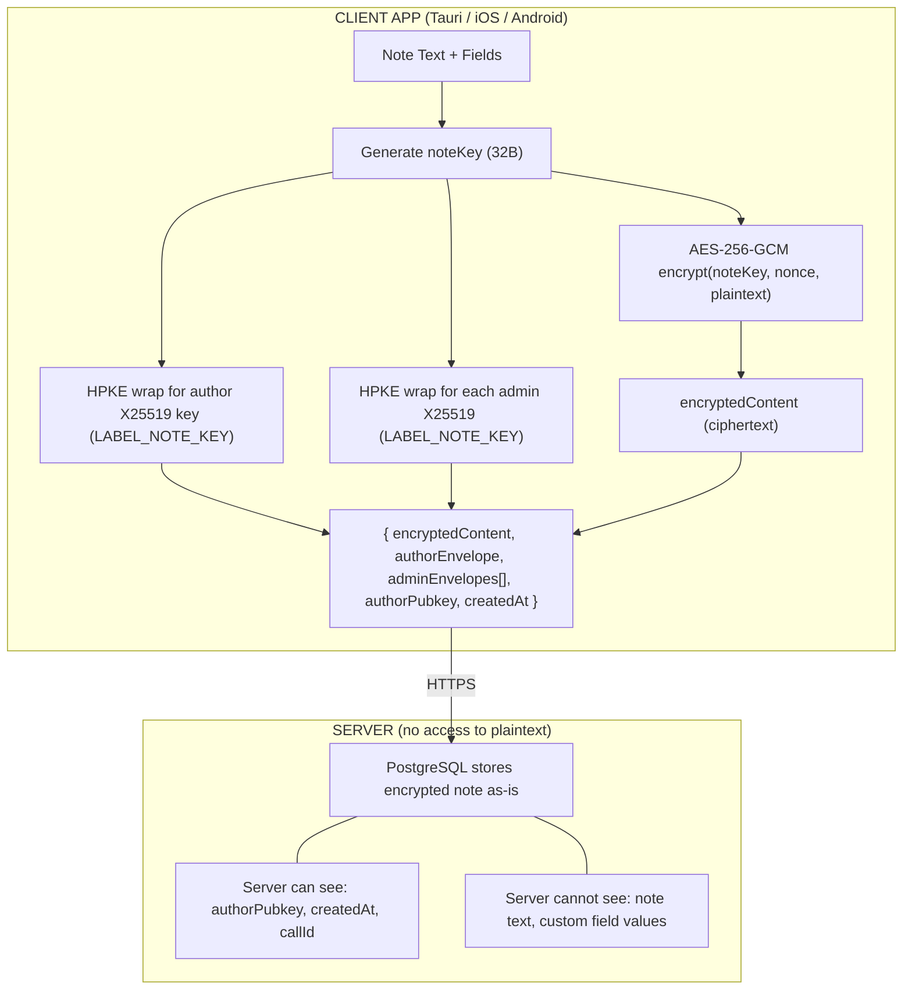
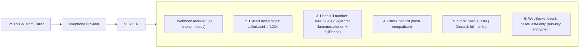

# Data Classification Reference

**Version:** 3.0
**Date:** 2026-05-18

Complete inventory of all data stored and processed by Llamenos, with classification levels for security audits, legal review, and GDPR compliance.

## Classification Levels

| Level | Definition | Examples |
|-------|------------|----------|
| **E2EE** | End-to-end encrypted; server stores ciphertext only | Note content, transcriptions |
| **Hashed** | One-way cryptographic hash; original not recoverable without brute-force | Caller phone numbers |
| **Encrypted-at-Rest** | Encrypted by infrastructure (database, disk); operator can decrypt | Volunteer personal info |
| **Plaintext** | Stored unencrypted; accessible to operator and under subpoena | Timestamps, call durations |

---

## Data Inventory by Storage Location

### PostgreSQL (Server-Side)

#### User Records

| Field | Classification | Retention | Notes |
|-------|---------------|-----------|-------|
| `pubkey` | Plaintext | Account lifetime | Ed25519 signing public key (device-specific) |
| `encryptionPubkey` | Plaintext | Account lifetime | X25519 encryption public key (device-specific) |
| `name` | Encrypted-at-Rest | Account lifetime | User's display name |
| `phone` | Encrypted-at-Rest | Account lifetime | User's phone number (for routing) |
| `email` | Encrypted-at-Rest | Account lifetime | Optional contact email |
| `roles` | Plaintext | Account lifetime | `['volunteer']`, `['admin']`, etc. — hub-scoped |
| `active` | Plaintext | Account lifetime | Account enabled/disabled |
| `createdAt` | Plaintext | Account lifetime | Registration timestamp |
| `lastSeen` | Plaintext | Updated on activity | Last API request timestamp |
| `webauthnCredentials` | Encrypted-at-Rest | Account lifetime | Passkey credential IDs and public keys |
| `sessionTokens` | Encrypted-at-Rest | 8-hour TTL | Active session tokens |

> **Legacy field:** `encryptedSecretKey` (legacy nsec) still exists in the `users` table for Phase 6 migration. New users use per-device keys in the `devices` table.

#### Sigchain Entries

| Field | Classification | Retention | Notes |
|-------|---------------|-----------|-------|
| `id` | Plaintext | Indefinite | Entry UUID |
| `seq` | Plaintext | Indefinite | Sequence number in chain |
| `prevHash` | Plaintext | Indefinite | SHA-256 of previous entry (chain link) |
| `entryHash` | Plaintext | Indefinite | SHA-256 of this entry |
| `signerDeviceId` | Plaintext | Indefinite | Which device signed this entry |
| `signerPubkey` | Plaintext | Indefinite | Ed25519 pubkey of signer |
| `signature` | Plaintext | Indefinite | Ed25519 signature (128 hex chars) |
| `payloadJson` | Plaintext | Indefinite | Canonical JSON (add-device, remove-device, rotate-puk) |

#### PUK (Per-User Key) State

| Field | Classification | Retention | Notes |
|-------|---------------|-----------|-------|
| `pukGeneration` | Plaintext | Account lifetime | Current PUK generation number |
| `pukSigningPubkey` | Plaintext | Account lifetime | Current PUK signing subkey |
| `pukDhPubkey` | Plaintext | Account lifetime | Current PUK DH subkey |
| `deviceSeedEnvelopes[]` | **E2EE** | Account lifetime | HPKE-wrapped PUK seed, one per authorized device (label: `LABEL_PUK_WRAP_TO_DEVICE`) |
| `clkrChainLinks[]` | **E2EE** | Account lifetime | AES-256-GCM encrypted previous-generation seeds (CLKR chain) |

#### Call Records and Notes

| Field | Classification | Retention | Notes |
|-------|---------------|-----------|-------|
| `callId` | Plaintext | Indefinite | Unique call identifier |
| `callSid` | Plaintext | Indefinite | Telephony provider call ID |
| `startedAt` | Plaintext | Indefinite | Call start timestamp |
| `duration` | Plaintext | Indefinite | Call duration in seconds |
| `answeredBy` | Plaintext | Indefinite | User pubkey who answered |
| `callerHash` | Hashed (HMAC-SHA256) | Indefinite | Caller phone hash (irreversible) |
| `callerLast4` | Plaintext | Indefinite | Last 4 digits of caller number |
| `hasTranscription` | Plaintext | Indefinite | Boolean flag |
| `hasVoicemail` | Plaintext | Indefinite | Boolean flag |
| `notes[].encryptedContent` | **E2EE** | Indefinite | AES-256-GCM ciphertext (via HPKE) |
| `notes[].authorEnvelope` | **E2EE** | Indefinite | HPKE-wrapped note key (author, label: `LABEL_NOTE_KEY`) |
| `notes[].adminEnvelopes[]` | **E2EE** | Indefinite | HPKE-wrapped note key (per admin, label: `LABEL_NOTE_KEY`) |
| `notes[].authorPubkey` | Plaintext | Indefinite | Who wrote the note |
| `notes[].createdAt` | Plaintext | Indefinite | Note creation timestamp |
| `transcription.encryptedContent` | **E2EE** | Indefinite | Encrypted transcript text |
| `transcription.authorEnvelope` | **E2EE** | Indefinite | HPKE-wrapped key (label: `LABEL_TRANSCRIPTION`) |
| `transcription.adminEnvelopes[]` | **E2EE** | Indefinite | HPKE-wrapped key (per admin) |

> **Note on envelope tiers:** Notes use a 2-envelope model (author + admin). A 3-tier model (summary/fields/pii) exists for CMS entity records (cases/contacts) but is not used for notes. See [Security Gaps](SECURITY_GAPS_AND_ROADMAP.md#14-3-tier-envelope-encryption-low).

#### Call Record Metadata

| Field | Classification | Retention | Notes |
|-------|---------------|-----------|-------|
| `encryptedMetadata` | **E2EE** | Indefinite | AES-256-GCM ciphertext (answeredBy, callerNumber) |
| `metadataEnvelopes[]` | **E2EE** | Indefinite | HPKE-wrapped metadata key (label: `LABEL_CALL_META`) |
| `callerLast4`, `startedAt`, etc. | Plaintext | Indefinite | Routing-required fields |

#### Shift Schedules

| Field | Classification | Retention | Notes |
|-------|---------------|-----------|-------|
| `shiftId` | Plaintext | Indefinite | Unique shift identifier |
| `volunteerPubkeys` | Plaintext | Indefinite | Who is assigned (routing requires plaintext) |
| `encryptedDetails` | **E2EE** | Indefinite | Encrypted schedule details (label: `LABEL_SHIFT_SCHEDULE`) |
| `adminEnvelopes[]` | **E2EE** | Indefinite | HPKE-wrapped schedule key (per admin) |
| `startTime` / `endTime` | Plaintext | Indefinite | Shift times (routing needs plaintext) |
| `daysOfWeek` | Plaintext | Indefinite | Recurring days (routing needs plaintext) |

#### Conversations (Messaging)

| Field | Classification | Retention | Notes |
|-------|---------------|-----------|-------|
| `conversationId` | Plaintext | Indefinite | Unique conversation identifier |
| `channel` | Plaintext | Indefinite | `sms`, `whatsapp`, `signal`, `telegram`, `rcs` |
| `participantHash` | Hashed (HMAC-SHA256) | Indefinite | Hashed phone/identifier |
| `assignedVolunteer` | Plaintext | Indefinite | User pubkey |
| `messages[].encryptedContent` | **E2EE** | Indefinite | AES-256-GCM ciphertext (envelope encryption) |
| `messages[].authorEnvelope` | **E2EE** | Indefinite | HPKE-wrapped message key (assigned volunteer, label: `LABEL_MESSAGE`) |
| `messages[].adminEnvelopes[]` | **E2EE** | Indefinite | HPKE-wrapped message key (per admin, label: `LABEL_MESSAGE`) |
| `messages[].direction` | Plaintext | Indefinite | `inbound` or `outbound` |
| `messages[].timestamp` | Plaintext | Indefinite | Message timestamp |
| `messages[].status` | Plaintext | Indefinite | `sent`, `delivered`, `failed` |

**Important**: Server encrypts inbound messages on webhook receipt and immediately discards plaintext. Outbound SMS/WhatsApp messages are momentarily visible to the server during the send flow (provider limitation). See [Threat Model: SMS/WhatsApp Outbound Message Limitation](THREAT_MODEL.md#smswhatsapp-outbound-message-limitation).

#### CMS Data (Case Management)

| Field | Classification | Retention | Notes |
|-------|---------------|-----------|-------|
| `contacts[].encryptedFields` | **E2EE** | Indefinite | HPKE-wrapped contact PII (label: `LABEL_CONTACT_ID`) |
| `contacts[].blindIndexes` | Hashed (HMAC-SHA256) | Indefinite | Server-side search indexes (exact, date, trigram) |
| `cases[].encryptedFields` | **E2EE** | Indefinite | HPKE-wrapped case fields (label: `LABEL_CASE_FIELDS`) |
| `cases[].statusIndex` | Hashed (HMAC-SHA256) | Indefinite | Blind index for status filtering |
| `reports[].encryptedContent` | **E2EE** | Indefinite | HPKE-wrapped report body |
| `interactions[].encryptedContent` | **E2EE** | Indefinite | HPKE-wrapped interaction notes |

#### Hub Key Distribution

| Field | Classification | Retention | Notes |
|-------|---------------|-----------|-------|
| `hubKeyVersion` | Plaintext | Current | Key version counter |
| `memberEnvelopes[]` | **E2EE** | Current | HPKE-wrapped hub key, one per member (label: `LABEL_HUB_KEY_WRAP`) |
| `hubKeyHistory[]` | Client-side only | Indefinite | Clients retain old hub keys for historical decryption |

#### Permission & Role Definitions (EP01)

| Field | Classification | Retention | Notes |
|-------|---------------|-----------|-------|
| `platformRoles[].encryptedName` | **E2EE** | Indefinite | Per-admin HPKE envelopes (label: `LABEL_PLATFORM_ROLE_NAME_ENCRYPT`) |
| `platformRoles[].encryptedDescription` | **E2EE** | Indefinite | Per-admin HPKE envelopes (label: `LABEL_PLATFORM_ROLE_DESC_ENCRYPT`) |
| `platformRoles[].adminEnvelopes[]` | **E2EE** | Indefinite | HPKE-wrapped key, one per super-admin |
| `platformRoles[].permissions` | Plaintext | Indefinite | Permission string array (not sensitive — defines capabilities, not identity) |
| `hubRoles[].encryptedName` | **E2EE** | Indefinite | Hub-key encrypted (label: `LABEL_HUB_ROLE_ENCRYPT`) |
| `hubRoles[].encryptedDescription` | **E2EE** | Indefinite | Hub-key encrypted (label: `LABEL_HUB_ROLE_ENCRYPT`) |
| `hubRoles[].permissions` | Plaintext | Indefinite | Permission string array |
| `hubRoles[].slug` | Plaintext | Indefinite | URL-safe identifier |
| `userRoleAssignments` | Plaintext | Account lifetime | Array of role IDs per user (global and per-hub) |

#### Device & Identity Management (EP02)

| Field | Classification | Retention | Notes |
|-------|---------------|-----------|-------|
| `devices[].deviceId` | Plaintext | Account lifetime | UUID |
| `devices[].deviceName` | Plaintext | Account lifetime | User-editable display name (auto-detected default) |
| `devices[].deviceModel` | Plaintext | Account lifetime | Auto-detected hardware model |
| `devices[].osVersion` | Plaintext | Account lifetime | Auto-detected OS version |
| `devices[].appVersion` | Plaintext | Account lifetime | Auto-detected app version |
| `devices[].signingPubkey` | Plaintext | Account lifetime | Ed25519 public key |
| `devices[].encryptionPubkey` | Plaintext | Account lifetime | X25519 public key |
| `device_verifications[].verifierPubkey` | Plaintext | Indefinite | Who performed SAS verification |
| `device_verifications[].targetDeviceId` | Plaintext | Indefinite | Which device was verified |
| `device_verifications[].targetPubkey` | Plaintext | Indefinite | Ed25519 pubkey of verified device |
| `device_verifications[].verifiedAt` | Plaintext | Indefinite | Verification timestamp |
| `device_verifications[].signedAuditEntry` | Plaintext | Indefinite | Ed25519-signed verification record |
| `security_events[].eventType` | Plaintext | Configurable | Event type (login, lockdown, device_revoked, etc.) |
| `security_events[].actorPubkey` | Plaintext | Configurable | Who triggered the event |
| `security_events[].details` | Plaintext | Configurable | Event-specific metadata |
| `security_events[].timestamp` | Plaintext | Configurable | Event timestamp |

#### Teams (EP03)

| Field | Classification | Retention | Notes |
|-------|---------------|-----------|-------|
| `teams[].id` | Plaintext | Indefinite | Client-generated UUID |
| `teams[].hubId` | Plaintext | Indefinite | Hub scope |
| `teams[].encryptedName` | **E2EE** | Indefinite | Hub-key encrypted (label: `LABEL_TEAM_ENCRYPT`) |
| `teams[].encryptedDescription` | **E2EE** | Indefinite | Hub-key encrypted (label: `LABEL_TEAM_ENCRYPT`) |
| `teams[].slug` | Plaintext | Indefinite | URL-safe identifier (server can see) |
| `teamMembers[].teamId` | Plaintext | Indefinite | FK to teams |
| `teamMembers[].userPubkey` | Plaintext | Indefinite | User public key |
| `teamMembers[].addedBy` | Plaintext | Indefinite | Pubkey of admin who added |
| `contactTeamAssignments[].contactId` | Plaintext | Indefinite | FK to contacts |
| `contactTeamAssignments[].teamId` | Plaintext | Indefinite | FK to teams |

#### Tags (EP03)

| Field | Classification | Retention | Notes |
|-------|---------------|-----------|-------|
| `tags[].id` | Plaintext | Indefinite | Client-generated UUID |
| `tags[].hubId` | Plaintext | Indefinite | Hub scope |
| `tags[].encryptedLabel` | **E2EE** | Indefinite | Hub-key encrypted (label: `LABEL_TAG_ENCRYPT`) |
| `tags[].encryptedCategory` | **E2EE** | Indefinite | Hub-key encrypted (label: `LABEL_TAG_ENCRYPT`); freeform text |
| `tags[].slug` | Plaintext | Indefinite | Auto-generated URL-safe identifier |
| `tags[].color` | Plaintext | Indefinite | Display color (not sensitive) |
| Contact tag blind indexes | Hashed (HMAC-SHA256) | Indefinite | `HMAC_CONTACT_TAG` prefix; enables server-side tag filtering without revealing tag labels |

#### Blast/Broadcast (EP05)

| Field | Classification | Retention | Notes |
|-------|---------------|-----------|-------|
| `blasts[].id` | Plaintext | Indefinite | Blast identifier |
| `blasts[].hubId` | Plaintext | Indefinite | Hub scope |
| `blasts[].encryptedContent` | **E2EE** | Indefinite | HPKE envelope-encrypted message body |
| `blasts[].contentEnvelopes[]` | **E2EE** | Indefinite | HPKE-wrapped content key (per admin) |
| `blasts[].channel` | Plaintext | Indefinite | `sms`, `whatsapp`, `signal`, `telegram`, `rcs` |
| `blasts[].status` | Plaintext | Indefinite | `pending`, `in_progress`, `completed`, `cancelled` |
| `blasts[].createdBy` | Plaintext | Indefinite | Creator pubkey |
| `blasts[].createdAt` | Plaintext | Indefinite | Creation timestamp |
| `blasts[].scheduledAt` | Plaintext | Indefinite | Scheduled delivery time (null = immediate) |
| `blast_deliveries[].deliveryId` | Plaintext | Indefinite | Per-recipient delivery ID |
| `blast_deliveries[].recipientHash` | Hashed (HMAC-SHA256) | Indefinite | HMAC-hashed recipient identifier |
| `blast_deliveries[].status` | Plaintext | Indefinite | `pending`, `sent`, `delivered`, `failed`, `opted_out` |
| `blast_deliveries[].error` | Plaintext | Indefinite | Provider error message (if failed) |
| `blast_deliveries[].sentAt` | Plaintext | Indefinite | Delivery timestamp |

**Important**: Blast message content is E2EE in the database. However, during outbound delivery via SMS/WhatsApp/Telegram/RCS, the content passes through the messaging provider in plaintext. Signal-routed blasts are E2EE end-to-end. See [Threat Model: Blast/Broadcast Amplification Risk](THREAT_MODEL.md#blastbroadcast-amplification-risk-ep05).

#### Entity System (EP06) — extends CMS Data

| Field | Classification | Retention | Notes |
|-------|---------------|-----------|-------|
| `entity_types[].encryptedDefinition` | **E2EE** | Indefinite | Hub-key encrypted (label: `LABEL_ENTITY_TYPE_DEFINITION`); contains field names, types, options |
| `entity_types[].category` | Plaintext | Indefinite | `case`, `event`, `incident`, etc. — structural category |
| `entity_types[].slug` | Plaintext | Indefinite | URL-safe identifier |
| `records[].encryptedSummary` | **E2EE** | Indefinite | Tier 1: case title/status display (label: `LABEL_CASE_SUMMARY`) |
| `records[].encryptedFields` | **E2EE** | Indefinite | Tier 2: custom field values including dates and locations (label: `LABEL_CASE_FIELDS`) |
| `records[].summaryEnvelopes[]` | **E2EE** | Indefinite | HPKE-wrapped summary key (per reader tier) |
| `records[].fieldEnvelopes[]` | **E2EE** | Indefinite | HPKE-wrapped fields key (per reader tier) |
| `records[].parentRecordId` | Plaintext | Indefinite | Parent-child hierarchy (sub-events, sub-cases) |
| `records[].entityTypeId` | Plaintext | Indefinite | FK to entity type definition |
| Date blind indexes | Hashed (HMAC-SHA256) | Indefinite | Day/week/month bucket tokens for encrypted date fields |
| Location blind indexes | Hashed (HMAC-SHA256) | Indefinite | Region-level bucket tokens for encrypted location fields |
| `evidence[].id` | Plaintext | Indefinite | Evidence entry UUID |
| `evidence[].recordId` | Plaintext | Indefinite | FK to parent record |
| `evidence[].encryptedMetadata` | **E2EE** | Indefinite | HPKE-wrapped evidence metadata (description, chain of custody notes) |
| `evidence[].previousHash` | Plaintext | Indefinite | Hash chain link for custody integrity |
| `evidence[].entryHash` | Plaintext | Indefinite | SHA-256 of this evidence entry |
| `evidence[].addedBy` | Plaintext | Indefinite | Pubkey of user who added evidence |
| `evidence[].addedAt` | Plaintext | Indefinite | Timestamp |

> **Note on event dates/locations**: Previously stored in cleartext columns on the `events` table. After EP06 entity unification, event dates and locations are encrypted in entity `fieldEnvelopes` with blind index bucketing for server-side queries. This is a threat model improvement — protest dates and incident locations are no longer server-visible.

#### Shift Management (EP07)

| Field | Classification | Retention | Notes |
|-------|---------------|-----------|-------|
| `shifts[].encryptedName` | **E2EE** | Indefinite | Hub-key encrypted (replaces plaintext `name`; label: `LABEL_SHIFT_NAME`) |
| `shifts[].startTime` | Plaintext | Indefinite | HH:MM UTC — routing requires plaintext |
| `shifts[].endTime` | Plaintext | Indefinite | HH:MM UTC — routing requires plaintext |
| `shifts[].days` | Plaintext | Indefinite | Day-of-week array — routing requires plaintext |
| `shifts[].userPubkeys` | Plaintext | Indefinite | Assigned volunteer pubkeys — routing requires plaintext |
| `shifts[].ringGroupId` | Plaintext | Indefinite | FK to ring_groups (nullable) |
| `ring_groups[].encryptedName` | **E2EE** | Indefinite | Hub-key encrypted (label: `LABEL_RING_GROUP_NAME`) |
| `ring_group_members[].userPubkey` | Plaintext | Indefinite | Member pubkey |
| `ring_group_members[].addedBy` | Plaintext | Indefinite | Admin pubkey who added |
| `shift_overrides[].encryptedNote` | **E2EE** | Indefinite | Hub-key encrypted admin note (label: `LABEL_SHIFT_OVERRIDE_NOTE`) |
| `shift_overrides[].type` | Plaintext | Indefinite | `cancel` or `substitute` |
| `shift_overrides[].date` | Plaintext | Indefinite | YYYY-MM-DD |
| `active_shifts[].pubkey` | Plaintext | Session | Clocked-in user pubkey |
| `active_shifts[].lastHeartbeat` | Plaintext | Session | Liveness timestamp (30s interval) |
| `availability_blocks[].encryptedReason` | **E2EE** | Indefinite | Hub-key encrypted (label: `LABEL_AVAILABILITY_REASON`) |
| `availability_blocks[].startDate` | Plaintext | Indefinite | Date range start |
| `availability_blocks[].endDate` | Plaintext | Indefinite | Date range end |
| `shift_requests[].type` | Plaintext | Indefinite | `join` or `leave` |
| `shift_requests[].status` | Plaintext | Indefinite | `pending`, `approved`, `rejected` |

#### Account Lifecycle & Erasure (EP08)

| Field | Classification | Retention | Notes |
|-------|---------------|-----------|-------|
| `erasure_requests[].id` | Plaintext | Until executed | Request UUID |
| `erasure_requests[].targetPubkey` | Plaintext | Until executed | User being erased |
| `erasure_requests[].requestedBy` | Plaintext | Until executed | Self or admin pubkey |
| `erasure_requests[].requestedAt` | Plaintext | Until executed | Request timestamp |
| `erasure_requests[].scheduledFor` | Plaintext | Until executed | Execution timestamp (after delay) |
| `erasure_requests[].status` | Plaintext | Until executed | `pending`, `cancelled`, `executed` |
| `erasure_requests[].justification` | Plaintext | Until executed | Required for admin-immediate; stored in audit before crypto-shred |
| `erasure_requests[].coApproverPubkey` | Plaintext | Until executed | Co-approver for emergency override |
| `erasure_requests[].coApproverSignature` | Plaintext | Until executed | Ed25519 signature over `(targetUserId \|\| timestamp \|\| justification)` |
| `erasure_config[].hubId` | Plaintext | Indefinite | Hub scope |
| `erasure_config[].delayHours` | Plaintext | Indefinite | 24–168 hours |
| `erasure_config[].emergencyOverrideEnabled` | Plaintext | Indefinite | Boolean |
| `re_encryption_jobs[].status` | Plaintext | Until completed | Job progress tracking |
| `re_encryption_jobs[].processedEnvelopes` | Plaintext | Until completed | Counter |
| `device_wipe_records[].deviceId` | Plaintext | Indefinite | Wiped device UUID |
| `device_wipe_records[].wipedAt` | Plaintext | Indefinite | Wipe timestamp |
| `device_wipe_records[].wipedBy` | Plaintext | Indefinite | Admin pubkey who triggered |
| `device_wipe_records[].acknowledgment` | Plaintext | Indefinite | Signed wipe confirmation (`LABEL_DEVICE_WIPE_SIG`) |
| `platform_bans[].phoneHash` | Hashed (HMAC-SHA256) | Indefinite | Cross-hub aggregated ban; HMAC-SHA256 with operator secret |
| `platform_bans[].scope` | Plaintext | Indefinite | `hub` or `platform` |
| `platform_bans[].reason` | Plaintext | Indefinite | Admin-provided reason |
| `platform_bans[].createdBy` | Plaintext | Indefinite | Admin pubkey |
| Per-user audit envelope key | **E2EE** | Account lifetime (destroyed on erasure) | HPKE-wrapped per admin (label: `LABEL_AUDIT_USER_KEY_WRAP`); destruction = crypto-shredding |

#### Recovery Groups (EP09)

| Field | Classification | Retention | Notes |
|-------|---------------|-----------|-------|
| `recovery_groups[].id` | Plaintext | Indefinite | Group UUID |
| `recovery_groups[].hubId` | Plaintext | Indefinite | Hub scope (per-hub groups) |
| `recovery_groups[].groupPubkey` | Plaintext | Indefinite | X25519 public key (anchored to user sigchain) |
| `recovery_groups[].threshold` | Plaintext | Indefinite | K value (2–5) |
| `recovery_groups[].totalShares` | Plaintext | Indefinite | N value (3–5) |
| `recovery_groups[].createdAt` | Plaintext | Indefinite | Creation timestamp |
| `recovery_share_envelopes[].shareHolderPubkey` | Plaintext | Indefinite | Which user holds this share |
| `recovery_share_envelopes[].encryptedShare` | **E2EE** | Indefinite | HPKE-wrapped Shamir share (label: `LABEL_RECOVERY_GROUP_SHARE_WRAP`) |
| `recovery_share_envelopes[].commitment` | Plaintext | Indefinite | SHA-256 commitment for tamper detection |
| `user_recovery_envelopes[].userPubkey` | Plaintext | Indefinite | User whose PUK seed is escrowed |
| `user_recovery_envelopes[].encryptedPukSeed` | **E2EE** | Indefinite | HPKE-wrapped PUK seed under recovery group pubkey (label: `LABEL_RECOVERY_PUK_SEED_WRAP`) |
| `recovery_sessions[].id` | Plaintext | Session lifetime | Recovery ceremony session UUID |
| `recovery_sessions[].targetPubkey` | Plaintext | Session lifetime | User being recovered |
| `recovery_sessions[].newDevicePubkey` | Plaintext | Session lifetime | X25519 pubkey of user's new device |
| `recovery_sessions[].status` | Plaintext | Session lifetime | `pending_verification`, `awaiting_shares`, `completed`, `cancelled`, `expired` |
| `recovery_sessions[].createdAt` | Plaintext | Session lifetime | Session start timestamp |
| `recovery_contributions[].sessionId` | Plaintext | Session lifetime | FK to recovery session |
| `recovery_contributions[].contributorPubkey` | Plaintext | Session lifetime | Share holder who contributed |
| `recovery_contributions[].encryptedShareForDevice` | **E2EE** | Session lifetime | HPKE-sealed share for recovering user's new device (label: `LABEL_RECOVERY_SHARE_CONTRIBUTE`) |
| `recovery_contributions[].signature` | Plaintext | Session lifetime | Ed25519 signature over (ciphertext + session ID) |
| `recovery_contributions[].contributedAt` | Plaintext | Session lifetime | Contribution timestamp |
| Liveness proofs | Plaintext | Configurable | Ed25519-signed proofs from share holders (`LABEL_RECOVERY_LIVENESS_PROOF`) |

**Important**: The Shamir secret (recovery group X25519 private key) is NEVER stored whole. It exists only transiently during the `split()` operation and is immediately zeroized after shares are distributed. Below-threshold shares reveal zero information about the secret (information-theoretic security).

#### Application Configuration

| Field | Classification | Retention | Notes |
|-------|---------------|-----------|-------|
| `telephonyProviders` | Encrypted-at-Rest | Indefinite | Provider API credentials |
| `messagingProviders` | Encrypted-at-Rest | Indefinite | Provider API credentials |
| `customFieldDefinitions` | Plaintext | Indefinite | Field names, types, options (no values) |
| `reportTypeDefinitions` | Plaintext | Indefinite | Template-driven report type schemas |
| `banList` | Hashed (HMAC-SHA256) | Indefinite | Banned phone hashes |
| `spamMitigation` | Plaintext | Indefinite | CAPTCHA settings, rate limits |

#### Audit Logs

Hash-chained for tamper detection.

| Field | Classification | Retention | Notes |
|-------|---------------|-----------|-------|
| `timestamp` | Plaintext | Configurable | Event timestamp |
| `action` | Plaintext | Configurable | What happened |
| `actorPubkey` | Plaintext | Configurable | Who did it |
| `ipHash` | Hashed (truncated) | Configurable | 96-bit truncated IP hash (HMAC-SHA256) |
| `ua` | Hashed (SHA-256) | Configurable | User-Agent string hashed with `sha256(rawUA)` — fingerprint preserved for correlation without storing UA string |
| `details` | Plaintext | Configurable | Action-specific metadata |
| `entryHash` | Plaintext | Configurable | SHA-256 of this entry's content |
| `previousEntryHash` | Plaintext | Configurable | Hash chain link to previous entry |

**Note**: Country/region is explicitly **not collected** — the audit service omits it entirely ("privacy cost outweighs operational value"). Prior deployments that stored country should remove it on next migration.

> **Note:** Audit log chain integrity can be independently verified via `GET /api/audit/verify`, which walks the full hash chain and reports any integrity violations.

---

### Client-Side Storage

| Platform | Storage | Key | Classification | Notes |
|----------|---------|-----|---------------|-------|
| **Desktop (Tauri)** | Tauri Store (plugin-store) | Device keys (encrypted) | **E2EE** (PIN-encrypted) | Argon2id (64MB/3/4) + AES-256-GCM; private keys in Rust CryptoState only |
| **iOS** | Keychain | Device keys (encrypted) | **E2EE** (PIN-encrypted) | Argon2id + AES-256-GCM + Secure Enclave (kSecAttrAccessibleWhenUnlockedThisDeviceOnly) |
| **Android** | EncryptedSharedPreferences | Device keys (encrypted) | **E2EE** (PIN-encrypted) | Argon2id + AES-256-GCM + Android Keystore-backed |
| All platforms | Local/app storage | Draft notes | **E2EE** | HKDF-derived key (local-only, label: `LABEL_DRAFTS`) |
| All platforms | Local/app storage | UI preferences | Plaintext | Non-sensitive settings |
| All platforms | Local/app storage | Hub key cache | **E2EE** | Encrypted with device key; zeroed on lock |
| All platforms | Local/app storage | PUK seed cache | **E2EE** | HPKE-wrapped; zeroed on lock |

> **Note on Tauri Stronghold:** The Stronghold plugin is initialized but device keys are currently stored via `tauri-plugin-store`. See [Security Gaps](SECURITY_GAPS_AND_ROADMAP.md#12-tauri-stronghold-vs-store-medium).

**Important**: Device private keys are NEVER stored in plaintext. They exist only:
1. Encrypted in platform secure storage (PIN-protected)
2. In the Rust `CryptoState` / `MobileState` during an unlocked session
3. Zeroized from memory on lock/logout

---

### Memory-Only (Never Persisted)

| Data | Lifetime | Notes |
|------|----------|-------|
| Device private keys (unlocked) | Unlocked session | In Rust CryptoState/MobileState; zeroized on lock |
| Decrypted note content | View lifetime | App UI state |
| Per-note encryption keys | Encryption operation | Generated fresh, never stored |
| HPKE ephemeral keys | Encryption operation | Used once, discarded |
| PUK seed (unlocked) | Unlocked session | Derived subkeys in memory; zeroized on lock |
| Hub key | Unlocked session | Stored in hub-key-manager; zeroized on lock |
| Hub event key | Unlocked session | HKDF-derived from hub key |
| Transcription audio | Recording duration | AudioWorklet → Web Worker, never persisted |
| Transcription text (pre-encryption) | Seconds | Encrypted immediately after WASM Whisper processing |

---

### Third-Party Systems

#### Telephony Providers (Twilio, SignalWire, Vonage, Plivo, Telnyx, Bandwidth)

| Data | Classification | Retention | Notes |
|------|---------------|-----------|-------|
| Call audio | Transient | Provider-controlled | Not recorded by default |
| Call detail records | Plaintext | Provider-controlled | Timestamps, numbers, durations |
| Webhook payloads | Transient | Request duration | Validated via HMAC signature |

#### Signal Notifier Sidecar (port 3100)

Data stored in PostgreSQL (migrated from SQLite for durability and column encryption).

| Data | Classification | Retention | Notes |
|------|---------------|-----------|-------|
| Contact identifiers | Hashed (HMAC) | Session only | Zero-knowledge: HMAC-hashed contact resolution |
| Plaintext phone numbers | **Never stored** | Never | Sidecar never stores plaintext phone numbers |
| Audit log (`signal_audit_log`) | Plaintext | Configurable | Actions: register, unregister, notify, rate_limited; indexed by `created_at` and `identifier_hash` |
| Rate limit state | In-memory | Request window | Sliding window per-IP: /register-client 10/60s, /notify 30/60s |

#### Transcription (Client-Side WASM Whisper)

| Data | Classification | Retention |
|------|---------------|-----------|
| Audio input | Memory-only | Duration of processing (in-browser/in-app) |
| Transcript output | Encrypted immediately | Stored as E2EE |

**Note**: Transcription is performed entirely on-device using WASM Whisper (`@huggingface/transformers`). Audio never leaves the device.

#### WebSocket Events (built-in endpoint on API server)

| Data | Classification | Retention | Notes |
|------|---------------|-----------|-------|
| Ephemeral events (kind 20001) | Never persisted | Forwarded only | Call signals, presence — never stored to disk |
| Persistent events (kind 1000+) | **E2EE** | Configurable | Content encrypted with epoch-rotating per-hub XChaCha20-Poly1305 key; padded to power-of-2 bucket |
| Connection metadata | Plaintext | Log-dependent | IP, timing — operator controls logging |
| Event publisher | Plaintext (pubkey) | Stored with event | Only server pubkey is accepted — write-policy enforces this |

---

## Data Flow Diagrams

### Note Encryption Flow

### Caller Phone Number Flow

---

## GDPR Data Subject Rights

| Right | Implementation |
|-------|----------------|
| **Access** | Users can export their notes (decrypted client-side). Admins can export all metadata. |
| **Rectification** | Users can edit their notes. Admins can update user profiles. |
| **Erasure** | Self-service erasure with configurable delay (24h–7d) or admin-immediate erasure. Full cryptographic cascade: sigchain revocation → hub key rotation → crypto-shredding (per-user audit key destroyed) → active re-encryption (envelope copies removed). E2EE content is both cryptographically inaccessible and actively cleaned. (EP08) |
| **Portability** | Backup export includes encrypted device keys (PIN-protected). No bulk data export by design (leakage risk). |
| **Restriction** | Admin can deactivate accounts (revokes sessions, deauthorizes devices via sigchain). Emergency lockdown terminates all sessions and triggers key rotations. (EP02) |

---

## Retention Recommendations

| Data Type | Recommended Retention | Rationale |
|-----------|----------------------|-----------|
| Call notes | 7 years or legal requirement | Crisis documentation |
| Call metadata | 2 years | Operational analysis |
| Audit logs | 1 year | Security review |
| Session tokens | 8 hours (automatic) | Security best practice |
| Messaging content | 1 year | Follow-up reference |
| User records | Account lifetime + 90 days | Post-departure access |
| Sigchain entries | Indefinite | Identity integrity — chain must be complete |
| PUK CLKR chain | Account lifetime | Required for historical note decryption |
| Blast delivery records | 90 days | Delivery status tracking; content is E2EE |
| Recovery group shares | Group lifetime | Shares invalidated on member departure or group rotation |
| Entity evidence chains | Indefinite | Legal chain of custody integrity |
| Device wipe records | 1 year | Security audit trail |
| SAS verification records | Indefinite | Device trust history |
| Team/tag assignments | Hub lifetime | Organizational metadata |
| Platform ban records | Indefinite | Safety — ban persistence across hubs |
| Erasure request records | Until executed + 30 days | Audit trail for erasure compliance |
| Re-encryption job records | Until completed | Operational tracking |

EP08 introduces per-hub data retention purge with platform-enforced minimums. Hub admins configure ciphertext TTLs; a daily cron job purges expired records. Platform admin sets a minimum floor to prevent evidence destruction.

---

## Revision History

| Date | Version | Changes |
|------|---------|---------|
| 2026-05-18 | 3.0 | EP01-EP09 data classification overhaul: added permission/role definitions (EP01), device/SAS verification records (EP02), teams and tags (EP03), blast/broadcast delivery (EP05), entity system with evidence chains (EP06), shift management (EP07), account lifecycle/erasure/device wipe/platform bans (EP08), recovery groups/Shamir shares (EP09). Updated GDPR erasure to reflect EP08 crypto-cascade. Added 11 new retention recommendations. |
| 2026-05-12 | 2.3 | Updated audit log chain verification note — `GET /api/audit/verify` endpoint now available (PR #288) |
| 2026-05-11 | 2.2 | Added legacy field note (`encryptedSecretKey`); added 3-tier envelope clarification; added Stronghold/Store note; added audit log verification note; added Security Gaps cross-references |
| 2026-05-03 | 2.1 | Post-hardening: added `ua` (SHA-256 hashed) field to audit logs; noted country is not collected; updated WebSocket events (epoch-rotating per-hub key, power-of-2 padding, server-only publishing) |
| 2026-05-02 | 2.0 | Complete rewrite: HPKE replaces ECIES for all key wrapping, per-device Ed25519/X25519 keys replace nsec, added sigchain/PUK/CLKR entries, added CMS data, added hub key distribution, added blind indexes, updated client storage to Tauri Store/Keychain/Keystore (not localStorage), updated WebSocket event data, added signal-notifier sidecar, removed Durable Objects/Cloudflare references |
| 2026-02-25 | 1.1 | ZK Architecture Overhaul: Updated ConversationDO to E2EE, ShiftManagerDO encrypted details, AuditDO hash chain, client-side transcription |
| 2026-02-25 | 1.0 | Initial data classification document |
