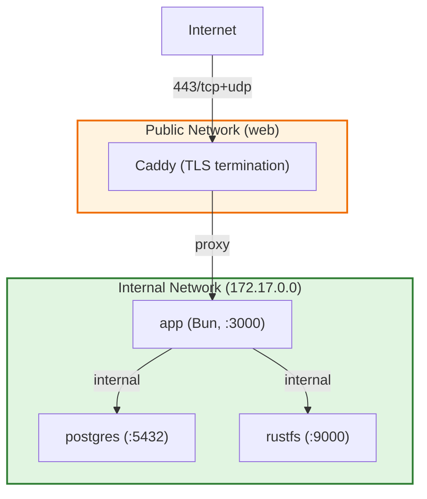

# Deployment Hardening Guide

**Version:** 2.2
**Date:** 2026-05-18

Security-focused deployment recommendations for Llamenos operators. Since Llamenos is self-hosted open-source software, the operator is responsible for infrastructure security. This document covers two deployment architectures.

**Related documents**:
- [Crypto Architecture](CRYPTO_ARCHITECTURE.md) — Cryptographic primitives and key hierarchy
- [Threat Model](THREAT_MODEL.md) — Adversary profiles, trust boundaries, and cryptographic guarantees
- [Key Revocation Runbook](KEY_REVOCATION_RUNBOOK.md) — Emergency key management procedures
- [Incident Response](INCIDENT_RESPONSE.md) — Incident response runbook

## Architecture Overview

| Architecture | Best For | Complexity | Security Surface |
|---|---|---|---|
| **Docker Compose on VPS** | Small orgs (1–10 volunteers) | Low | Single server, all services co-located |
| **Kubernetes (Helm)** | Medium-large orgs (10–100+ volunteers) | High | Multi-node, network policies, pod isolation |

Both architectures provide E2EE for call notes, messages, and transcriptions. The security of the cryptographic layer is independent of the deployment model — the server never has access to plaintext note content regardless of where it runs.

**Note**: Cloudflare Workers is NOT a deployment target for the Llamenos backend. The backend runs on Bun + PostgreSQL (self-hosted). Cloudflare Pages hosts only the marketing site at `site/wrangler.jsonc`.

---

## 1. Docker Compose on VPS (Recommended for Small Deployments)

### VPS Selection

**Recommended providers** (privacy-focused, GDPR-compliant):
- Hetzner (Germany/Finland) — good privacy track record, EU jurisdiction
- OVH (France) — EU jurisdiction, dedicated servers available
- Greenhost (Netherlands) — privacy-focused nonprofit hosting

**Avoid**:
- US-based providers subject to NSLs/FISA (unless operating under US jurisdiction)
- Providers without full-disk encryption at the hypervisor level
- Shared hosting / VPS with known noisy-neighbor attacks

**Minimum specifications**:
- 2 vCPU, 4GB RAM, 40GB SSD
- Dedicated IP (not shared)
- KVM or dedicated hardware (avoid OpenVZ — no kernel isolation)

### VPS Hardening with Ansible

Ansible playbooks at `deploy/ansible/` automate VPS hardening and deployment. The hardening playbook (`playbooks/harden.yml`) applies roles in sequence:

```bash
cd deploy/ansible
cp inventory.example.yml inventory.yml
# Edit inventory.yml with VPS IP, SSH key, domain name

ansible-playbook -i inventory.yml playbooks/harden.yml
ansible-playbook -i inventory.yml playbooks/deploy.yml
```

The hardening playbook is idempotent and applies:

#### OS-Level Hardening (role: `common`, `ssh-hardening`, `kernel-hardening`)
- **Unattended security updates** (security-only sources)
- **SSH hardening**: Keys-only auth (no passwords), custom port, `MaxAuthTries 3`, `MaxSessions 3`, `AllowUsers` whitelist, curve25519 KEX, chacha20-poly1305 ciphers
- **Kernel hardening** (sysctl):
  ```
  net.ipv4.tcp_syncookies = 1                  # SYN flood protection
  net.ipv4.conf.all.rp_filter = 1              # Strict reverse path filtering
  net.ipv4.conf.all.accept_redirects = 0        # Ignore ICMP redirects
  net.ipv4.conf.all.send_redirects = 0
  net.ipv6.conf.all.accept_redirects = 0
  net.ipv4.conf.all.log_martians = 1
  kernel.kptr_restrict = 2                      # Hide kernel pointers
  kernel.dmesg_restrict = 1
  kernel.perf_event_paranoid = 3
  kernel.unprivileged_bpf_disabled = 1          # Prevent eBPF container escape
  fs.protected_hardlinks = 1
  fs.protected_symlinks = 1
  fs.suid_dumpable = 0                          # Core dumps disabled
  ```
- **Core dump disable**: `* hard core 0` in limits.d

#### Firewall (role: `firewall`)
- UFW default deny incoming
- Allow: SSH (custom port, restricted CIDRs), 80/tcp (ACME), 443/tcp+udp (HTTPS + HTTP/3 QUIC)

#### Fail2ban (role: `fail2ban`)
- SSH jail: 3 attempts, 1-hour ban
- Aggressive jail: 3 attempts in 30 min, 24-hour ban
- UFW integration for blocking

#### Docker Hardening (role: `docker`)
- Official Docker CE from signed repository
- `userns-remap: dockremap` (user namespace isolation)
- `no-new-privileges` default security option
- JSON log driver with rotation
- Docker socket not exposed to containers

#### Security Scanning (role: `security-scan`)
- Trivy container vulnerability scanning (CRITICAL/HIGH)
- CycloneDX SBOM generation
- Automated security update timer

### Docker Compose Services

The base compose (`deploy/docker/docker-compose.yml`) runs:

| Service | Image | Network | Security |
|---------|-------|---------|----------|
| **app** | Bun (port 3000) | internal + web | Read-only rootfs, 64MB tmpfs |
| **postgres** | PostgreSQL 17-alpine (SHA256-pinned) | internal | Health checks, internal-only |
| **caddy** | Caddy 2.9-alpine | web | TLS termination, security headers |
| **rustfs** | S3-compatible storage | internal | Console API on 9001 (disable in prod) |
| **app** | Bun (port 3000) | internal + web | Built-in WebSocket endpoint at `/ws` |

Optional profiles: `--profile signal`, `--profile telephony`, `--profile monitoring`, `--profile transcription`.

The production overlay (`deploy/docker/docker-compose.production.yml`) adds:
- `security_opt: no-new-privileges:true` on all containers
- Resource limits (app: 1GB/1CPU, postgres: 512MB/1CPU, caddy: 256MB/0.5CPU)
- Watchtower for automatic image updates

### Network Isolation



### Secrets Management

```bash
# Generate secrets (NEVER commit .env to version control)
openssl rand -hex 32  # PG_PASSWORD
openssl rand -hex 32  # SERVER_SECRET (must be exactly 64 hex chars)
openssl rand -hex 32  # HMAC_SECRET (64 hex chars)

# Required in .env:
# PG_PASSWORD, ADMIN_PUBKEY, SERVER_SECRET, HMAC_SECRET
# STORAGE_ACCESS_KEY, STORAGE_SECRET_KEY, ARI_PASSWORD, BRIDGE_SECRET

chmod 600 .env
chown root:root .env
```

### Backup Strategy

The Ansible backup role (`playbooks/backup.yml`) provides automated encrypted backups:

```bash
# Database backup (encrypted with age)
docker compose exec -T postgres pg_dump -U llamenos llamenos \
  | gzip \
  | age -r "age1..." \
  > "$BACKUP_DIR/llamenos_$(date +%Y%m%d_%H%M%S).sql.gz.age"

# Rotate: keep 30 days
find "$BACKUP_DIR" -name "*.age" -mtime +30 -delete
```

Additional backup roles: `backup-postgres/`, `backup-rustfs/`, `backup-config/`, `backup-monitor/`.

### Monitoring

- **Health probes**: `/api/health/ready` and `/api/health/live` (Docker health checks at 15s intervals)
- **Lightweight monitoring**: `llamenos-healthcheck` role — polls `/api/health/ready`, sends failure alerts via ntfy
- **Full observability stack** (optional roles): Prometheus + Grafana + Loki + Alertmanager
- **Metrics endpoint**: `/api/metrics/prometheus` (bearer token protected)

---

## 2. Kubernetes Deployment (Helm Chart)

The Helm chart at `deploy/helm/llamenos/` provides production-grade Kubernetes deployment.

### Prerequisites

- Kubernetes 1.28+ with a CNI that enforces NetworkPolicy (Calico or Cilium recommended)
- Ingress controller (Caddy-ingress or Traefik recommended; nginx is NOT recommended)
- cert-manager for TLS certificate management
- External Secrets Operator or Vault for secret injection (recommended)

### Security Defaults in the Helm Chart

```yaml
# Pod security (all pods)
runAsNonRoot: true
runAsUser: 1000
allowPrivilegeEscalation: false
readOnlyRootFilesystem: true
capabilities:
  drop: [ALL]
automountServiceAccountToken: false
```

### NetworkPolicy (Enabled by Default)

```
App pod:
  Ingress: from ingress controller on 3000/tcp
  Egress: DNS (53/udp+tcp), RustFS (9000, if enabled), Whisper (8080, if enabled),
          PostgreSQL (external, configurable port), External HTTPS (443)

RustFS pod:
  Ingress: from app pod only (9000/tcp)
  Egress: none
```

> **Note:** The Strfry/Nostr relay pod was removed. The WebSocket event relay is now built into the app server at `/ws`. There is no separate relay service or pod. The Helm chart's `networkpolicy.yaml` reflects this — no Strfry rules exist.

### Health Probes

- **Liveness**: `/api/health/live` (15s interval, 3 retries)
- **Readiness**: `/api/health/ready` (10s interval, 3 retries)
- **Startup**: `/api/health/live` (5s interval, 30 retries = 150s grace period)

### Required Values

```yaml
# values.yaml — minimum for production
app:
  replicas: 2
  env:
    ENVIRONMENT: production

postgres:
  host: "your-rds-instance.region.rds.amazonaws.com"

ingress:
  enabled: true
  className: ""  # Caddy-ingress or Traefik; nginx NOT recommended
  hosts:
    - host: hotline.yourdomain.org
  tls:
    - secretName: llamenos-tls
      hosts: [hotline.yourdomain.org]

networkPolicy:
  enabled: true

autoscaling:
  enabled: false
  minReplicas: 2
  maxReplicas: 10
  targetCPU: 70
  targetMem: 80
```

### Hardening Checklist

- [ ] Enable etcd encryption at rest (for Kubernetes Secrets)
- [ ] Use External Secrets Operator or Vault — never store secrets in plaintext `values.yaml`
- [ ] PodDisruptionBudget configured (Helm template: `pdb.yaml`)
- [ ] HPA configured if running multiple replicas (Helm template: `hpa.yaml`)
- [ ] Enable audit logging on the Kubernetes API server
- [ ] `helm lint` passes
- [ ] `kubectl` access restricted with RBAC

---

## Secure Ingress (Caddy)

Caddy is the reverse proxy and TLS termination layer for all deployments.

### Why Caddy (Not nginx)

| Feature | Caddy | nginx |
|---------|-------|-------|
| Automatic ACME/Let's Encrypt | Built-in, zero-config | Requires certbot |
| OCSP stapling | Automatic | Manual configuration |
| HTTP/2 + HTTP/3 | Default | HTTP/3 requires rebuild |
| Memory safety | Go | C (memory-unsafe) |
| WebSocket proxy | Automatic detection | Requires explicit headers |

### Development Caddyfile (`deploy/docker/Caddyfile`)

Single-origin setup with security headers:
```
Strict-Transport-Security: max-age=63072000; includeSubDomains; preload
X-Content-Type-Options: nosniff
X-Frame-Options: DENY
Referrer-Policy: strict-origin-when-cross-origin
Content-Security-Policy: default-src 'self'; script-src 'self'; style-src 'self' 'unsafe-inline'; connect-src 'self' wss://{domain}/WebSocket
Permissions-Policy: camera=(), microphone=(self), geolocation=(), payment=(), usb=()
Server: (removed)
```

### Production Caddyfile (`deploy/docker/Caddyfile.production`)

**Tier 4 split-origin architecture** with 5 distinct domains:

| Domain | Purpose | Key CSP |
|--------|---------|---------|
| `app.{domain}` | SPA static files | `script-src 'self'`; COEP: require-corp |
| `api.{domain}` | Backend API + WebSocket | Rate limiting: 10r/m auth, 5r/m register |
| `crypto.{domain}` | Sandboxed crypto iframe | **`connect-src 'none'`** (HARD INVARIANT — zero network access) |
| `downloads.{domain}` | Desktop release artifacts | `script-src 'none'` |
| `updates.{domain}` | Tauri updater metadata | CORS for app.* only |

The `crypto.{domain}` origin enforces `connect-src 'none'` — the crypto iframe cannot make any network requests. This is a defense-in-depth measure ensuring that even if the crypto code is compromised, it cannot exfiltrate keys.

---

## WebSocket Operations

The API server provides a built-in WebSocket endpoint at `/ws` for real-time event delivery (call notifications, presence, typing indicators). No separate relay service is required.

### Configuration

The WebSocket endpoint is configured via environment variables:
- `SERVER_SECRET`: 64-hex-char root secret from which the server derives its event signing key
- `WS_MAX_PAYLOAD_SIZE`: Max event payload size (default: 64KB)
- `WS_EPOCH_ROTATION_HOURS`: Event encryption key rotation interval (default: 24 hours)

### Authentication

Clients authenticate to the WebSocket using the same session token or signed auth token used for REST API requests:

1. Client opens WebSocket connection to `wss://api.example.com/ws`
2. Client sends auth message with session token or signed challenge
3. Server verifies auth and associates connection with user identity
4. Server pushes hub-scoped events to which the user has access

### Security Properties

- **Server-only publishing**: Only the server publishes events — clients receive only
- **Content encryption**: All event content encrypted with epoch-rotating server event key (XChaCha20-Poly1305 + HKDF, 24h epoch rotation) with per-hub key scoping
- **Auth verification**: All connections must authenticate before receiving events
- **Hub scoping**: Events are filtered server-side — clients only receive events for hubs they are members of

### Blast/Broadcast Rate Limiting

The blast system sends bulk messages to subscriber lists. Rate limiting is configured per-hub via the admin UI (stored in `blast_settings` table) with the following defaults:

| Setting | Default | Description |
|---------|---------|-------------|
| `maxBlastsPerDay` | 10 | Maximum blast sends per hub per calendar day |
| `rateLimitPerSecond` | 10 | Global message send rate (across all channels) |
| `rateLimits.sms` | 10/s | Per-channel send rate |
| `rateLimits.whatsapp` | 25/s | Per-channel send rate |
| `rateLimits.signal` | 15/s | Per-channel send rate |
| `rateLimits.rcs` | 10/s | Per-channel send rate |
| `rateLimits.telegram` | 20/s | Per-channel send rate |

**Security guidance**:
- Keep `maxBlastsPerDay` at the minimum necessary for your operational needs. Lower values reduce the blast radius if an admin account is compromised.
- Ensure telephony provider accounts have sending limits configured independently (Twilio messaging limits, etc.) as a defense-in-depth measure.
- `doubleOptIn: false` is the default but **enable double opt-in** for subscriber lists containing sensitive demographics to reduce spoofed subscriptions.
- Monitor `blast_deliveries` table for unexpected delivery spikes — anomalous patterns indicate possible abuse.

### Signal-First Delivery Configuration

The messaging delivery router (`apps/worker/messaging/delivery-router.ts`) supports two configuration keys in hub messaging config:

| Key | Default | Purpose |
|-----|---------|---------|
| `preferSignalDelivery` | `true` | Route to Signal when recipient is registered; fallback to SMS/other on failure |
| `smsContentMode` | `'notification-only'` | When `'notification-only'`, SMS body is replaced with a generic "new message" notification; full content sent only via Signal or WhatsApp |

`smsContentMode: 'notification-only'` is the default. This means SMS recipients see "You have a new message" instead of the message body, preventing message content from appearing in SMS provider logs. Set to `'full'` only if you accept provider-side plaintext exposure.

### Signal-Notifier Hardening

The signal-notifier sidecar (`--profile signal`) has been hardened with:

| Feature | Configuration |
|---------|--------------|
| **Database** | PostgreSQL (migrated from SQLite) — auto-creates `signal_identifiers` and `signal_audit_log` tables |
| **Rate limiting** | Sliding window per-IP: `/register-client` 10 req/60s, `/notify` 30 req/60s |
| **Audit logging** | All actions (register, unregister, notify, rate_limited) logged to `signal_audit_log` with indexed `created_at` and `identifier_hash` |
| **Auth** | Timing-safe bearer token comparison; supports token rotation (current + previous key for zero-downtime rotation) |
| **Registration** | HMAC-verified registration tokens with expiry check |

The sidecar connects to the same PostgreSQL instance as the main app. Ensure `SIGNAL_NOTIFIER_BEARER_TOKEN` matches between the app and sidecar configurations.

### Internal TLS

The `internal-tls` Ansible role generates a self-signed CA and per-host certificates for cross-host service communication (PostgreSQL, RustFS). Certificates include DNS SAN + IP SAN, valid for 1 year.

---

## Key Management

1. **Admin device keys**: Generated via `bun run bootstrap-admin` on a trusted device. Store securely (HSM or hardened device). Admin has separate Ed25519 signing and X25519 encryption keys.

2. **Server secret**: `openssl rand -hex 32`. Set as `SERVER_SECRET`. Must be exactly 64 hex chars. Server derives its event signing keypair via HKDF.

3. **Hub key**: Random 32 bytes, generated by admin client during hub setup. HPKE-wrapped per member (label: `LABEL_HUB_KEY_WRAP`). Rotation handled via admin UI — see [Key Revocation Runbook, Section 4](KEY_REVOCATION_RUNBOOK.md#4-hub-key-rotation-ceremony).

4. **User onboarding**: Invite system. Each user generates their own Ed25519/X25519 device keys during onboarding. Device authorized via sigchain entry signed by an existing authorized device.

5. **Device decommissioning**: Deactivate user → revoke sessions → deauthorize device via sigchain → rotate hub key → rotate PUK (exclude departed user). See [Key Revocation Runbook](KEY_REVOCATION_RUNBOOK.md).

---

## Reproducible Build Verification

```bash
scripts/verify-build.sh [version]

# Manual:
git checkout v1.0.0
docker build -f Dockerfile.build -t llamenos-verify .
docker run --rm llamenos-verify cat /app/CHECKSUMS.txt
# Compare against CHECKSUMS.txt in GitHub Release
```

Trust anchor is the **GitHub Release** (not the running application). CI generates `CHECKSUMS.txt` (SHA-256), SLSA provenance attestation, and SBOM.

---

## Regular Maintenance

| Task | Frequency | How |
|------|-----------|-----|
| OS security updates | Daily (automated) | `unattended-upgrades` or Ansible |
| Container vulnerability scan | Weekly | Trivy via `security-scan` role |
| Dependency audit | Weekly | `bun audit` / `cargo audit` |
| TLS certificate renewal | Automatic | Caddy / cert-manager |
| Database backups | Daily | Ansible backup roles (encrypted with age) |
| Audit log review | Weekly | Admin panel or database query |
| Key rotation (telephony) | Quarterly | Regenerate provider API keys |
| Docker image updates | Monthly | Pull latest pinned images, rebuild |
| Penetration testing | Annually | Engage external security firm |
| Hub key rotation | On departure + quarterly | Admin UI or CLI |

---

## Compliance Notes

### GDPR (EU)

- **Data controller**: The organization operating the hotline
- **Data processor**: VPS hosting provider
- **Data processing agreement**: Required with the hosting provider
- **Right to erasure**: Admin can delete user accounts and notes. Sigchain deauthorization is permanent.
- **Data minimization**: Phone numbers hashed, caller numbers not stored in plaintext, blind indexes for CMS search
- **Encryption**: E2EE for notes satisfies Article 32 (security of processing)
- **Breach notification**: 72-hour window — monitor audit logs for unauthorized access

### HIPAA (US, if applicable)

- Llamenos does NOT claim HIPAA compliance out of the box
- E2EE notes satisfy encryption at-rest and in-transit requirements
- Audit logging satisfies some HIPAA requirements
- Additional BAAs with hosting providers required if used in healthcare context

---

## Revision History

| Date | Version | Changes |
|------|---------|---------|
| 2026-05-18 | 2.2 | EP01–EP09 update: removed stale Strfry/Nostr relay pod from Kubernetes NetworkPolicy section (relay is now built-in WebSocket at /ws, no separate pod); added blast/broadcast rate limiting configuration guidance (maxBlastsPerDay, per-channel limits, security recommendations) |
| 2026-05-03 | 2.1 | Post-hardening: updated WebSocket section for built-in endpoint (no separate relay); corrected event age limits (300s, not 24h); Signal-first delivery and SMS notification-only mode config; updated hub event encryption cipher (XChaCha20-Poly1305 + epoch rotation) |
| 2026-05-02 | 2.0 | Complete rewrite: removed Cloudflare Workers section (backend is Bun+PostgreSQL, not CF Workers), updated to match actual deploy/ configs (Ansible roles, Docker Compose overlays, Helm templates, Caddyfile.production), HPKE replaces ECIES, device keys replace nsec, added sigchain/PUK references, added split-origin production Caddyfile, added internal TLS, added security scanning role |
| 2026-02-25 | 1.2 | Added Caddy section, WebSocket operations, reproducible builds |
| 2026-02-23 | 1.0 | Initial deployment hardening guide |
