# Llamenos Threat Model

## Document Purpose

This document defines the threat model for Llamenos, a secure crisis response hotline app. It identifies adversaries, attack surfaces, trust boundaries, and the security properties the system must maintain. All architectural decisions and security controls are evaluated against this model.

**Related Documents**:
- [Security Overview](README.md) — Entry point for security auditors
- [Crypto Architecture](CRYPTO_ARCHITECTURE.md) — Cryptographic primitives, key hierarchy, protocols
- [Data Classification](DATA_CLASSIFICATION.md) — Complete data inventory with encryption status
- [Protocol Specification](../protocol/PROTOCOL.md) — Wire formats and API contracts
- [Deployment Hardening](DEPLOYMENT_HARDENING.md) — Infrastructure security guidance
- [Security Gaps and Roadmap](SECURITY_GAPS_AND_ROADMAP.md) — Known gaps and planned improvements

## Protected Assets

| Asset | Classification | Storage Location | Protection |
|-------|---------------|-----------------|------------|
| Caller phone numbers | PII / Safety-Critical | Hashed in PostgreSQL | HMAC-SHA256 with operator secret; last 4 digits stored plaintext for display |
| Call note content | Confidential | Encrypted in PostgreSQL | E2EE: per-note AES-256-GCM, HPKE key wrapping (RFC 9180) |
| Volunteer identity (name, phone) | PII / Safety-Critical | Encrypted at rest in PostgreSQL | Visible only to admins; never exposed to other users or callers |
| Device private keys | Secret | Platform secure storage (Tauri Store / iOS Keychain / Android Keystore) | Argon2id (64MB/3/4) + AES-256-GCM; private keys never leave Rust layer |
| Admin device keys | Secret | Operator-managed (platform secure storage, HSM) | Never stored server-side; separate signing and encryption keypairs |
| Session tokens | Secret | Client memory, PostgreSQL (server) | 256-bit random, 8-hour TTL, revocable |
| User sigchain | Integrity-Critical | PostgreSQL | Append-only, hash-chained, Ed25519-signed device authorization log |
| PUK seed | Secret | HPKE-wrapped per device, stored server-side | Per-user key hierarchy with cascading lazy key rotation (CLKR) |
| Hub key | Secret | HPKE-wrapped per member, client memory | Random 32 bytes; rotated on member departure |
| Audit logs | Operational | PostgreSQL | Admin-only access; IP hashes truncated to 96 bits; SHA-256 hash chain |
| Telephony credentials | Secret | Environment variables / Kubernetes Secrets | Never in source control; never sent to client |
| Recovery group shares | Secret | HPKE-wrapped per share holder, stored server-side | Shamir K-of-N; below-threshold shares reveal zero information |
| Blast delivery records | Operational | PostgreSQL | Delivery status per recipient; message content is E2EE |
| Entity evidence chains | Integrity-Critical | PostgreSQL (E2EE content, plaintext chain metadata) | Hash-linked custody chain; evidence content HPKE-wrapped |
| Team/tag assignments | Encrypted-at-Rest | PostgreSQL | Team names hub-key encrypted; tag labels hub-key encrypted; slugs plaintext |
| Platform ban records | Hashed | PostgreSQL | HMAC-SHA256 phone hashes; cross-hub aggregation for multi-number harassers |
| Device wipe confirmations | Operational | PostgreSQL | Signed wipe acknowledgments (`LABEL_DEVICE_WIPE_SIG`) |
| SAS verification records | Integrity-Critical | PostgreSQL | Verifier-signed audit entry; global per-device scope |
| Role definitions (platform) | E2EE | PostgreSQL | Per-admin HPKE envelopes for name/description (`LABEL_PLATFORM_ROLE_NAME_ENCRYPT`) |
| Role definitions (hub) | E2EE | PostgreSQL | Hub-key encrypted name/description (`LABEL_HUB_ROLE_ENCRYPT`) |
| Erasure config | Plaintext | PostgreSQL | Per-hub delay hours; platform-enforced minimum floor |

## Adversary Profiles

### Tier 1: Nation-State Actor

**Capabilities**: TLS interception via national CA, ISP-level traffic analysis, physical device seizure, legal compulsion of hosting/cloud providers, advanced persistent threats against CI/CD, social engineering of developers/operators.

**Goals**: Identify callers (political dissidents, activists). Identify volunteers. Obtain call note content. Disrupt hotline operations.

**Mitigations**:
- E2EE notes with forward secrecy — per-note random key, HPKE-wrapped; server compromise reveals nothing
- Per-device Ed25519/X25519 keys — no single "identity key" to compromise; device deauthorization via sigchain
- PIN-encrypted device keys — physical seizure requires PIN brute-force (Argon2id 64MB/3/4 — GPU/ASIC resistant)
- Auto-lock on idle — limits physical access window
- 87 domain separation labels — prevents cross-context key reuse (Albrecht defense)
- HPKE label enforcement at decrypt — label mismatch causes immediate rejection before decryption
- Certificate pinning scaffolding (iOS/Android) — pins to be populated after first production deployment
- Sigchain device revocation — compromised devices can be deauthorized without affecting other devices
- Recovery group key escrow with Shamir threshold — account recovery without single-point trust
- Active re-encryption on departure — envelope copies for departed users are removed, not just access-revoked
- Remote device wipe — server-pushed key destruction for compromised devices
- Crypto-shredding for erasure — per-user audit envelope key destroyed, rendering audit details unreadable while preserving hash chain integrity

**Residual risks**:
- PIN/passphrase entropy: numeric PIN (minimum 8 digits, ~26.6 bits) or alphanumeric passphrase (minimum 8 characters with at least one letter, ~47+ bits for mixed case + digits). Argon2id (64MB/3/4) materially increases offline brute-force cost — but seized encrypted blob + sufficient GPU resources can still crack weak credentials. Alphanumeric passphrase is strongly recommended for high-threat environments
- Caller phone numbers are transiently available to answering volunteers during active calls
- Traffic analysis can reveal call timing, duration, and volunteer activity patterns (hub event padding partially mitigates size analysis)
- Legal compulsion of hosting provider yields encrypted blobs (but not decryption keys)
- Certificate pinning is not yet active (scaffolding only) — mobile apps rely on standard TLS validation
- Blast/broadcast messages sent via SMS/WhatsApp are visible to telephony providers in bulk — high-volume sends increase exposure window
- Recovery group share holders could be coerced simultaneously in a coordinated seizure — mitigated by configurable delay and duress detection, but K-of-N colluding share holders can reconstruct the recovery key

### Tier 2: Private Intelligence / Hacking Firm

**Capabilities**: Targeted phishing, watering-hole attacks, 0-day browser exploits, insider recruitment, social engineering.

**Goals**: Same as Tier 1 but typically contracted by specific interests. May target individual volunteers or admins.

**Mitigations**:
- WebAuthn passkeys — phishing-resistant authentication
- Tauri isolation pattern — crypto operations in sandboxed Rust backend, never in webview
- CSP `script-src 'self'` — limits XSS payload injection
- Session revocation on role change/deactivation — compromised accounts can be cut off
- Invite-code system — no open registration; requires admin approval
- Webhook signature validation — prevents telephony API spoofing
- Device keys never enter webview — private keys stay in Rust CryptoState (desktop) or MobileState (iOS/Android)
- SAS emoji verification — out-of-band device identity confirmation prevents server-side key substitution during provisioning
- Permission-based access control (PBAC) — granular permission catalog replaces role-name checks; multi-role union model
- Recovery group with sigchain-anchored pubkey — prevents server from substituting a malicious recovery key
- Blast rate limiting — per-channel rate limits and delivery queue prevent abuse of bulk messaging

**Residual risks**:
- WebAuthn enforcement settings exist but may not be wired into auth middleware (see [Security Gaps](SECURITY_GAPS_AND_ROADMAP.md#15-webauthn-enforcement-settings-low))
- iOS DEBUG blocks in security-critical paths could expose mock identities if compiled into production (see [Security Gaps](SECURITY_GAPS_AND_ROADMAP.md#4-ios-debug-code-in-production-paths-medium))
- Imported permission templates could grant excessive permissions if admin does not review before applying

### Tier 3: Opportunistic Attacker / Script Kiddie

**Capabilities**: Known CVE exploitation, credential stuffing, automated scanning.

**Goals**: Disruption, data theft, defacement.

**Mitigations**:
- Rate limiting on all auth endpoints
- Voice CAPTCHA for call spam
- SHA-pinned GitHub Actions
- `--frozen-lockfile` dependency installation
- HSTS preload + security headers
- Non-root container execution with `no-new-privileges`
- Single Rust crypto crate — minimal supply chain surface for cryptographic operations
- Blast delivery queue with per-channel rate limiting — prevents SMS/telephony credit exhaustion
- Cross-hub ban aggregation — platform-scoped bans block multi-number harassers across all hubs
- Tag creation gated by permissions — prevents unauthorized taxonomy manipulation

## Trust Boundaries

```mermaid
flowchart TB
    subgraph UNTRUSTED["🌐 UNTRUSTED"]
        direction LR
        PSTN["Callers (PSTN)"]
        Internet["Public Internet"]
        Provider["Hosting Provider"]
        MsgProviders["SMS/WhatsApp/Telegram/RCS Providers"]
    end

    subgraph SEMI["🔒 SEMI-TRUSTED"]
        direction TB
        Server["Bun HTTP Server (Hono) + PostgreSQL"]
        API["Hono API → Auth MW → Perm MW → Route Handler"]
        DB["PostgreSQL<br/>(encrypted blobs, hashed identifiers)"]
        BlastQueue["Blast Delivery Queue<br/>(rate-limited, per-channel)"]
        ErasureEngine["Erasure Engine<br/>(crypto-cascade, re-encryption jobs)"]
        RecoveryRelay["Recovery Session Relay<br/>(HPKE ciphertext only)"]
        ServerMeta["Server can see: metadata, delivery status, team/tag IDs, ban hashes"]
        ServerCant["Server CANNOT see: note content, role names, entity fields, recovery shares"]
    end

    subgraph SIDECAR["🔐 SIDECAR (Zero-Knowledge)"]
        SignalNotifier["Signal Notifier (port 3100)<br/>HMAC-hashed contact resolution"]
    end

    subgraph TRUSTED["✅ TRUSTED"]
        direction TB
        Client["Client App (Tauri Desktop / iOS / Android)"]
        DevKey["Device Key Manager"]
        Crypto["Crypto (Rust)<br/>HPKE + AES-GCM + Shamir"]
        Auth["Auth Context<br/>Ed25519 / WebAuthn"]
        ClientNote["Decrypted content exists ONLY here, in memory, while unlocked"]
        ClientKey["Device private keys NEVER leave the Rust layer"]
        SASVerify["SAS Emoji Verification<br/>(out-of-band device identity)"]
    end

    PSTN -->|Telephony Webhooks| Server
    Internet -->|HTTPS / WSS| Server
    Provider -->|Infrastructure Access| Server
    MsgProviders -->|Messaging Webhooks| Server

    Server -->|E2EE payloads| Client
    Server -->|HPKE-wrapped key blobs| Client
    Server -->|Blast delivery| MsgProviders
    Server -->|Signal messages| SignalNotifier

    Server --- API
    API --- DB
    Server --- BlastQueue
    Server --- ErasureEngine
    Server --- RecoveryRelay
    Server --- ServerMeta
    Server --- ServerCant

    Client --- DevKey
    Client --- Crypto
    Client --- Auth
    Client --- ClientNote
    Client --- ClientKey
    Client --- SASVerify
```

### Boundary Rules

1. **PSTN → Server**: All telephony webhooks MUST be signature-validated (Twilio HMAC-SHA1, Vonage HMAC-SHA256, etc.). Caller numbers are hashed on receipt; only last-4 digits retained in call records.

2. **Internet → Server**: All API requests require Ed25519 or WebAuthn session authentication (except `/api/config`, `/api/auth/login`, `/api/auth/bootstrap`). CORS restricts to same-origin. Security headers enforced on all responses.

3. **Server → Client**: The server NEVER sends plaintext note content, transcription text, or file data. All sensitive data is HPKE-wrapped for the recipient's X25519 pubkey before storage.

4. **Client → Server**: The client sends HPKE-encrypted payloads only. Exception: `plaintextForSending` in messaging (SMS/WhatsApp require server-side plaintext to reach the provider — documented and accepted).

5. **Hosting Provider**: The hosting provider can access encrypted blobs, metadata, and traffic patterns. They CANNOT decrypt E2EE content without device private keys.

6. **Messaging Providers → Server**: Inbound messaging webhooks (SMS, WhatsApp, Telegram, RCS) are signature-validated per provider. Server encrypts message content immediately on receipt and discards plaintext. Outbound blast messages pass through providers in plaintext (inherent channel limitation).

7. **Signal Notifier Sidecar**: Zero-knowledge intermediary. Resolves contacts via HMAC-hashed identifiers. Never stores plaintext phone numbers. Authenticated via shared bearer token (`SIGNAL_NOTIFIER_BEARER_TOKEN`).

8. **Recovery Session Relay**: Server stores and relays only HPKE ciphertext during recovery ceremonies. Share contributions are HPKE-sealed directly to the recovering user's new device pubkey. Server cannot read shares, reconstruct the recovery group private key, or access PUK seeds.

## Attack Surface Inventory

### External Attack Surface

| Surface | Entry Point | Auth Required | Validation |
|---------|------------|---------------|------------|
| Login | `POST /api/auth/login` | No | Ed25519 signature + rate limit |
| Bootstrap | `POST /api/auth/bootstrap` | No | Ed25519 signature + one-shot guard + rate limit |
| Config | `GET /api/config` | No | Read-only; exposes server WebSocket pubkey |
| Telephony webhooks (10 endpoints) | `POST /telephony/*` | Webhook signature | Provider-specific HMAC |
| Messaging webhooks | `POST /messaging/*` | Webhook signature | Provider-specific validation |
| All other API endpoints | `*/api/*` | Ed25519 or Session | Auth + permission middleware |
| IVR audio | `GET /api/ivr-audio/*` | No | Strict regex on path params |
| Recovery initiation | `POST /api/recovery/initiate` | No (Signal-verified) | Signal OTP via sidecar + rate limit + configurable delay |
| Dev endpoints | `POST /api/test-*` | No (env-gated) | `ENVIRONMENT=development` check + `DEV_RESET_SECRET` |

### Internal Attack Surface (Post-Authentication)

| Surface | Risk | Mitigation |
|---------|------|------------|
| User → Admin escalation | Role modification | Safe-fields allowlist on self-update; `roles` requires `volunteers:update` permission |
| User → Other user's notes | Note content theft | E2EE — server has no plaintext; `notes:read-own` permission scoping; per-note HPKE wrapping |
| User → Caller identification | PII exposure | Caller numbers hashed; only `callerLast4` sent to answering volunteer; redacted for others |
| Admin → Excessive data access | Insider threat | Audit logging of all admin actions; admin notes are separately encrypted |
| WebSocket event injection | Fake call events | Server-signed events (clients verify server pubkey) + authenticated connections + hub key encryption |
| Device compromise → Other devices | Lateral movement | Sigchain-based device authorization — compromised device can be deauthorized without affecting others |
| Blast message injection | Mass spam/phishing via bulk send | Permission-gated (`blasts:create`); per-channel rate limiting; delivery queue with status tracking |
| Team membership manipulation | Privilege escalation via team join | `teams:manage` permission required; audit log entry for every membership change |
| Tag-based information disclosure | Leak organizational taxonomy | Tag labels hub-key encrypted; server sees only slugs and HMAC blind indexes |
| Permission template import | Excessive privilege grant | Templates arrive as plaintext suggestions; admin must review and approve each permission before role creation |
| Recovery group share collusion | PUK seed reconstruction | K-of-N Shamir threshold; configurable delay with rejection window; duress detection; sigchain-anchored group pubkey |
| Entity relationship manipulation | False evidence chain links | Evidence custody chain with hash-linked entries; all evidence operations audit-logged |
| Account erasure abuse | Coerced or premature data destruction | Configurable delay (24h–7d); emergency override requires co-approver Ed25519 signature; 4h hard minimum floor |
| Device wipe abuse | Unauthorized remote key destruction | Wipe requires `erasure:admin` permission; signed wipe confirmation (`LABEL_DEVICE_WIPE_SIG`); audit-logged |
| Cross-entity data leakage | Information leak between entity types | Entity records scoped to hub; 3-tier envelope model (summary/fields/pii) limits decryption surface per permission tier |
| Role name reconnaissance | Organizational structure disclosure | Platform role names per-admin HPKE encrypted; hub role names hub-key encrypted; server never sees plaintext |
| SAS verification MITM | False device identity confirmation | SAS derived from both pubkeys + out-of-band nonce; HKDF with `LABEL_SAS_DERIVE`; nonce never relayed via server |
| Shift schedule information leak | Volunteer activity pattern disclosure | Shift names hub-key encrypted; clock-in heartbeat is server-side only; shift times plaintext for routing (accepted) |

## Cryptographic Properties

### What We Guarantee

| Property | Mechanism | Strength |
|----------|-----------|----------|
| Note confidentiality | AES-256-GCM with random per-note key | 256-bit symmetric |
| Note integrity | GCM authentication tag | 128-bit |
| Note forward secrecy | HPKE encapsulation per note + per recipient | X25519 |
| Key-at-rest confidentiality | Argon2id (64MB/3/4) + AES-256-GCM | ~20–27 bits PIN + 256-bit key; GPU/ASIC resistant |
| Auth token unforgeability | Ed25519 signatures | 128-bit security level |
| Session token unpredictability | `crypto.getRandomValues(32)` | 256-bit |
| Phone hash preimage resistance | HMAC-SHA256 with operator secret | Infeasible without HMAC secret |
| Cross-context key reuse prevention | 87 domain separation labels + Albrecht defense | Label enforced at decrypt |
| Recovery share secrecy | Shamir GF(2^8) — below-threshold shares reveal zero information | Information-theoretic |
| Recovery group integrity | Group pubkey anchored to user sigchain + share holder cross-signatures | Tamper-evident, server cannot substitute |
| Erasure completeness | Crypto-shredding — per-user audit key destroyed; active re-encryption removes departed envelopes | Forward-secure revocation |
| Entity field confidentiality | 3-tier envelope model (summary/fields/pii) per entity | Per-tier HPKE wrapping |
| Role metadata confidentiality | Platform roles: per-admin HPKE; Hub roles: hub-key symmetric | Domain-separated labels |
| Device authorization integrity | Sigchain — append-only, hash-chained, Ed25519-signed | Tamper-evident |
| User key forward secrecy | PUK with CLKR — key rotation without re-encrypting historical data | Per-generation isolation |

### What We Do NOT Guarantee

| Gap | Reason | Acceptable? |
|-----|--------|------------|
| Traffic analysis (full) | Hub events padded to power-of-2 buckets; API payloads not padded; no dummy traffic | Partial — hub event sizes hidden; call pattern timing still visible |
| Metadata confidentiality | Server needs `callId`, `authorPubkey`, timestamps; caller number is HMAC-hashed; User-Agent is SHA-256 hashed; country not stored | Improved — less metadata retained than before; routing metadata unavoidable |
| SMS/WhatsApp E2EE | Provider requires plaintext during send; Signal-first routing used when available; SMS notification-only mode omits body content | Partial — Signal routing eliminates provider visibility when applicable |
| PIN/passphrase brute-force resistance (offline) | Argon2id (64MB, 3 iter, 4 lanes) + minimum 8-digit PIN (~26.6 bits) or alphanumeric passphrase (~47+ bits for mixed case + digits) | Significantly improved — GPU/ASIC attack substantially more expensive than PBKDF2. Alphanumeric passphrase strongly recommended |
| Server-side key deletion verification | Cannot prove hosting provider deleted data | Yes — fundamental cloud trust limitation |
| WebSocket metadata privacy | Server handles all event distribution; authenticated connections only; content epoch-encrypted per hub | Improved — event injection blocked; content hidden; connection metadata visible to server only |
| Certificate pinning | Scaffolding only; placeholder pins on mobile | No — pins must be populated after first production deployment |
| SFrame media encryption | Key derivation implemented; per-frame AES-128-CTR + HMAC not yet complete | No — voice E2EE is not end-to-end complete |

## Legal Compulsion and Subpoena Scenarios

This section documents what data can be obtained through legal process against various parties. Crisis hotlines operating in hostile legal environments should understand these limitations.

### Subpoena of Hosting Provider (VPS)

**Obtainable:**
- Encrypted database contents (ciphertext for E2EE data)
- Plaintext metadata: call timestamps, durations, volunteer assignments, call IDs
- Caller phone hashes (irreversible without operator's HMAC secret)
- Audit logs with truncated IP hashes
- Traffic metadata (request times, sizes, source IPs)
- Account information for the operator

**Also obtainable (new with EP01-EP09):**
- Blast delivery status records (recipient hashes, delivery timestamps, channel, status per delivery)
- Team and tag IDs, slugs, and membership associations (names are hub-key encrypted — ciphertext only)
- Erasure request metadata (timestamps, delay configuration, co-approver pubkey)
- Recovery session metadata (session ID, share holder pubkeys, contribution timestamps — not share content)
- Entity relationship metadata (record IDs, parent-child links, evidence chain hashes)
- Device wipe records (device ID, wipe timestamp, acknowledgment status)
- SAS verification records (verifier pubkey, target device ID, verification timestamp)
- Platform ban hashes (cross-hub aggregated HMAC-SHA256 phone hashes)

**Not Obtainable:**
- Note content, transcription text, report bodies (E2EE — provider has ciphertext only)
- Device private keys (stored client-side in platform secure storage, never uploaded)
- Per-note encryption keys (ephemeral, never persisted)
- PUK seeds (HPKE-wrapped for each device — server has ciphertext only)
- Operator's HMAC secret (not stored with hosting provider)
- Recovery group shares (HPKE-wrapped per share holder — server has ciphertext only)
- Role names and descriptions (E2EE — per-admin HPKE for platform roles, hub-key encrypted for hub roles)
- Team names, tag labels, tag categories (hub-key encrypted)
- Entity field values (3-tier HPKE envelope encryption)
- Blast message content (E2EE envelope encryption; only delivery metadata is plaintext)

### Subpoena of Telephony Provider (Twilio, SignalWire, etc.)

**Obtainable:**
- Call detail records (timestamps, phone numbers, durations)
- Call recordings (if recording is enabled — **Llamenos does NOT enable recording by default**)
- SMS message content (passes through provider in plaintext)
- WhatsApp message content (passes through Meta)
- Account and billing information
- **Blast/broadcast message content** sent via SMS, WhatsApp, Telegram, or RCS (passes through provider in plaintext during delivery). A single blast to 1,000 recipients produces 1,000 provider-visible messages. Signal-routed blasts are E2EE and not visible to the telephony provider.

**Not Obtainable:**
- Call notes (never sent to telephony provider)
- Volunteer identities beyond phone numbers used for call routing
- Any E2EE content
- Blast recipient list or delivery status (held server-side only)

### Device Seizure (Volunteer)

**Without PIN:**
- Encrypted key blob in platform secure storage requires PIN/passphrase brute-force
- Argon2id (64MB, 3 iterations, 4 parallelism) + minimum 8-digit or alphanumeric passphrase = substantially harder than PBKDF2 on GPU hardware; Argon2id's memory cost makes ASIC/GPU attacks significantly more expensive
- Session tokens may still be valid if device was recently used (8-hour TTL)
- Sigchain is public (device pubkeys are visible) but does not contain private keys

**With PIN (or successful brute-force):**
- Access to that user's decrypted notes (via author envelope)
- Cannot decrypt other users' notes (separate keypairs, per-note HPKE wrapping)
- Per-note forward secrecy: compromising device key requires also obtaining the per-note HPKE envelopes from the server
- PUK seed for current generation — can walk CLKR chain to decrypt historical notes

**Mitigations:**
- Enable device full-disk encryption
- Use alphanumeric passphrase (stronger than minimum 8-digit PIN)
- Enable auto-lock on shorter timeout
- Admin can remotely deauthorize device via sigchain + revoke sessions
- Admin can trigger remote device wipe — server pushes key destruction + data wipe to the seized device (EP08)
- Hub key rotation on departure excludes seized device
- Argon2id (64MB/3/4) applied automatically — no user action required
- If seizure is detected, admin can initiate immediate account erasure with cryptographic cascade — hub keys rotated, PUK envelopes deleted, active re-encryption removes departed user's envelope copies

### Device Seizure (Admin)

**Impact if admin device keys are obtained:**
- Can decrypt all notes (admin envelope exists on every note)
- Can decrypt all messages (admin envelope on every message)
- Cannot impersonate other users (separate device keypairs)

**Mitigations:**
- Store admin device on hardened platform with strong PIN/biometrics
- Use YubiKey or similar for admin WebAuthn authentication
- Implement admin key rotation procedures (see [Key Revocation Runbook](KEY_REVOCATION_RUNBOOK.md))
- Consider hardware security module (HSM) for admin key storage

### Insider Threat (Malicious Operator)

A malicious operator with server access can:
- Read all plaintext metadata
- Modify server code to capture data before encryption (requires deployment access)
- Access HMAC secret to reverse phone hashes
- Cannot decrypt E2EE content without device private keys

**Mitigations:**
- Reproducible builds allow verification of deployed code
- Multi-party deployment approval
- Audit logging of all server access
- Sigchain provides tamper-evident record of device authorizations

## Deployment-Specific Threats

### Self-Hosted Deployment (Docker Compose / Kubernetes)

- **Operator as trusted party**: The operator has full access to the server, database, and secrets. They cannot read E2EE content without device private keys.
- **VPS provider access**: The hosting provider can image the VM, access disk, and intercept network traffic. TLS + E2EE provides defense-in-depth.
- **PostgreSQL security**: Database credentials, TLS for connections, encrypted backups are the operator's responsibility.
- **Reverse proxy configuration**: Caddy provides TLS termination and security headers. Misconfiguration (e.g., HTTP without redirect) would expose session tokens.

### Kubernetes Deployment

- **NetworkPolicy enforcement**: Requires a CNI that supports NetworkPolicy (Calico, Cilium). Without enforcement, pod-to-pod traffic is unrestricted.
- **Secret management**: Kubernetes Secrets are base64-encoded, not encrypted, unless etcd encryption is configured. Use External Secrets Operator or Vault for production.
- **Pod security**: `runAsNonRoot`, `readOnlyRootFilesystem`, `drop: ALL` capabilities enforced in the Helm chart.

## Push Notification Infrastructure (APNs/FCM) as Trusted Parties

Mobile push notifications require routing through Apple Push Notification service (APNs) and Google Firebase Cloud Messaging (FCM). These are platform-mandated intermediaries.

### What APNs/FCM Can Observe

| Observable | Detail | Severity |
|-----------|--------|----------|
| Device tokens | Unique per-device identifier registered with the push service | Medium |
| Push timing | Exact timestamp of every notification delivery | High |
| Push metadata | Message size, priority level, collapse keys | Medium |
| Delivery receipts | Whether the notification was delivered, opened, or dismissed | Low |

### What APNs/FCM Cannot Observe (With Encrypted Payloads)

Push payloads are encrypted with a per-device wake key (symmetric, HPKE-wrapped for the device's X25519 pubkey). APNs/FCM see an opaque blob and a priority level.

> **Note:** iOS WakeKeyService has a TODO to "Switch to X25519 key derivation when server sends HPKE envelopes." See [Security Gaps](SECURITY_GAPS_AND_ROADMAP.md#31-ios-wakekeyservice--x25519-migration-medium).

### Two-Tier Push Encryption

- **Tier 1 (Wake Key)**: No PIN required. Contains notification type, resource ID, display-safe preview. Sufficient to show "Incoming call" without decrypting E2EE content.
- **Tier 2 (Device Key)**: PIN required. Full message content, caller details, sensitive data. App prompts for PIN unlock.

### Residual Risk: Activity Pattern Analysis

A sophisticated adversary with APNs/FCM access can infer hotline activity windows, call volume, and volunteer shift patterns from push notification timing. This is an inherent limitation of mobile push infrastructure. Organizations under extreme threat models should consider foreground-only operation (no push notifications).

## Admin Pubkey Fetch Trust

The client fetches admin pubkeys from the server (`GET /api/auth/me`). If an attacker performs MITM and substitutes their own pubkey, volunteers would unknowingly encrypt admin envelopes for the attacker.

### Current Mitigation

Admin pubkeys are only returned to authenticated users. The attacker must compromise the TLS connection to an already-authenticated session OR compromise the server itself.

### Defense-in-Depth Recommendations

1. **Build-time pubkey pinning**: Embed SHA-256 hash of expected admin pubkey in client bundle. Requires two-point compromise (API response + served JS).
2. **Out-of-band verification**: Display admin pubkey fingerprint in admin UI for manual verification via secure side channel.
3. **Subresource Integrity (SRI)**: SRI hashes on client bundle protect pinned hash in transit.

### Residual Risk

A server compromise can serve modified client code that removes the pinning check. This is a fundamental limitation of any application that receives code from a server. Native apps with code signing (Tauri updater, App Store) partially address this but introduce their own supply chain risks.

## Departed User Key Retirement

When a user departs the organization, they retain their device private keys. There is no technical mechanism to force deletion of keys from a device the organization no longer controls.

### What a Departed User CAN Do

| Action | Reason | Severity |
|--------|--------|----------|
| Decrypt notes they authored | They hold the author envelope key | Low — they wrote these notes |
| Walk their CLKR chain for historical PUK generations | They hold the current PUK seed | Low — historical access during their tenure |
| Prove they were a member | Their sigchain is published | Medium — depending on context |

### What a Departed User CANNOT Do

| Action | Reason |
|--------|--------|
| Decrypt new hub events | Hub key rotated on departure; new key not distributed to them |
| Decrypt other users' notes | They never had those HPKE envelope keys |
| Decrypt notes created after departure | New notes use keys they don't possess |
| Access the application | Sessions revoked; WebAuthn credentials revoked; device deauthorized via sigchain |

### Hub Key Rotation and Active Re-Encryption (EP08)

When a user departs (voluntarily or via admin erasure):

**Phase 1 — Immediate revocation:**
1. Admin deactivates the user and revokes all sessions
2. Sigchain terminal entry (`revoke-user`) appended — tamper-evident revocation record
3. New hub key generated and HPKE-wrapped for remaining members (label: `LABEL_HUB_KEY_WRAP`)
4. MLS epoch advance removes user from all group states
5. Remote device wipe pushed to all user's devices
6. WebSocket connection terminated immediately

**Phase 2 — Server-side cleanup:**
7. Delete WebAuthn credentials, provision rooms, shift assignments, PUK envelopes
8. Invalidate recovery group shares held by this user — re-deal of affected groups excluding departed user
9. Anonymize user row (clear encrypted PII, set `status: 'erased'`)

**Phase 3 — Crypto-shredding:**
10. Destroy per-user audit envelope key — audit entries referencing this user become undecryptable
11. Replace `actorPubkey` with `[erased]` on audit entries (preserves hash chain integrity)

**Phase 4 — Active re-encryption (background):**
12. Find all note/message envelopes referencing departed user's pubkey
13. Remove the departed user's HPKE-wrapped key copy from each envelope JSONB array
14. Progress tracked in `re_encryption_jobs` table — admin monitors via UI

This goes beyond access revocation: even if an adversary had previously extracted the departed user's keys AND ciphertext, the server-side envelopes are re-wrapped without them. Historical data encrypted before departure remains accessible only to currently authorized users via the CLKR chain.

## SMS/WhatsApp Outbound Message Limitation

Outbound messages via SMS and WhatsApp are **not zero-knowledge**. The server sees plaintext momentarily during the send flow. This is an inherent limitation of these messaging channels, not a bug.

### Channel Comparison

| Channel | Server Sees Plaintext? | Provider Sees Plaintext? | True E2EE Possible? |
|---------|----------------------|--------------------------|---------------------|
| In-app notes | No | N/A | Yes (current) |
| In-app messaging (WebSocket) | No | N/A | Yes (current) |
| SMS outbound | Yes (momentarily, only when Signal unavailable) | Yes (stored by provider) | No — but `smsContentMode: 'notification-only'` omits body content by default |
| WhatsApp outbound (Business API) | Yes (momentarily) | Yes (Meta can read) | No |
| Signal outbound (via signal-notifier sidecar) | No (sidecar handles) | No (Signal protocol E2EE) | Yes — preferred when recipient is Signal-registered (`preferSignalDelivery: true` default) |
| Telegram outbound | Yes (momentarily) | Yes (Telegram can read) | No — Telegram server-side E2EE only in secret chats |
| RCS outbound (Google RBM) | Yes (momentarily) | Yes (Google can read) | No |

The Signal notification sidecar (`signal-notifier/` on port 3100) provides true E2EE: it resolves contacts via HMAC-hashed identifiers (zero-knowledge) and re-encrypts via Signal protocol.

### Blast/Broadcast Amplification Risk (EP05)

The blast/broadcast system (EP05) amplifies the outbound message limitation. A single blast to N recipients produces N individual provider-visible messages. Concrete example: an admin sends a blast to 5,000 contacts via SMS — the telephony provider sees 5,000 individual SMS messages with plaintext content, recipient phone numbers, and timestamps.

**Mitigations:**
- Per-channel rate limiting in the delivery queue (e.g., Twilio 400/sec, Vonage 30/sec) — limits burst exposure
- Signal-first routing: when recipients are Signal-registered, blast messages route through the signal-notifier sidecar (E2EE, zero-knowledge)
- `smsContentMode: 'notification-only'` omits message body from SMS, sending only a notification to check the app
- Blast message content is E2EE in the database (HPKE envelope encryption) — only the outbound delivery to non-Signal channels exposes plaintext
- Delivery status tracking is server-side only (recipient hashes, not plaintext phone numbers)
- `blasts:create` permission gates who can initiate blasts — prevents unauthorized bulk sends that could exhaust SMS credits or expose content at scale

**Residual risk:** A compromised telephony provider account or a subpoena of the provider yields the full plaintext of every blast message sent via that channel. Organizations sending sensitive blast content should prefer Signal-only delivery or use the notification-only SMS mode.

## Rust Crypto Supply Chain

All cryptographic operations are implemented in `packages/crypto/` (Rust), eliminating npm as the supply chain surface for crypto. The Rust crate uses audited RustCrypto dependencies.

### Critical Rust Dependencies

| Crate | Purpose | Risk if Compromised |
|-------|---------|-------------------|
| `hpke` 0.13 | RFC 9180 key encapsulation | Key theft, AEAD backdoor |
| `ed25519-dalek` v2 | Ed25519 signing | Signature forgery |
| `x25519-dalek` v2 | X25519 key agreement | Key agreement backdoor |
| `aes-gcm` 0.10 | AES-256-GCM encryption | Plaintext recovery |
| `openmls` 0.8 | MLS group management | Group key compromise |

### Mitigations

- `Cargo.lock` ensures reproducible builds
- Single crate compiled for all platforms — one audit target
- No npm crypto dependencies in production (legacy `@noble/*` being phased out)
- `bun audit` / `cargo audit` in CI pipeline
- SHA-pinned GitHub Actions
- Bun does not run postinstall scripts by default

## WebSocket Trust Boundary

The API server handles all real-time event delivery via a built-in WebSocket endpoint at `/ws`.

### What the Server Can Observe

| Observable | Detail | Severity |
|-----------|--------|----------|
| Event metadata | Hub IDs, timestamps, event types (before encryption) | Medium |
| Connection metadata | IP addresses, connection timing, duration | Medium |
| Event sizes (bucket only) | Ciphertext padded to power-of-2 buckets (min 512B) — exact size hidden | Low |

### What is Protected

| Protected | Mechanism |
|-----------|-----------|
| Event content | Encrypted with epoch-rotating server event key (XChaCha20-Poly1305 + HKDF, 24h epoch rotation) |
| Event type | Actual type (call:ring, presence, typing) is inside encrypted content |
| User identity | Device keys are pseudonymous; no mapping to real identities in event payloads |
| Fake event injection | Only the server publishes events — clients receive only; no client publishing path |

### Client Authentication

Clients authenticate to the WebSocket using the same session token or signed auth token used for REST API requests. All connections must authenticate before receiving events. The server filters events server-side — clients only receive events for hubs they are members of.

## Permission System Attack Surface (EP01)

The permission-based access control (PBAC) system replaces role-name checks with a granular permission catalog. Multi-role assignment uses a union model — a user holding roles A and B gets the union of both permission sets.

### Threats

| Threat | Example | Mitigation |
|--------|---------|------------|
| Permission escalation via self-update | Attacker modifies their own `roles` array via `PATCH /api/users/:id` | Safe-fields allowlist on self-update endpoint; `roles` field requires `volunteers:update` permission |
| Template import with excessive permissions | Admin imports a role template containing `*` wildcard or `system:*` permissions without reviewing | Templates arrive as plaintext suggestions requiring explicit admin review; hub roles exclude `system:*` permissions by design |
| Role name reconnaissance | Server operator reads platform role names (e.g., "ICE Rapid Response Coordinator") to infer organizational structure | Platform role names encrypted with per-admin HPKE envelopes (`LABEL_PLATFORM_ROLE_NAME_ENCRYPT`); hub role names encrypted with hub key (`LABEL_HUB_ROLE_ENCRYPT`) |
| Multi-role permission explosion | User granted multiple roles accumulates unexpected permission combinations | Permission resolution is union-only (no deny rules); admin can inspect effective permissions via `GET /users/:id/effective-permissions` |
| Role definition tampering | Attacker modifies a role definition to grant themselves permissions | Role CRUD requires `system:manage-roles` (platform) or hub-admin permission; all changes audit-logged |

### Role Metadata Encryption

Role names like "ICE Rapid Response Coordinator" or "Protest Legal Observer" reveal organizational intent. The server must not see these in plaintext.

- **Platform roles**: Per-admin HPKE envelopes — each super-admin gets their own envelope for name and description fields
- **Hub roles**: Hub-key symmetric encryption — all hub members can decrypt
- **Template-suggested roles**: Arrive as plaintext from JSON templates, immediately encrypted on creation; server never persists plaintext after encrypt-on-create

## Device Identity and Verification Attack Surface (EP02)

### SAS Emoji Verification Threats

| Threat | Example | Mitigation |
|--------|---------|------------|
| MITM during emoji comparison | Server substitutes a different pubkey during provisioning, then relays a manipulated SAS display | SAS derived from `min(verifierPubkey, targetPubkey) || max(...) || sessionNonce` with HKDF (`LABEL_SAS_DERIVE`); nonce communicated out-of-band (verbal, QR code), never via server relay |
| Emoji generation bias | Weak HKDF output produces predictable emoji sequences that an attacker can guess | HKDF-SHA256 output of 42 bits into 7 indices from a 64-entry table; 64^7 ≈ 4.4 billion possible sequences; bias infeasible with cryptographic HKDF |
| Stale device enumeration | Attacker enumerates devices that should have been revoked but still appear in device lists | Sigchain is the authoritative device list; `verify_sigchain()` returns only currently authorized devices; revoked devices are excluded |
| Device revocation race condition | User sends a message encrypted to a device that was revoked milliseconds earlier | Sigchain sequence numbers enforce ordering; client refreshes device list before encrypting; server rejects operations from revoked devices |
| Emergency lockdown bypass | Attacker maintains session while victim triggers lockdown | Lockdown terminates ALL sessions except current device immediately; WebSocket connections killed; all other devices receive 401 on next request |

### Session Management Threats

| Threat | Example | Mitigation |
|--------|---------|------------|
| Session token theft | Attacker obtains valid session token from device memory | 8-hour TTL; revocable; lockdown terminates all sessions; tokens are 256-bit random |
| Lockdown during active call | Admin triggers lockdown while volunteer is on an active crisis call | Phase 1 (session termination) is immediate; Phase 2 (key rotation) is client-driven and can handle partial failure with retry on next launch |

## Teams and Tags Attack Surface (EP03)

### Threats

| Threat | Example | Mitigation |
|--------|---------|------------|
| Privilege escalation via team assignment | Attacker adds themselves to a team that grants access to sensitive cases | `teams:manage` permission required; junction table `teamMembers` records `addedBy` for audit; all membership changes logged |
| Tag-based information disclosure | Server operator reads tag labels to learn organizational taxonomy (e.g., "domestic violence", "immigration raid") | Tag labels and categories hub-key encrypted; server sees only auto-generated slugs and HMAC blind indexes |
| Unauthorized tag creation | Volunteer creates misleading or malicious tags | `tags:create` permission gates inline tag creation; defaults to hub-admin only; configurable per role |
| Contact filtering by tag reveals grouping | Server observes which contacts share blind index tokens for the same tag | HMAC blind indexes use hub key as root secret; without hub key, server cannot correlate tag assignments across contacts |
| Team deletion while in use by shifts | Deleting a team that EP07 shift routing depends on breaks call routing | EP07 adds `onDelete: 'restrict'` FK constraint or application-level guard preventing deletion of teams in active shift routing |

## Blast/Broadcast Attack Surface (EP05)

### Threats

| Threat | Example | Mitigation |
|--------|---------|------------|
| Mass message injection | Attacker with `blasts:create` permission sends 10,000 SMS messages to exhaust the organization's telephony credits ($0.0075/SMS × 10,000 = $75 per blast) | Per-channel rate limiting in delivery queue; delivery tracking with admin-visible progress; `blasts:create` permission restricts who can initiate |
| Rate limit bypass | Attacker crafts requests that bypass per-channel rate limiting to send faster than the configured limit | Rate limits enforced server-side in the delivery worker, not client-side; batches of 50 with configurable inter-batch delay |
| Channel-specific spoofing | Attacker sends blast messages that appear to come from a different sender ID | Sender ID configured per channel in hub settings by admin; webhook signature validation on inbound; A2P 10DLC registration required for SMS |
| Blast content interception at provider | Telephony provider reads blast message content in transit | Signal-first routing when recipients have Signal; `smsContentMode: 'notification-only'` for SMS; blast content E2EE in database |
| Delivery status information leak | Delivery status records reveal which phone numbers are active/reachable | Recipient identifiers stored as HMAC hashes in delivery records; status is per-delivery-ID, not per-phone |
| Blast scheduling abuse | Attacker schedules many future blasts to execute simultaneously | Scheduled blasts require same `blasts:create` permission; admin can cancel pending blasts; delivery queue processes sequentially per channel |

### Real-Time Progress as Information Channel

Blast progress events are sent via WebSocket (`blast:progress`). These events contain delivery counts (pending/sent/delivered/failed) but not recipient identifiers. An attacker with WebSocket access (authenticated hub member) can observe delivery velocity, which could reveal the total recipient count and delivery health of the messaging infrastructure.

## CMS Entity System Attack Surface (EP06)

### Threats

| Threat | Example | Mitigation |
|--------|---------|------------|
| Evidence chain tampering | Attacker modifies evidence metadata to break custody chain | Hash-linked evidence entries; each entry references previous hash; all evidence operations audit-logged |
| Entity relationship manipulation | Attacker links unrelated entities to fabricate connections (e.g., linking a contact to an incident they weren't involved in) | Entity linking requires appropriate record permission; all relationship changes audit-logged; `parentRecordId` changes tracked |
| Cross-entity data leakage | Attacker with access to entity type A reads fields from entity type B through relationship traversal | Entity records scoped to hub; 3-tier envelope model limits decryption: `summary` tier (case title), `fields` tier (custom fields), `pii` tier (contact identifiers) — each tier gated by separate permission |
| Event date/location disclosure | Server operator reads event dates (protest timing) or locations (incident sites) from cleartext columns | Event dates and locations encrypted in entity `fieldEnvelopes`; server-side queries use blind index date bucketing (day/week/month tokens) and blind-indexed region buckets |
| Entity type definition leak | Server reads entity type configuration to learn what categories of incidents the organization tracks | Entity type definitions encrypted with hub key; field names and types are inside the encrypted blob |
| Contact merge data leak | During client-side contact merge, decrypted PII from both contacts is temporarily in memory | Merge is client-side only; server receives only re-encrypted merged payload; no plaintext sent to server; merge requires admin-level permission |
| Batch import injection | Attacker uploads a crafted CSV that exploits the batch import process | Import is client-side: CSV parsed in browser, each row encrypted individually with hub key before upload; server receives only HPKE-wrapped payloads; duplicate detection uses blind indexes |

### 3-Tier Envelope Model

Entity records (cases, contacts, events) use a 3-tier encryption model that limits decryption surface per permission level:

| Tier | Contains | Who Can Decrypt | Label |
|------|----------|----------------|-------|
| Summary | Title, status display | Users with `records:read-*` | `LABEL_CASE_SUMMARY` |
| Fields | Custom field values, dates, locations | Users with `records:read-assigned` or higher | `LABEL_CASE_FIELDS` |
| PII | Contact identifiers, phone numbers, addresses | Users with `contacts:envelope-full` | `LABEL_CONTACT_ID` |

## Shift Management Attack Surface (EP07)

### Threats

| Threat | Example | Mitigation |
|--------|---------|------------|
| Shift schedule reconnaissance | Server operator reads shift names to learn volunteer schedule patterns (e.g., "Emergency Weekend Team") | Shift names, ring group names, and override notes hub-key encrypted; start/end times and days are plaintext (required for server-side routing — accepted trade-off) |
| Clock-in spoofing | Attacker sends forged clock-in requests to appear on-shift | Clock-in requires authenticated session; heartbeat liveness (30s interval, 90s timeout) confirms continued presence; stale records auto-cleaned |
| Shift routing manipulation | Attacker modifies shift user assignments to redirect calls | Shift CRUD requires `shifts:manage` permission; all changes audit-logged; routing pipeline validates assignments against current shift state |
| Override abuse | Attacker creates substitute overrides to redirect calls to accomplices | Override creation requires `shifts:manage` permission; overrides audit-logged with creator pubkey; substitute overrides specify replacement user pubkeys explicitly |

## Account Lifecycle Attack Surface (EP08)

### Threats

| Threat | Example | Mitigation |
|--------|---------|------------|
| Coerced erasure | Adversary forces volunteer to request account erasure under duress | Configurable delay (24h–7d) with cancellation window; emergency override requires co-approver Ed25519 signature from a different user; 4h hard minimum floor prevents zero-delay erasure |
| Incomplete data purge | Erasure process fails to remove all user data from all locations | 4-phase cryptographic cascade: revocation → cleanup → crypto-shredding → active re-encryption; `re_encryption_jobs` table tracks progress; idempotent retry on failure |
| Re-registration with old data | Erased user re-registers and somehow regains access to old encrypted data | Erasure destroys per-user audit envelope key and removes all HPKE envelopes addressed to the departed user; new registration creates fresh keypair with no link to old envelopes; hub keys were rotated on departure |
| Retention bypass | Hub admin sets data retention to minimum (24h) to destroy evidence | Platform admin enforces a minimum delay floor across all hubs via `erasurePlatformFloor.minDelayHours`; retention minimums are hard-coded constants, not configurable by hub admins |
| Remote wipe abuse | Malicious admin triggers device wipe on a legitimate volunteer's device | Wipe requires `erasure:admin` permission; wipe events audit-logged; signed wipe confirmation (`LABEL_DEVICE_WIPE_SIG`) creates tamper-evident record |
| Cross-hub ban evasion | Harasser uses multiple phone numbers across different hubs | Platform-scoped ban aggregation matches HMAC-hashed phone numbers across all hubs; `bans:create-platform` permission for cross-hub bans |
| Crypto-shredding leaves metadata | After erasure, hash chain and timestamps still exist in audit log | By design: hash chain integrity is preserved (audit continuity), but actor identity is anonymized (`[erased]`) and per-user audit details become undecryptable |

### Erasure Co-Approver Security

The emergency erasure override requires a co-approver who is a *different* user with `erasure:admin` permission in the same hub. The co-approver signs `(targetUserId || timestamp || justification)` with their device Ed25519 key. The server verifies the signature against the co-approver's sigchain-authorized device key. Self-approval is rejected.

This prevents:
- Single-point coercion (attacker must coerce two separate people)
- Server-side forgery (Ed25519 signature verified against sigchain — server cannot fabricate)
- Delayed replay (timestamp binding prevents reusing old approvals)

## Recovery Group Attack Surface (EP09)

### Threats

| Threat | Example | Mitigation |
|--------|---------|------------|
| Shamir threshold manipulation | Attacker modifies the threshold (K) or total (N) parameters to make recovery easier | Threshold constrained to [2,5], total to [3,5] in Rust `split()` function; parameters anchored to user's sigchain (`recovery-group-enroll` link) — clients verify before auto-enrolling PUK seed |
| Recovery group member collusion | K share holders coordinate to reconstruct the recovery key and steal a user's PUK seed | Configurable delay with rejection window (user can cancel during delay); duress detection for suspicious patterns; geographic distribution guidance; share holders must each publish `recovery-group-accept` sigchain link (public commitment) |
| Share reconstruction by compromised server | Server collects HPKE-wrapped shares during a ceremony and attempts offline decryption | Shares are HPKE-sealed to the recovering user's new device X25519 pubkey — server has ciphertext only; each share holder's contribution is Ed25519-signed for authentication |
| Server-side recovery key substitution | Server replaces the recovery group's X25519 pubkey with its own, intercepting future PUK seed enrollments | Recovery group pubkey anchored to user's personal sigchain; share holders cross-reference via `recovery-group-accept` links; clients verify K matching accept links before auto-enrollment |
| Recovery initiation without identity verification | Attacker initiates recovery for another user without proving identity | Recovery initiation requires Signal OTP verification via the signal-notifier sidecar (zero-knowledge); IP rate limiting as defense-in-depth; server creates recovery session only after Signal verification |
| Stale share after member departure | Departed share holder's share remains valid, reducing the effective security of the group | EP08 erasure invalidates recovery group shares held by departed users and triggers re-deal of affected groups excluding the departed member |
| Recovery ceremony desynchronization | Network failure during share contribution leaves ceremony in inconsistent state | Ceremony is idempotent — share contributions can be retried; session has configurable timeout; admin can cancel stuck sessions |
| Liveness proof forgery | Attacker forges a share holder's liveness proof to claim they are still active | Liveness proofs are Ed25519-signed with the share holder's device key and domain-separated (`LABEL_RECOVERY_LIVENESS_PROOF`); verified against sigchain |

### Recovery Group Pubkey Transparency

The recovery group public key is anchored to the enrolling user's personal sigchain (inspired by Keybase's sigchain anchoring). This creates a verifiable chain of trust:

1. Enrolling user publishes `recovery-group-enroll` sigchain link (hub ID, X25519 pubkey, share holder list, threshold)
2. Each share holder publishes `recovery-group-accept` on their own sigchain (references enroll link hash)
3. Clients verify ≥ K matching accept links before auto-enrolling PUK seed
4. On rotation: new `recovery-group-rotate` link published with updated parameters

This prevents the server from silently substituting a malicious recovery key — any substitution would require forging sigchain entries signed by multiple independent Ed25519 keys.

## Audit Log Tamper Detection

Audit logs use a SHA-256 hash chain with `previousEntryHash` → `entryHash` linking.

**Protects against**: Silent entry deletion, entry modification, entry reordering.

**Does NOT protect against**: Log truncation from the end, complete log replacement by an attacker with full DB access, operator collusion (could disable logging entirely).

**Mitigation for advanced threats**: Periodically export and sign audit log checkpoints to an external append-only store.

**Crypto-shredding on erasure (EP08)**: When a user is erased, their per-user audit envelope key (`LABEL_AUDIT_USER_KEY_WRAP`) is destroyed. Audit entries where this user was the actor have `actorPubkey` replaced with `[erased]`. The hash chain remains intact (hashes include original values), but the detailed audit content for that user becomes undecryptable. This preserves chain integrity while achieving GDPR-compliant data erasure.

> **Note:** Audit log chain integrity can be independently verified via `GET /api/audit/verify`, which walks the full hash chain and reports any integrity violations.

## Admin Key Separation

The admin has separate keys for different operations:

| Key | Purpose | Compromise Impact |
|-----|---------|------------------|
| Ed25519 signing key | Authentication, signing events, hub administration | Can impersonate admin; encrypted content remains protected |
| X25519 encryption key | HPKE envelope unwrapping (notes, messages, metadata) | Can decrypt all admin-wrapped envelopes; cannot impersonate |
| Both | Full admin compromise | Equivalent to pre-separation compromise |

## Reproducible Builds

Verification via `scripts/verify-build.sh [version]`:

| Verification | What It Proves | What It Does NOT Prove |
|-------------|---------------|----------------------|
| Script passes | Client JS/CSS bundles match source | That the deployed server is serving those bundles |
| `CHECKSUMS.txt` matches | File integrity between build and release | That the release was built from unmodified source |
| SLSA provenance | Build ran in a specific GitHub Actions workflow | That the Actions environment was not compromised |

Trust anchor is the **GitHub Release**, not the running application.

## Client-Side Transcription

Audio from the volunteer's microphone is processed entirely in-browser/in-app:
- Captured via AudioWorklet ring buffer
- Processed in Web Worker using WASM Whisper (`@huggingface/transformers` ONNX runtime)
- Transcript encrypted immediately with the note's E2EE key
- **No audio data ever leaves the device**

---

## Revision History

| Date | Version | Author | Changes |
|------|---------|--------|---------|
| 2026-05-18 | 3.0 | EP01-EP09 threat model overhaul | Added attack surfaces for 9 epics: permissions (EP01), device identity/SAS verification (EP02), teams/tags (EP03), blast/broadcast (EP05), CMS entities/evidence chains (EP06), shift management (EP07), account lifecycle/erasure/device wipe (EP08), recovery groups/Shamir (EP09). Updated domain separation label count to 87. Updated trust boundary diagram with blast queue, erasure engine, recovery relay, signal notifier sidecar. Added 11 new protected assets. Expanded subpoena scenarios for blast and new data types. Added blast amplification risk section. Updated departed user section with EP08 4-phase cryptographic cascade. Added co-approver security analysis. Added recovery group pubkey transparency section. |
| 2026-05-11 | 2.2 | Security docs overhaul | Added Security Gaps cross-references; added certificate pinning residual risk; added SFrame media encryption gap; added iOS DEBUG block risk; added WebAuthn enforcement gap; added audit log verification gap; updated domain separation label count to 69 |
| 2026-05-03 | 2.1 | Post-hardening update | Argon2id + min-8 PIN; WebSocket write-policy publisher verification; epoch-rotating event keys; power-of-2 payload padding; Signal-first routing; SMS notification-only mode; User-Agent hashed / country removed from audit; MLS always-on |
| 2026-05-02 | 2.0 | Security docs overhaul | Complete rewrite: HPKE replaces ECIES, per-device Ed25519/X25519 keys replace nsec, added sigchain/PUK/CLKR/MLS/SFrame, removed Cloudflare Workers/Durable Objects references (backend is Bun+PostgreSQL), updated trust boundary diagram, updated all crypto references to packages/crypto Rust crate |
| 2026-02-25 | 1.3 | ZK Architecture Overhaul | Added WebSocket trust boundary, audit log tamper detection, admin key separation, hub key compromise analysis, reproducible builds, client-side transcription |
| 2026-02-25 | 1.2 | Epic 76.0 Phase 4 | Added APNs/FCM trust, Cloudflare trust boundary, admin pubkey fetch trust, departed volunteer key retirement, SMS/WhatsApp outbound limitation, npm supply chain risk |
| 2026-02-23 | 1.0 | Security Audit R6 | Initial threat model document |
