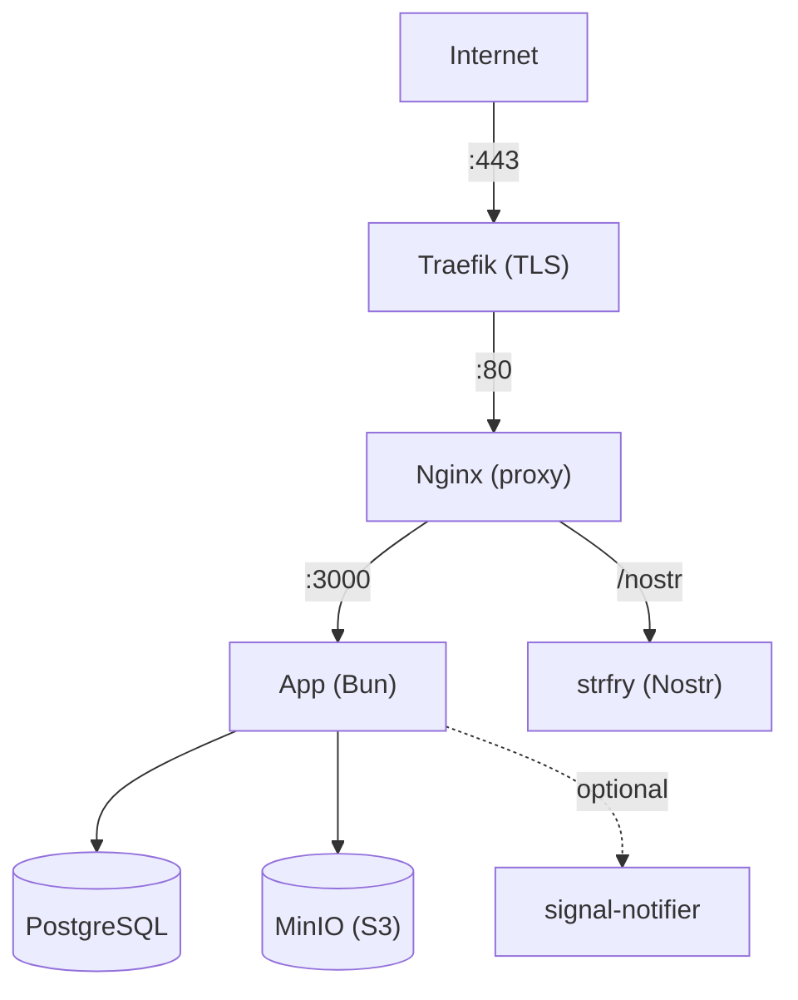

This guide walks you through deploying Llamenos as a [Co-op Cloud](https://coopcloud.tech) recipe. Co-op Cloud uses Docker Swarm with Traefik for TLS termination and the `abra` CLI for standardized app management — ideal for tech co-ops and small hosting collectives.

The recipe is maintained in a [standalone repository](https://github.com/rhonda-rodododo/llamenos-template).

## Prerequisites

- A server with [Docker Swarm](https://docs.docker.com/engine/swarm/) initialized and [Traefik](https://doc.traefik.io/traefik/) running
- The [`abra` CLI](https://docs.coopcloud.tech/abra/install/) installed locally
- A domain name pointing to your server's IP
- SSH access to the server

If you're new to Co-op Cloud, follow the [Co-op Cloud setup guide](https://docs.coopcloud.tech/intro/) first.

## Quick start

```bash
# Add your server (if not already added)
abra server add hotline.example.com

# Clone the recipe
git clone https://github.com/rhonda-rodododo/llamenos-template.git \
  ~/.abra/recipes/llamenos

# Create a new Llamenos app
abra app new llamenos --server hotline.example.com --domain hotline.example.com

# Generate all secrets
abra app secret generate -a hotline.example.com

# Deploy
abra app deploy hotline.example.com
```

Visit `https://hotline.example.com` and follow the setup wizard.

## Core services

| Service | Image | Purpose |
|---------|-------|---------|
| **app** | `ghcr.io/rhonda-rodododo/llamenos` | Bun application server |
| **db** | `postgres:17-alpine` | PostgreSQL database |
| **minio** | `minio/minio` | S3-compatible file storage |
| **relay** | `dockurr/strfry` | Nostr relay for real-time events |
| **web** | `nginx:1.27-alpine` | Reverse proxy with Traefik labels |

## Secrets

All secrets are managed via Docker Swarm secrets (versioned, immutable):

| Secret | Type | Description |
|--------|------|-------------|
| `hmac_secret` | hex (64 chars) | HMAC signing key |
| `server_nostr` | hex (64 chars) | Server Nostr identity key |
| `db_password` | alnum (32 chars) | PostgreSQL password |
| `minio_access` | alnum (20 chars) | MinIO access key |
| `minio_secret` | alnum (40 chars) | MinIO secret key |

Generate all at once:

```bash
abra app secret generate -a hotline.example.com
```

To rotate a secret:

```bash
# 1. Bump version in app config
abra app config hotline.example.com
# Change SECRET_HMAC_SECRET_VERSION=v2

# 2. Generate new secret
abra app secret generate hotline.example.com hmac_secret

# 3. Redeploy
abra app deploy hotline.example.com
```

## Configuration

```bash
abra app config hotline.example.com
```

Key settings:

```env
DOMAIN=hotline.example.com
LETS_ENCRYPT_ENV=production
HOTLINE_NAME=My Hotline
```

## Optional: Enable Signal sidecar

```bash
abra app config hotline.example.com
# Set:
# COMPOSE_FILE=compose.yml:compose.signal.yml
# SECRET_SIGNAL_NOTIFIER_TOKEN_VERSION=v1
abra app secret generate hotline.example.com signal_notifier_token
abra app deploy hotline.example.com
```

## Optional: Enable SIP bridge

```bash
abra app config hotline.example.com
# Set:
# COMPOSE_FILE=compose.yml:compose.telephony.yml
# PBX_TYPE=asterisk
# SECRET_ARI_PASSWORD_VERSION=v1
# SECRET_BRIDGE_SECRET_VERSION=v1
abra app secret generate hotline.example.com ari_password bridge_secret
abra app deploy hotline.example.com
```

## Configure webhooks

Point your telephony provider's webhooks to your domain:

- **Voice (incoming)**: `https://hotline.example.com/api/telephony/incoming`
- **Voice (status)**: `https://hotline.example.com/api/telephony/status`
- **SMS**: `https://hotline.example.com/api/messaging/sms/webhook`
- **WhatsApp**: `https://hotline.example.com/api/messaging/whatsapp/webhook`

## Updating

```bash
abra app upgrade hotline.example.com
```

Data persists in Docker volumes through upgrades.

## Backups

### Backupbot integration

The recipe includes [backupbot](https://docs.coopcloud.tech/backupbot/) labels for automated PostgreSQL and MinIO backups.

### Manual backup

```bash
# PostgreSQL
docker exec $(docker ps -q -f name=<stack-name>_db) pg_dump -U llamenos llamenos | \
  gzip > backup.sql.gz
```

## Monitoring

```bash
abra app ps hotline.example.com
abra app logs -f hotline.example.com app
curl https://hotline.example.com/health/ready
```

## Service architecture



## Next steps

- [Docker Compose Deployment](/docs/en/deploy/docker) — alternative single-server deployment
- [Self-Hosting Overview](/docs/en/deploy/self-hosting) — compare deployment options
- [Recipe repository](https://github.com/rhonda-rodododo/llamenos-template) — Co-op Cloud recipe source
- [Co-op Cloud documentation](https://docs.coopcloud.tech/) — learn more about the platform
