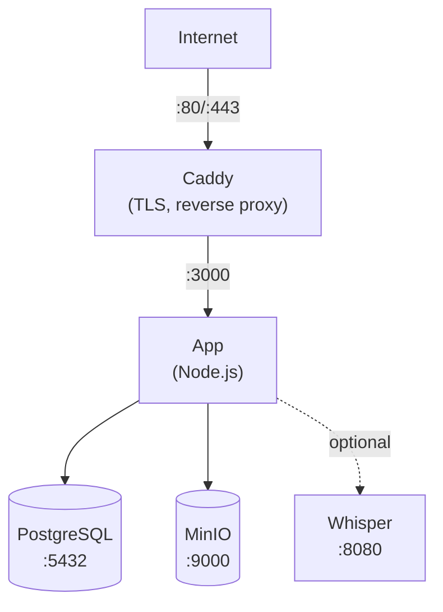

يرشدك هذا الدليل خلال نشر Llamenos باستخدام Docker Compose على خادم واحد. ستحصل على خط طوارئ يعمل بالكامل مع HTTPS تلقائي، قاعدة بيانات PostgreSQL، تخزين الكائنات، ونسخ تلقائي اختياري — كل ذلك يُدار بواسطة Docker Compose.

## المتطلبات الأساسية

- خادم Linux (Ubuntu 22.04+ أو Debian 12+ أو ما شابه)
- [Docker Engine](https://docs.docker.com/engine/install/) الإصدار 24+ مع Docker Compose v2
- اسم نطاق مع DNS يشير إلى عنوان IP لخادمك
- [Bun](https://bun.sh/) مثبت محلياً (لإنشاء زوج مفاتيح المسؤول)

## 1. استنساخ المستودع

```bash
git clone https://github.com/rhonda-rodododo/llamenos-platform.git
cd llamenos-platform
```

## 2. إنشاء زوج مفاتيح المسؤول

تحتاج إلى زوج مفاتيح Nostr لحساب المسؤول. شغّل هذا على جهازك المحلي (أو على الخادم إذا كان Bun مثبتاً):

```bash
bun install
bun run bootstrap-admin
```

احفظ **nsec** (بيانات تسجيل دخول المسؤول) بشكل آمن. انسخ **المفتاح العام بصيغة hex** — ستحتاجه في الخطوة التالية.

## 3. تكوين البيئة

```bash
cd deploy/docker
cp .env.example .env
```

عدّل `.env` بقيمك:

```env
# مطلوب
ADMIN_PUBKEY=your_hex_public_key_from_step_2
DOMAIN=hotline.yourdomain.com

# كلمة مرور PostgreSQL (أنشئ واحدة قوية)
PG_PASSWORD=$(openssl rand -base64 24)

# اسم خط الطوارئ (يظهر في رسائل IVR)
HOTLINE_NAME=Your Hotline

# مزود الصوت (اختياري — يمكن التكوين عبر واجهة المسؤول)
TWILIO_ACCOUNT_SID=your_sid
TWILIO_AUTH_TOKEN=your_token
TWILIO_PHONE_NUMBER=+1234567890

# بيانات اعتماد MinIO (غيّرها عن الافتراضي!)
MINIO_ACCESS_KEY=your-access-key
MINIO_SECRET_KEY=your-secret-key-min-8-chars
```

> **مهم**: عيّن كلمات مرور قوية وفريدة لـ `PG_PASSWORD` و `MINIO_ACCESS_KEY` و `MINIO_SECRET_KEY`.

## 4. تكوين النطاق

عدّل `Caddyfile` لتعيين نطاقك:

```
hotline.yourdomain.com {
    reverse_proxy app:3000
    encode gzip
    header {
        Strict-Transport-Security "max-age=63072000; includeSubDomains; preload"
        X-Content-Type-Options "nosniff"
        X-Frame-Options "DENY"
        Referrer-Policy "no-referrer"
    }
}
```

يحصل Caddy تلقائياً على شهادات TLS من Let's Encrypt ويجددها لنطاقك. تأكد من فتح المنفذين 80 و 443 في جدار الحماية.

## 5. بدء الخدمات

```bash
docker compose up -d
```

هذا يبدأ أربع خدمات أساسية:

| الخدمة | الغرض | المنفذ |
|--------|--------|--------|
| **app** | تطبيق Llamenos | 3000 (داخلي) |
| **postgres** | قاعدة بيانات PostgreSQL | 5432 (داخلي) |
| **caddy** | وكيل عكسي + TLS | 80، 443 |
| **minio** | تخزين الملفات/التسجيلات | 9000، 9001 (داخلي) |

تحقق من أن كل شيء يعمل:

```bash
docker compose ps
docker compose logs app --tail 50
```

تحقق من نقطة نهاية الصحة:

```bash
curl https://hotline.yourdomain.com/api/health
# → {"status":"ok"}
```

## 6. تسجيل الدخول الأول

افتح `https://hotline.yourdomain.com` في متصفحك. سجّل الدخول باستخدام nsec المسؤول من الخطوة 2. سيرشدك معالج الإعداد خلال:

1. **تسمية خط الطوارئ** — الاسم المعروض للتطبيق
2. **اختيار القنوات** — تفعيل الصوت، SMS، WhatsApp، Signal، و/أو التقارير
3. **تكوين المزودين** — إدخال بيانات الاعتماد لكل قناة
4. **المراجعة والإنهاء**

## 7. تكوين الـ webhooks

وجّه webhooks مزود الاتصالات إلى نطاقك. راجع أدلة المزود المحددة للتفاصيل:

- **الصوت** (جميع المزودين): `https://hotline.yourdomain.com/telephony/incoming`
- **SMS**: `https://hotline.yourdomain.com/api/messaging/sms/webhook`
- **WhatsApp**: `https://hotline.yourdomain.com/api/messaging/whatsapp/webhook`
- **Signal**: كوّن الجسر للتوجيه إلى `https://hotline.yourdomain.com/api/messaging/signal/webhook`

## اختياري: تفعيل النسخ التلقائي

تتطلب خدمة النسخ التلقائي Whisper ذاكرة إضافية (4 جيجابايت+). فعّلها مع ملف `transcription`:

```bash
docker compose --profile transcription up -d
```

هذا يبدأ حاوية `faster-whisper-server` باستخدام نموذج `base` على المعالج. لنسخ أسرع:

- **استخدم نموذجاً أكبر**: عدّل `docker-compose.yml` وغيّر `WHISPER__MODEL` إلى `Systran/faster-whisper-small` أو `Systran/faster-whisper-medium`
- **استخدم تسريع GPU**: غيّر `WHISPER__DEVICE` إلى `cuda` وأضف موارد GPU لخدمة whisper

## اختياري: تفعيل Asterisk

للاتصال الهاتفي SIP المستضاف ذاتياً (راجع [إعداد Asterisk](/docs/deploy/providers/asterisk)):

```bash
# تعيين السر المشترك للجسر
echo "BRIDGE_SECRET=$(openssl rand -hex 32)" >> .env

docker compose --profile asterisk up -d
```

## اختياري: تفعيل Signal

لرسائل Signal (راجع [إعداد Signal](/docs/deploy/providers/signal)):

```bash
docker compose --profile signal up -d
```

ستحتاج إلى تسجيل رقم Signal عبر حاوية signal-cli. راجع [دليل إعداد Signal](/docs/deploy/providers/signal) للتعليمات.

## التحديث

اسحب أحدث الصور وأعد التشغيل:

```bash
docker compose pull
docker compose up -d
```

بياناتك محفوظة في وحدات تخزين Docker (`postgres-data`، `minio-data`، إلخ) وتبقى بعد إعادة تشغيل الحاويات وتحديث الصور.

## النسخ الاحتياطي

### PostgreSQL

استخدم `pg_dump` للنسخ الاحتياطي لقاعدة البيانات:

```bash
docker compose exec postgres pg_dump -U llamenos llamenos > backup-$(date +%Y%m%d).sql
```

للاستعادة:

```bash
docker compose exec -T postgres psql -U llamenos llamenos < backup-20250101.sql
```

### تخزين MinIO

يخزن MinIO الملفات المرفوعة والتسجيلات والمرفقات:

```bash
# باستخدام عميل MinIO (mc)
docker compose exec minio mc alias set local http://localhost:9000 $MINIO_ACCESS_KEY $MINIO_SECRET_KEY
docker compose exec minio mc mirror local/llamenos /tmp/minio-backup
docker compose cp minio:/tmp/minio-backup ./minio-backup-$(date +%Y%m%d)
```

### النسخ الاحتياطي التلقائي

للإنتاج، أعد مهمة cron:

```bash
# /etc/cron.d/llamenos-backup
0 3 * * * root cd /path/to/llamenos/deploy/docker && docker compose exec -T postgres pg_dump -U llamenos llamenos | gzip > /backups/llamenos-$(date +\%Y\%m\%d).sql.gz 2>&1 | logger -t llamenos-backup
```

## المراقبة

### فحوصات الصحة

يعرض التطبيق نقطة نهاية صحة على `/api/health`. يحتوي Docker Compose على فحوصات صحة مدمجة. راقب خارجياً باستخدام أي فاحص HTTP.

### السجلات

```bash
# جميع الخدمات
docker compose logs -f

# خدمة محددة
docker compose logs -f app

# آخر 100 سطر
docker compose logs --tail 100 app
```

### استخدام الموارد

```bash
docker stats
```

## استكشاف الأخطاء

### التطبيق لا يبدأ

```bash
# تحقق من السجلات بحثاً عن أخطاء
docker compose logs app

# تحقق من تحميل .env
docker compose config

# تحقق من صحة PostgreSQL
docker compose ps postgres
docker compose logs postgres
```

### مشاكل الشهادات

يحتاج Caddy إلى فتح المنفذين 80 و 443 لتحديات ACME. تحقق بـ:

```bash
# تحقق من سجلات Caddy
docker compose logs caddy

# تحقق من إمكانية الوصول إلى المنافذ
curl -I http://hotline.yourdomain.com
```

### أخطاء اتصال MinIO

تأكد من صحة خدمة MinIO قبل بدء التطبيق:

```bash
docker compose ps minio
docker compose logs minio
```

## بنية الخدمات



## الخطوات التالية

- [دليل المسؤول](/docs/admin-guide) — تكوين خط الطوارئ
- [نظرة عامة على الاستضافة الذاتية](/docs/deploy/self-hosting) — مقارنة خيارات النشر
- [نشر Kubernetes](/docs/deploy/kubernetes) — الانتقال إلى Helm
