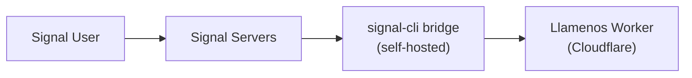

يدعم Llamenos رسائل Signal عبر جسر [signal-cli-rest-api](https://github.com/bbernhard/signal-cli-rest-api) المستضاف ذاتياً. يقدم Signal أقوى ضمانات الخصوصية بين قنوات المراسلة، مما يجعله مثالياً لسيناريوهات الاستجابة للأزمات الحساسة.

## المتطلبات الأساسية

- خادم Linux أو آلة افتراضية للجسر (يمكن أن يكون نفس خادم Asterisk، أو منفصلاً)
- Docker مثبت على خادم الجسر
- رقم هاتف مخصص لتسجيل Signal
- وصول شبكي من الجسر إلى Cloudflare Worker الخاص بك

## البنية



يعمل جسر signal-cli على بنيتك التحتية ويوجه الرسائل إلى Worker الخاص بك عبر webhooks HTTP. هذا يعني أنك تتحكم في مسار الرسالة بالكامل من Signal إلى تطبيقك.

## 1. نشر جسر signal-cli

شغّل حاوية Docker لـ signal-cli-rest-api:

```bash
docker run -d \
  --name signal-cli \
  --restart unless-stopped \
  -p 8080:8080 \
  -v signal-cli-data:/home/.local/share/signal-cli \
  -e MODE=json-rpc \
  bbernhard/signal-cli-rest-api:latest
```

## 2. تسجيل رقم هاتف

سجّل الجسر برقم هاتف مخصص:

```bash
# طلب رمز التحقق عبر SMS
curl -X POST http://localhost:8080/v1/register/+1234567890

# التحقق بالرمز الذي تلقيته
curl -X POST http://localhost:8080/v1/register/+1234567890/verify/123456
```

## 3. تكوين توجيه الـ webhook

أعد الجسر لتوجيه الرسائل الواردة إلى Worker الخاص بك:

```bash
curl -X PUT http://localhost:8080/v1/about \
  -H "Content-Type: application/json" \
  -d '{
    "webhook": {
      "url": "https://your-worker.your-domain.com/api/messaging/signal/webhook",
      "headers": {
        "Authorization": "Bearer your-webhook-secret"
      }
    }
  }'
```

## 4. تفعيل Signal في إعدادات المسؤول

انتقل إلى **إعدادات المسؤول > قنوات المراسلة** (أو استخدم معالج الإعداد) وفعّل **Signal**.

أدخل ما يلي:
- **رابط الجسر** — رابط جسر signal-cli الخاص بك (مثلاً `https://signal-bridge.example.com:8080`)
- **مفتاح API للجسر** — رمز bearer لمصادقة الطلبات إلى الجسر
- **سر الـ Webhook** — السر المستخدم للتحقق من صحة الـ webhooks الواردة (يجب أن يطابق ما كوّنته في الخطوة 3)
- **الرقم المسجل** — رقم الهاتف المسجل مع Signal

## 5. الاختبار

أرسل رسالة Signal إلى رقم هاتفك المسجل. يجب أن تظهر المحادثة في علامة تبويب **المحادثات**.

## مراقبة الصحة

يراقب Llamenos صحة جسر signal-cli:
- فحوصات صحة دورية لنقطة نهاية `/v1/about` للجسر
- تراجع سلس إذا كان الجسر غير قابل للوصول — القنوات الأخرى تستمر في العمل
- تنبيهات للمسؤول عند توقف الجسر

## نسخ الرسائل الصوتية

يمكن نسخ رسائل Signal الصوتية مباشرة في متصفح المتطوع باستخدام Whisper من جانب العميل (WASM عبر `@huggingface/transformers`). الصوت لا يغادر الجهاز أبداً — يتم تشفير النسخة وتخزينها بجانب الرسالة الصوتية في عرض المحادثة. يمكن للمتطوعين تفعيل أو تعطيل النسخ في إعداداتهم الشخصية.

## ملاحظات أمنية

- يوفر Signal تشفيراً من طرف إلى طرف بين المستخدم وجسر signal-cli
- يفك الجسر تشفير الرسائل لتوجيهها كـ webhooks — خادم الجسر لديه وصول للنص الواضح
- مصادقة الـ webhook تستخدم رموز bearer مع مقارنة ثابتة الوقت
- احتفظ بالجسر على نفس الشبكة مع خادم Asterisk (إن وُجد) لأقل تعرض
- يخزن الجسر سجل الرسائل محلياً في وحدة تخزين Docker — فكر في التشفير في حالة السكون
- لأقصى خصوصية: استضف كلاً من Asterisk (الصوت) و signal-cli (المراسلة) على بنيتك التحتية الخاصة

## استكشاف الأخطاء

- **الجسر لا يستقبل رسائل**: تحقق من أن رقم الهاتف مسجل بشكل صحيح مع `GET /v1/about`
- **فشل تسليم الـ webhook**: تحقق من أن رابط الـ webhook قابل للوصول من خادم الجسر وأن رأس التفويض يطابق
- **مشاكل التسجيل**: بعض أرقام الهواتف قد تحتاج إلى إلغاء ربطها من حساب Signal موجود أولاً
