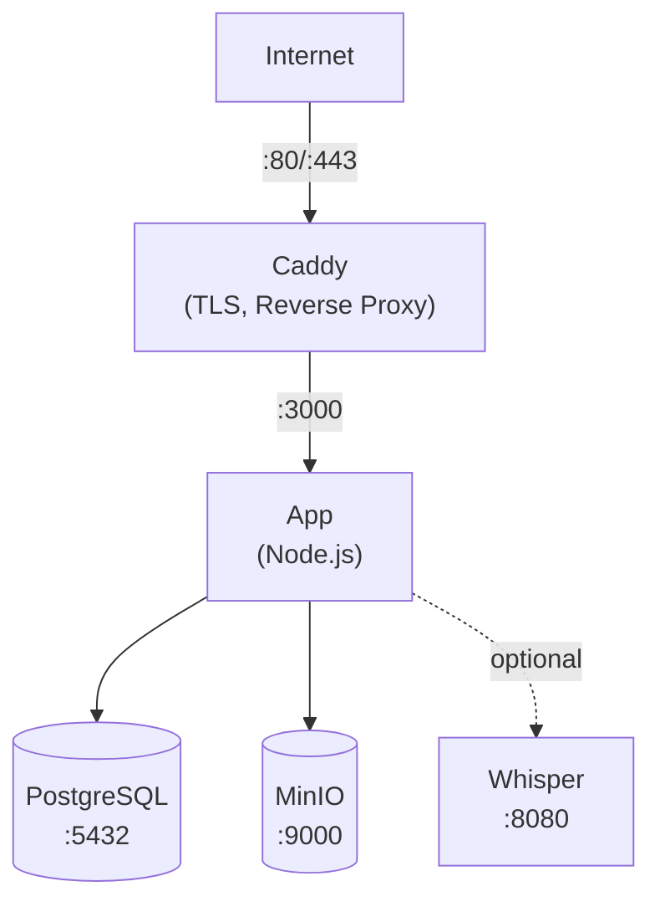

Diese Anleitung fuehrt Sie durch die Bereitstellung von Llamenos mit Docker Compose auf einem einzelnen Server. Sie erhalten eine voll funktionsfaehige Hotline mit automatischem HTTPS, PostgreSQL-Datenbank, Objektspeicher und optionaler Transkription -- alles verwaltet durch Docker Compose.

## Voraussetzungen

- Ein Linux-Server (Ubuntu 22.04+, Debian 12+ oder aehnlich)
- [Docker Engine](https://docs.docker.com/engine/install/) v24+ mit Docker Compose v2
- Ein Domainname mit DNS-Verweis auf die IP-Adresse Ihres Servers
- [Bun](https://bun.sh/) lokal installiert (zur Generierung des Admin-Schluesselpaar)

## 1. Repository klonen

```bash
git clone https://github.com/your-org/llamenos.git
cd llamenos
```

## 2. Admin-Schluesselpaar generieren

Sie benoetigen ein Nostr-Schluesselpaar fuer das Admin-Konto. Fuehren Sie dies auf Ihrem lokalen Rechner aus (oder auf dem Server, wenn Bun installiert ist):

```bash
bun install
bun run bootstrap-admin
```

Bewahren Sie den **nsec** (Ihre Admin-Anmeldedaten) sicher auf. Kopieren Sie den **hexadezimalen oeffentlichen Schluessel** -- Sie benoetigen ihn im naechsten Schritt.

## 3. Umgebung konfigurieren

```bash
cd deploy/docker
cp .env.example .env
```

Bearbeiten Sie `.env` mit Ihren Werten:

```env
# Erforderlich
ADMIN_PUBKEY=ihr_hex_oeffentlicher_schluessel_aus_schritt_2
DOMAIN=hotline.ihredomain.com

# PostgreSQL-Passwort (generieren Sie ein starkes)
PG_PASSWORD=$(openssl rand -base64 24)

# Hotline-Anzeigename (wird in IVR-Ansagen angezeigt)
HOTLINE_NAME=Ihre Hotline

# Sprachanbieter (optional -- kann ueber die Admin-Oberflaeche konfiguriert werden)
TWILIO_ACCOUNT_SID=ihre_sid
TWILIO_AUTH_TOKEN=ihr_token
TWILIO_PHONE_NUMBER=+1234567890

# MinIO-Anmeldedaten (Standardwerte aendern!)
MINIO_ACCESS_KEY=ihr-zugangsschluessel
MINIO_SECRET_KEY=ihr-geheimschluessel-min-8-zeichen
```

> **Wichtig**: Setzen Sie starke, einzigartige Passwoerter fuer `PG_PASSWORD`, `MINIO_ACCESS_KEY` und `MINIO_SECRET_KEY`.

## 4. Domain konfigurieren

Bearbeiten Sie das `Caddyfile`, um Ihre Domain festzulegen:

```
hotline.ihredomain.com {
    reverse_proxy app:3000
    encode gzip
    header {
        Strict-Transport-Security "max-age=63072000; includeSubDomains; preload"
        X-Content-Type-Options "nosniff"
        X-Frame-Options "DENY"
        Referrer-Policy "no-referrer"
    }
}
```

Caddy bezieht und erneuert automatisch Let's Encrypt TLS-Zertifikate fuer Ihre Domain. Stellen Sie sicher, dass die Ports 80 und 443 in Ihrer Firewall geoeffnet sind.

## 5. Dienste starten

```bash
docker compose up -d
```

Dies startet vier Kerndienste:

| Dienst | Zweck | Port |
|--------|-------|------|
| **app** | Llamenos-Anwendung | 3000 (intern) |
| **postgres** | PostgreSQL-Datenbank | 5432 (intern) |
| **caddy** | Reverse Proxy + TLS | 80, 443 |
| **minio** | Datei-/Aufnahmespeicher | 9000, 9001 (intern) |

Ueberpruefen Sie, ob alles laeuft:

```bash
docker compose ps
docker compose logs app --tail 50
```

Ueberpruefen Sie den Health-Endpunkt:

```bash
curl https://hotline.ihredomain.com/api/health
# → {"status":"ok"}
```

## 6. Erste Anmeldung

Oeffnen Sie `https://hotline.ihredomain.com` in Ihrem Browser. Melden Sie sich mit dem Admin-nsec aus Schritt 2 an. Der Einrichtungsassistent fuehrt Sie durch:

1. **Hotline benennen** -- Anzeigename fuer die App
2. **Kanaele waehlen** -- Sprache, SMS, WhatsApp, Signal und/oder Berichte aktivieren
3. **Anbieter konfigurieren** -- Anmeldedaten fuer jeden Kanal eingeben
4. **Ueberpruefen und abschliessen**

## 7. Webhooks konfigurieren

Richten Sie die Webhooks Ihres Telefonieanbieters auf Ihre Domain. Einzelheiten finden Sie in den anbieterspezifischen Anleitungen:

- **Sprache** (alle Anbieter): `https://hotline.ihredomain.com/telephony/incoming`
- **SMS**: `https://hotline.ihredomain.com/api/messaging/sms/webhook`
- **WhatsApp**: `https://hotline.ihredomain.com/api/messaging/whatsapp/webhook`
- **Signal**: Konfigurieren Sie die Bridge zur Weiterleitung an `https://hotline.ihredomain.com/api/messaging/signal/webhook`

## Optional: Transkription aktivieren

Der Whisper-Transkriptionsdienst benoetigt zusaetzlichen RAM (4 GB+). Aktivieren Sie ihn mit dem `transcription`-Profil:

```bash
docker compose --profile transcription up -d
```

Dies startet einen `faster-whisper-server`-Container mit dem `base`-Modell auf der CPU. Fuer schnellere Transkription:

- **Groesseres Modell verwenden**: Bearbeiten Sie `docker-compose.yml` und aendern Sie `WHISPER__MODEL` auf `Systran/faster-whisper-small` oder `Systran/faster-whisper-medium`
- **GPU-Beschleunigung verwenden**: Aendern Sie `WHISPER__DEVICE` auf `cuda` und fuegen Sie GPU-Ressourcen zum Whisper-Dienst hinzu

## Optional: Asterisk aktivieren

Fuer selbst gehostete SIP-Telefonie (siehe [Asterisk-Einrichtung](/docs/setup-asterisk)):

```bash
# Gemeinsames Bridge-Geheimnis setzen
echo "BRIDGE_SECRET=$(openssl rand -hex 32)" >> .env

docker compose --profile asterisk up -d
```

## Optional: Signal aktivieren

Fuer Signal-Nachrichten (siehe [Signal-Einrichtung](/docs/setup-signal)):

```bash
docker compose --profile signal up -d
```

Sie muessen die Signal-Nummer ueber den signal-cli-Container registrieren. Anweisungen finden Sie in der [Signal-Einrichtungsanleitung](/docs/setup-signal).

## Aktualisierung

Laden Sie die neuesten Images herunter und starten Sie neu:

```bash
docker compose pull
docker compose up -d
```

Ihre Daten werden in Docker-Volumes (`postgres-data`, `minio-data`, etc.) persistiert und ueberleben Container-Neustarts und Image-Aktualisierungen.

## Backups

### PostgreSQL

Verwenden Sie `pg_dump` fuer Datenbank-Backups:

```bash
docker compose exec postgres pg_dump -U llamenos llamenos > backup-$(date +%Y%m%d).sql
```

Zur Wiederherstellung:

```bash
docker compose exec -T postgres psql -U llamenos llamenos < backup-20250101.sql
```

### MinIO-Speicher

MinIO speichert hochgeladene Dateien, Aufnahmen und Anhaenge:

```bash
# Mit dem MinIO-Client (mc)
docker compose exec minio mc alias set local http://localhost:9000 $MINIO_ACCESS_KEY $MINIO_SECRET_KEY
docker compose exec minio mc mirror local/llamenos /tmp/minio-backup
docker compose cp minio:/tmp/minio-backup ./minio-backup-$(date +%Y%m%d)
```

### Automatisierte Backups

Fuer den Produktivbetrieb richten Sie einen Cron-Job ein:

```bash
# /etc/cron.d/llamenos-backup
0 3 * * * root cd /path/to/llamenos/deploy/docker && docker compose exec -T postgres pg_dump -U llamenos llamenos | gzip > /backups/llamenos-$(date +\%Y\%m\%d).sql.gz 2>&1 | logger -t llamenos-backup
```

## Ueberwachung

### Gesundheitspruefungen

Die App stellt einen Health-Endpunkt unter `/api/health` bereit. Docker Compose verfuegt ueber integrierte Gesundheitspruefungen. Ueberwachen Sie extern mit einem beliebigen HTTP-Uptime-Checker.

### Logs

```bash
# Alle Dienste
docker compose logs -f

# Bestimmter Dienst
docker compose logs -f app

# Letzte 100 Zeilen
docker compose logs --tail 100 app
```

### Ressourcenverbrauch

```bash
docker stats
```

## Fehlerbehebung

### App startet nicht

```bash
# Logs auf Fehler pruefen
docker compose logs app

# Ueberpruefen, ob .env geladen wird
docker compose config

# Pruefen, ob PostgreSQL gesund ist
docker compose ps postgres
docker compose logs postgres
```

### Zertifikatsprobleme

Caddy benoetigt die Ports 80 und 443 fuer ACME-Challenges. Ueberpruefen Sie mit:

```bash
# Caddy-Logs pruefen
docker compose logs caddy

# Ueberpruefen, ob Ports erreichbar sind
curl -I http://hotline.ihredomain.com
```

### MinIO-Verbindungsfehler

Stellen Sie sicher, dass der MinIO-Dienst gesund ist, bevor die App startet:

```bash
docker compose ps minio
docker compose logs minio
```

## Dienstarchitektur



## Naechste Schritte

- [Administratorhandbuch](/docs/admin-guide) -- die Hotline konfigurieren
- [Uebersicht Selbst-Hosting](/docs/self-hosting) -- Bereitstellungsoptionen vergleichen
- [Kubernetes-Bereitstellung](/docs/deploy-kubernetes) -- zu Helm migrieren
