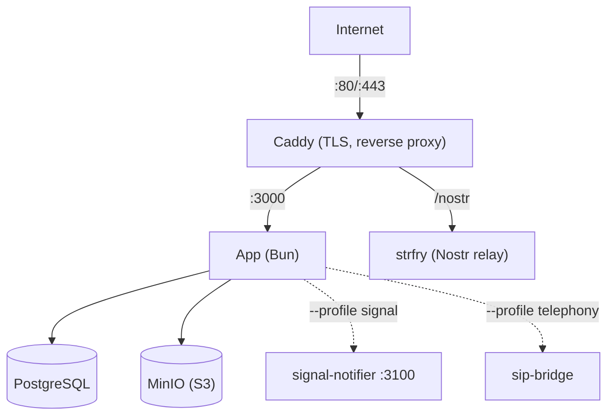

This guide walks you through deploying Llamenos with Docker Compose on a single server. You'll have a fully functional hotline with automatic HTTPS, PostgreSQL database, object storage, Nostr relay, and optional transcription — all managed by Docker Compose.

## Prerequisites

- A Linux server (Ubuntu 22.04+, Debian 12+, or similar)
- [Docker Engine](https://docs.docker.com/engine/install/) v24+ with Docker Compose v2
- `openssl` (pre-installed on most systems)
- A domain name with DNS pointing to your server's IP

## Quick start (local)

```bash
git clone https://github.com/rhonda-rodododo/llamenos-platform.git
cd llamenos-platform
./scripts/docker-setup.sh
```

Visit **http://localhost:8000** and follow the setup wizard.

## Production deployment

```bash
./scripts/docker-setup.sh --domain hotline.yourorg.com --email admin@yourorg.com
```

The setup script:
1. Generates strong random secrets (database password, HMAC key, storage credentials, Nostr relay secret)
2. Writes them to `deploy/docker/.env`
3. Builds and starts all services using the production overlay
4. Waits for the app to become healthy

The production overlay (`docker-compose.production.yml`) adds:
- **TLS termination** via Let's Encrypt (Caddy)
- **Log rotation** for all services (10 MB max, 5 files)
- **Resource limits** (1 GB memory for the app)
- **Strict CSP** — only `wss://` WebSocket connections

Visit `https://hotline.yourorg.com` and follow the setup wizard.

### Manual setup

```bash
cd deploy/docker
cp .env.example .env
```

Edit `.env` and fill in the required secrets:

```bash
# Hex secrets (HMAC_SECRET, SERVER_NOSTR_SECRET):
openssl rand -hex 32

# Passwords (PG_PASSWORD, MINIO_ACCESS_KEY, MINIO_SECRET_KEY):
openssl rand -base64 24
```

```env
DOMAIN=hotline.yourorg.com
ACME_EMAIL=admin@yourorg.com
ADMIN_PUBKEY=your_hex_pubkey   # from bun run bootstrap-admin
```

Start with the production overlay:

```bash
docker compose -f docker-compose.yml -f docker-compose.production.yml up -d
```

## Docker Compose files

| File | Purpose |
|------|---------|
| `deploy/docker/docker-compose.yml` | Base configuration — all services, networks, volumes |
| `deploy/docker/docker-compose.production.yml` | Production overlay — TLS Caddyfile, log rotation, resource limits |
| `deploy/docker/docker-compose.dev.yml` | Development overlay — exposes app port, file watching |
| `deploy/docker/docker-compose.ci.yml` | CI overlay — deterministic test environment |

**Local development** uses the dev overlay. **Production** stacks the production overlay on top of the base.

## Core services

| Service | Purpose | Port |
|---------|---------|------|
| **app** | Llamenos application (Bun + Hono) | 3000 (internal) |
| **postgres** | PostgreSQL database | 5432 (internal) |
| **caddy** | Reverse proxy + automatic TLS | 8000 (local), 80/443 (production) |
| **minio** | S3-compatible file storage | 9000 (internal) |
| **strfry** | Nostr relay for real-time events | 7777 (internal) |

## Optional profiles

Start optional services with `--profile`:

```bash
# Signal messaging sidecar
docker compose -f docker-compose.yml -f docker-compose.production.yml --profile signal up -d

# Asterisk/FreeSWITCH/Kamailio SIP bridge (PBX_TYPE selects backend)
docker compose -f docker-compose.yml -f docker-compose.production.yml --profile telephony up -d

# Ollama/vLLM inference for message extraction
docker compose -f docker-compose.yml -f docker-compose.production.yml --profile inference up -d

# Prometheus + Grafana monitoring
docker compose -f docker-compose.yml -f docker-compose.production.yml --profile monitoring up -d
```

## SIP bridge

The `sip-bridge` service connects Llamenos to a self-hosted PBX. Set `PBX_TYPE` in `.env` to select the backend:

```env
PBX_TYPE=asterisk      # Asterisk ARI
# PBX_TYPE=freeswitch  # FreeSWITCH ESL
# PBX_TYPE=kamailio    # Kamailio
```

Also required: `ARI_PASSWORD` and `BRIDGE_SECRET`.

## Signal notifier sidecar

The `signal-notifier` service runs on port 3100. It resolves Signal contacts via HMAC-hashed identifiers — it never stores plaintext phone numbers. Configure:

```env
SIGNAL_NOTIFIER_BEARER_TOKEN=your_shared_token  # must match in both app and sidecar
```

## Health checks

The app exposes:
- `GET /health/ready` — ready when DB connected and migrations applied
- `GET /health/live` — alive check

```bash
curl https://hotline.yourorg.com/health/ready
# {"status":"ok"}
```

## Verify deployment

```bash
cd deploy/docker
docker compose -f docker-compose.yml -f docker-compose.production.yml ps
docker compose -f docker-compose.yml -f docker-compose.production.yml logs app --tail 50
curl https://hotline.yourorg.com/health/ready
```

## Configure webhooks

Point your telephony provider's webhooks to your domain:

| Webhook | URL |
|---------|-----|
| Voice (incoming) | `https://hotline.yourorg.com/api/telephony/incoming` |
| Voice (status) | `https://hotline.yourorg.com/api/telephony/status` |
| SMS | `https://hotline.yourorg.com/api/messaging/sms/webhook` |
| WhatsApp | `https://hotline.yourorg.com/api/messaging/whatsapp/webhook` |
| Signal | Forward to `https://hotline.yourorg.com/api/messaging/signal/webhook` |

## Updating

```bash
cd deploy/docker
git -C ../.. pull
docker compose -f docker-compose.yml -f docker-compose.production.yml build
docker compose -f docker-compose.yml -f docker-compose.production.yml up -d
```

Data persists in Docker volumes (`postgres-data`, `minio-data`, etc.) across restarts and rebuilds.

## Backups

### PostgreSQL

```bash
docker compose -f docker-compose.yml -f docker-compose.production.yml exec postgres \
  pg_dump -U llamenos llamenos > backup-$(date +%Y%m%d).sql
```

Restore:

```bash
docker compose -f docker-compose.yml -f docker-compose.production.yml exec -T postgres \
  psql -U llamenos llamenos < backup-20250101.sql
```

### Automated backups (cron)

```bash
# /etc/cron.d/llamenos-backup
0 3 * * * root cd /opt/llamenos/deploy/docker && \
  docker compose -f docker-compose.yml -f docker-compose.production.yml exec -T postgres \
  pg_dump -U llamenos llamenos | gzip > /backups/llamenos-$(date +\%Y\%m\%d).sql.gz
```

## Logs

```bash
cd deploy/docker

# All services
docker compose -f docker-compose.yml -f docker-compose.production.yml logs -f

# Specific service
docker compose -f docker-compose.yml -f docker-compose.production.yml logs -f app

# Last 100 lines
docker compose -f docker-compose.yml -f docker-compose.production.yml logs --tail 100 app
```

## Troubleshooting

### App won't start

```bash
docker compose logs app
docker compose config   # verify .env loaded
docker compose ps       # check service health
```

### Certificate issues

Caddy needs ports 80 and 443 open for ACME challenges:

```bash
docker compose logs caddy
curl -I http://hotline.yourorg.com
```

## Service architecture



## Next steps

- [Kubernetes Deployment](/docs/en/deploy/kubernetes) — horizontal scaling with Helm
- [Co-op Cloud Deployment](/docs/en/deploy/coopcloud) — cooperative hosting
- [Telephony Providers](/docs/en/deploy/providers/) — configure voice providers
