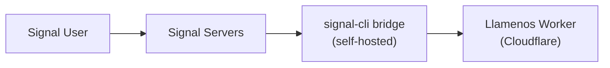

Llamenos supports Signal messaging via a self-hosted [signal-cli-rest-api](https://github.com/bbernhard/signal-cli-rest-api) bridge. Signal offers the strongest privacy guarantees of any messaging channel, making it ideal for sensitive crisis response scenarios.

## Prerequisites

- A Linux server or VM for the bridge (can be the same server as Asterisk, or separate)
- Docker installed on the bridge server
- A dedicated phone number for Signal registration
- Network access from the bridge to your Cloudflare Worker

## Architecture



The signal-cli bridge runs on your infrastructure and forwards messages to your Worker via HTTP webhooks. This means you control the entire message path from Signal to your application.

## 1. Deploy the signal-cli bridge

Run the signal-cli-rest-api Docker container:

```bash
docker run -d \
  --name signal-cli \
  --restart unless-stopped \
  -p 8080:8080 \
  -v signal-cli-data:/home/.local/share/signal-cli \
  -e MODE=json-rpc \
  bbernhard/signal-cli-rest-api:latest
```

## 2. Register a phone number

Register the bridge with a dedicated phone number:

```bash
# Request a verification code via SMS
curl -X POST http://localhost:8080/v1/register/+1234567890

# Verify with the code you received
curl -X POST http://localhost:8080/v1/register/+1234567890/verify/123456
```

## 3. Configure webhook forwarding

Set up the bridge to forward incoming messages to your Worker:

```bash
curl -X PUT http://localhost:8080/v1/about \
  -H "Content-Type: application/json" \
  -d '{
    "webhook": {
      "url": "https://your-worker.your-domain.com/api/messaging/signal/webhook",
      "headers": {
        "Authorization": "Bearer your-webhook-secret"
      }
    }
  }'
```

## 4. Enable Signal in admin settings

Navigate to **Admin Settings > Messaging Channels** (or use the setup wizard) and toggle **Signal** on.

Enter the following:
- **Bridge URL** — the URL of your signal-cli bridge (e.g., `https://signal-bridge.example.com:8080`)
- **Bridge API Key** — a bearer token for authenticating requests to the bridge
- **Webhook Secret** — the secret used to validate incoming webhooks (must match what you configured in step 3)
- **Registered Number** — the phone number registered with Signal

## 5. Test

Send a Signal message to your registered phone number. The conversation should appear in the **Conversations** tab.

## Health monitoring

Llamenos monitors the signal-cli bridge health:
- Periodic health checks to the bridge's `/v1/about` endpoint
- Graceful degradation if the bridge is unreachable — other channels continue working
- Admin alerts when the bridge goes down

## Voice message transcription

Signal voice messages can be transcribed directly in the volunteer's browser using client-side Whisper (WASM via `@huggingface/transformers`). Audio never leaves the device — the transcript is encrypted and stored alongside the voice message in the conversation view. Volunteers can enable or disable transcription in their personal settings.

## Security notes

- Signal provides end-to-end encryption between the user and the signal-cli bridge
- The bridge decrypts messages to forward them as webhooks — the bridge server has plaintext access
- Webhook authentication uses bearer tokens with constant-time comparison
- Keep the bridge on the same network as your Asterisk server (if applicable) for minimal exposure
- The bridge stores message history locally in its Docker volume — consider encryption at rest
- For maximum privacy: self-host both Asterisk (voice) and signal-cli (messaging) on your own infrastructure

## Troubleshooting

- **Bridge not receiving messages**: Check that the phone number is correctly registered with `GET /v1/about`
- **Webhook delivery failures**: Verify the webhook URL is reachable from the bridge server and the authorization header matches
- **Registration issues**: Some phone numbers may need to be unlinked from an existing Signal account first
