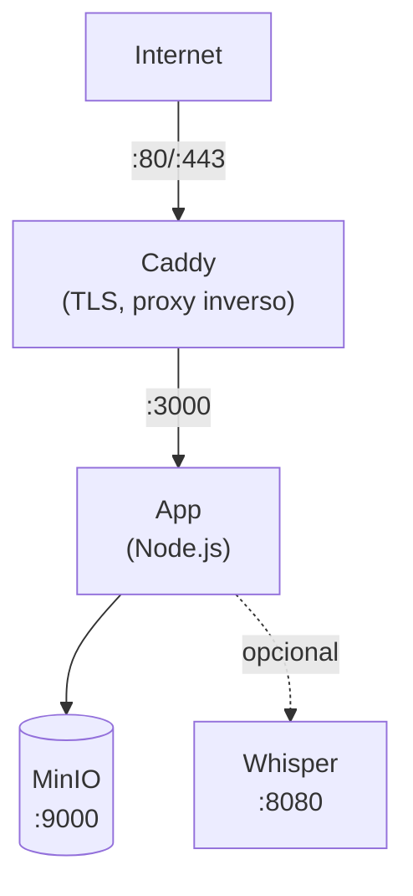

Esta guia te lleva paso a paso a traves del despliegue de Llamenos con Docker Compose en un solo servidor. Tendras una linea de ayuda completamente funcional con HTTPS automatico, almacenamiento de objetos y transcripcion opcional — todo gestionado por Docker Compose.

## Requisitos previos

- Un servidor Linux (Ubuntu 22.04+, Debian 12+ o similar)
- [Docker Engine](https://docs.docker.com/engine/install/) v24+ con Docker Compose v2
- Un nombre de dominio con DNS apuntando a la IP de tu servidor
- [Bun](https://bun.sh/) instalado localmente (para generar el par de claves admin)

## 1. Clonar el repositorio

```bash
git clone https://github.com/your-org/llamenos.git
cd llamenos
```

## 2. Generar el par de claves admin

Necesitas un par de claves Nostr para la cuenta admin. Ejecuta esto en tu maquina local (o en el servidor si Bun esta instalado):

```bash
bun install
bun run bootstrap-admin
```

Guarda el **nsec** (tu credencial de inicio de sesion admin) de forma segura. Copia la **clave publica hex** — la necesitaras en el siguiente paso.

## 3. Configurar el entorno

```bash
cd deploy/docker
cp .env.example .env
```

Edita `.env` con tus valores:

```env
# Requerido
ADMIN_PUBKEY=tu_clave_publica_hex_del_paso_2
DOMAIN=linea.tudominio.com

# Nombre mostrado de la linea (aparece en mensajes IVR)
HOTLINE_NAME=Tu Linea de Ayuda

# Proveedor de voz (opcional — puedes configurar via UI admin)
TWILIO_ACCOUNT_SID=tu_sid
TWILIO_AUTH_TOKEN=tu_token
TWILIO_PHONE_NUMBER=+1234567890

# Credenciales MinIO (cambia los valores por defecto!)
MINIO_ACCESS_KEY=tu-clave-de-acceso
MINIO_SECRET_KEY=tu-clave-secreta-min-8-caracteres
```

> **Importante**: Cambia las credenciales de MinIO de los valores por defecto. Estas controlan el acceso a archivos subidos y grabaciones.

## 4. Configurar tu dominio

Edita el `Caddyfile` para establecer tu dominio:

```
linea.tudominio.com {
    reverse_proxy app:3000
    encode gzip
    header {
        Strict-Transport-Security "max-age=63072000; includeSubDomains; preload"
        X-Content-Type-Options "nosniff"
        X-Frame-Options "DENY"
        Referrer-Policy "no-referrer"
    }
}
```

Caddy obtiene y renueva automaticamente los certificados TLS de Let's Encrypt para tu dominio. Asegurate de que los puertos 80 y 443 esten abiertos en tu firewall.

## 5. Iniciar los servicios

```bash
docker compose up -d
```

Esto inicia tres servicios principales:

| Servicio | Proposito | Puerto |
|----------|-----------|--------|
| **app** | Aplicacion Llamenos | 3000 (interno) |
| **caddy** | Proxy inverso + TLS | 80, 443 |
| **minio** | Almacenamiento de archivos/grabaciones | 9000, 9001 (interno) |

Verifica que todo este funcionando:

```bash
docker compose ps
docker compose logs app --tail 50
```

Verifica el endpoint de salud:

```bash
curl https://linea.tudominio.com/api/health
# → {"status":"ok","platform":"node","timestamp":"...","uptime":...}
```

## 6. Primer inicio de sesion

Abre `https://linea.tudominio.com` en tu navegador. Inicia sesion con el nsec admin del paso 2. El asistente de configuracion te guiara a traves de:

1. **Nombrar tu linea** — nombre para mostrar en la app
2. **Elegir canales** — habilitar Voz, SMS, WhatsApp, Signal y/o Reportes
3. **Configurar proveedores** — ingresar credenciales para cada canal
4. **Revisar y finalizar**

## 7. Configurar webhooks

Apunta los webhooks de tu proveedor de telefonia a tu dominio. Consulta las guias especificas del proveedor para detalles:

- **Voz** (todos los proveedores): `https://linea.tudominio.com/telephony/incoming`
- **SMS**: `https://linea.tudominio.com/api/messaging/sms/webhook`
- **WhatsApp**: `https://linea.tudominio.com/api/messaging/whatsapp/webhook`
- **Signal**: Configura el bridge para reenviar a `https://linea.tudominio.com/api/messaging/signal/webhook`

## Opcional: Habilitar transcripcion

El servicio de transcripcion Whisper requiere RAM adicional (4 GB+). Habilitalo con el perfil `transcription`:

```bash
docker compose --profile transcription up -d
```

## Opcional: Habilitar Asterisk

Para telefonia SIP autoalojada (ver [configuracion de Asterisk](/docs/setup-asterisk)):

```bash
echo "BRIDGE_SECRET=$(openssl rand -hex 32)" >> .env
docker compose --profile asterisk up -d
```

## Opcional: Habilitar Signal

Para mensajeria Signal (ver [configuracion de Signal](/docs/setup-signal)):

```bash
docker compose --profile signal up -d
```

## Actualizacion

Descarga las ultimas imagenes y reinicia:

```bash
docker compose pull
docker compose up -d
```

Tus datos se mantienen en volumenes Docker (`app-data`, `minio-data`, etc.) y sobreviven a reinicios de contenedores y actualizaciones de imagenes.

## Respaldos

### PostgreSQL

Usa `pg_dump` para respaldos de la base de datos:

```bash
docker compose exec postgres pg_dump -U llamenos llamenos > backup-$(date +%Y%m%d).sql
```

Para restaurar:

```bash
docker compose exec -T postgres psql -U llamenos llamenos < backup-20250101.sql
```

### Almacenamiento MinIO

MinIO almacena archivos subidos, grabaciones y adjuntos:

```bash
docker compose exec minio mc alias set local http://localhost:9000 $MINIO_ACCESS_KEY $MINIO_SECRET_KEY
docker compose exec minio mc mirror local/llamenos /tmp/minio-backup
docker compose cp minio:/tmp/minio-backup ./minio-backup-$(date +%Y%m%d)
```

## Solucion de problemas

### La app no inicia

```bash
docker compose logs app
docker compose config
docker compose exec app ls -la /app/data
```

### Problemas con certificados

Caddy necesita los puertos 80 y 443 abiertos para los desafios ACME:

```bash
docker compose logs caddy
curl -I http://linea.tudominio.com
```

## Arquitectura del servicio



## Siguientes pasos

- [Guia del Administrador](/docs/admin-guide) — configura la linea
- [Autoalojamiento](/docs/self-hosting) — compara opciones de despliegue
- [Despliegue en Kubernetes](/docs/deploy-kubernetes) — migra a Helm
