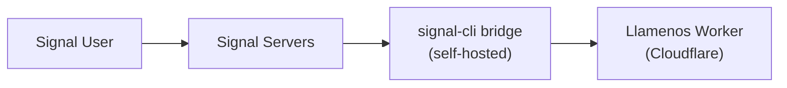

Llamenos prend en charge la messagerie Signal via un bridge [signal-cli-rest-api](https://github.com/bbernhard/signal-cli-rest-api) auto-hébergé. Signal offre les garanties de confidentialité les plus fortes parmi tous les canaux de messagerie, ce qui le rend idéal pour les scénarios de réponse aux crises sensibles.

## Prérequis

- Un serveur Linux ou une VM pour le bridge (peut être le même serveur qu'Asterisk, ou séparé)
- Docker installé sur le serveur du bridge
- Un numéro de téléphone dédié pour l'enregistrement Signal
- Accès réseau du bridge à votre Cloudflare Worker

## Architecture



Le bridge signal-cli fonctionne sur votre infrastructure et transmet les messages à votre Worker via des webhooks HTTP. Vous contrôlez ainsi l'intégralité du chemin des messages, de Signal à votre application.

## 1. Déployer le bridge signal-cli

Exécutez le conteneur Docker signal-cli-rest-api :

```bash
docker run -d \
  --name signal-cli \
  --restart unless-stopped \
  -p 8080:8080 \
  -v signal-cli-data:/home/.local/share/signal-cli \
  -e MODE=json-rpc \
  bbernhard/signal-cli-rest-api:latest
```

## 2. Enregistrer un numéro de téléphone

Enregistrez le bridge avec un numéro de téléphone dédié :

```bash
# Demander un code de vérification par SMS
curl -X POST http://localhost:8080/v1/register/+1234567890

# Vérifier avec le code reçu
curl -X POST http://localhost:8080/v1/register/+1234567890/verify/123456
```

## 3. Configurer la redirection webhook

Configurez le bridge pour transmettre les messages entrants à votre Worker :

```bash
curl -X PUT http://localhost:8080/v1/about \
  -H "Content-Type: application/json" \
  -d '{
    "webhook": {
      "url": "https://your-worker.your-domain.com/api/messaging/signal/webhook",
      "headers": {
        "Authorization": "Bearer your-webhook-secret"
      }
    }
  }'
```

## 4. Activer Signal dans les paramètres admin

Naviguez vers **Paramètres admin > Canaux de messagerie** (ou utilisez l'assistant de configuration) et activez **Signal**.

Saisissez les informations suivantes :
- **URL du bridge** — l'URL de votre bridge signal-cli (ex. `https://signal-bridge.example.com:8080`)
- **Clé API du bridge** — un token bearer pour authentifier les requêtes au bridge
- **Secret du webhook** — le secret utilisé pour valider les webhooks entrants (doit correspondre à ce que vous avez configuré à l'étape 3)
- **Numéro enregistré** — le numéro de téléphone enregistré avec Signal

## 5. Test

Envoyez un message Signal à votre numéro enregistré. La conversation devrait apparaître dans l'onglet **Conversations**.

## Surveillance de la santé

Llamenos surveille la santé du bridge signal-cli :
- Vérifications de santé périodiques sur le endpoint `/v1/about` du bridge
- Dégradation gracieuse si le bridge est injoignable — les autres canaux continuent de fonctionner
- Alertes administrateur lorsque le bridge tombe en panne

## Transcription des messages vocaux

Les messages vocaux Signal peuvent être transcrits directement dans le navigateur du bénévole en utilisant Whisper côté client (WASM via `@huggingface/transformers`). L'audio ne quitte jamais l'appareil — la transcription est chiffrée et stockée à côté du message vocal dans la vue conversation. Les bénévoles peuvent activer ou désactiver la transcription dans leurs paramètres personnels.

## Notes de sécurité

- Signal fournit un chiffrement de bout en bout entre l'utilisateur et le bridge signal-cli
- Le bridge déchiffre les messages pour les transmettre en webhooks — le serveur du bridge a accès au texte en clair
- L'authentification webhook utilise des tokens bearer avec comparaison à temps constant
- Gardez le bridge sur le même réseau que votre serveur Asterisk (le cas échéant) pour une exposition minimale
- Le bridge stocke l'historique des messages localement dans son volume Docker — envisagez le chiffrement au repos
- Pour une confidentialité maximale : auto-hébergez Asterisk (voix) et signal-cli (messagerie) sur votre propre infrastructure

## Dépannage

- **Le bridge ne reçoit pas de messages** : Vérifiez que le numéro est correctement enregistré avec `GET /v1/about`
- **Échecs de livraison webhook** : Vérifiez que l'URL du webhook est joignable depuis le serveur du bridge et que l'en-tête d'autorisation correspond
- **Problèmes d'enregistrement** : Certains numéros peuvent nécessiter d'être dissociés d'un compte Signal existant au préalable
