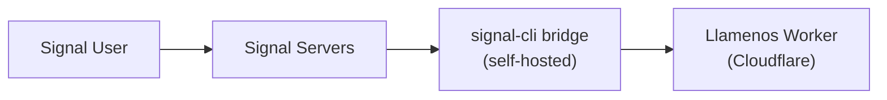

Llamenos prend en charge la messagerie Signal via un bridge [signal-cli-rest-api](https://github.com/bbernhard/signal-cli-rest-api) auto-heberge. Signal offre les garanties de confidentialite les plus fortes parmi tous les canaux de messagerie, ce qui le rend ideal pour les scenarios de reponse aux crises sensibles.

## Prerequis

- Un serveur Linux ou une VM pour le bridge (peut etre le meme serveur qu'Asterisk, ou separe)
- Docker installe sur le serveur du bridge
- Un numero de telephone dedie pour l'enregistrement Signal
- Acces reseau du bridge a votre Cloudflare Worker

## Architecture



Le bridge signal-cli fonctionne sur votre infrastructure et transmet les messages a votre Worker via des webhooks HTTP. Vous controlez ainsi l'integralite du chemin des messages, de Signal a votre application.

## 1. Deployer le bridge signal-cli

Executez le conteneur Docker signal-cli-rest-api :

```bash
docker run -d \
  --name signal-cli \
  --restart unless-stopped \
  -p 8080:8080 \
  -v signal-cli-data:/home/.local/share/signal-cli \
  -e MODE=json-rpc \
  bbernhard/signal-cli-rest-api:latest
```

## 2. Enregistrer un numero de telephone

Enregistrez le bridge avec un numero de telephone dedie :

```bash
# Demander un code de verification par SMS
curl -X POST http://localhost:8080/v1/register/+1234567890

# Verifier avec le code recu
curl -X POST http://localhost:8080/v1/register/+1234567890/verify/123456
```

## 3. Configurer la redirection webhook

Configurez le bridge pour transmettre les messages entrants a votre Worker :

```bash
curl -X PUT http://localhost:8080/v1/about \
  -H "Content-Type: application/json" \
  -d '{
    "webhook": {
      "url": "https://your-worker.your-domain.com/api/messaging/signal/webhook",
      "headers": {
        "Authorization": "Bearer your-webhook-secret"
      }
    }
  }'
```

## 4. Activer Signal dans les parametres admin

Naviguez vers **Parametres admin > Canaux de messagerie** (ou utilisez l'assistant de configuration) et activez **Signal**.

Saisissez les informations suivantes :
- **URL du bridge** — l'URL de votre bridge signal-cli (ex. `https://signal-bridge.example.com:8080`)
- **Cle API du bridge** — un token bearer pour authentifier les requetes au bridge
- **Secret du webhook** — le secret utilise pour valider les webhooks entrants (doit correspondre a ce que vous avez configure a l'etape 3)
- **Numero enregistre** — le numero de telephone enregistre avec Signal

## 5. Test

Envoyez un message Signal a votre numero enregistre. La conversation devrait apparaitre dans l'onglet **Conversations**.

## Surveillance de la sante

Llamenos surveille la sante du bridge signal-cli :
- Verifications de sante periodiques sur le endpoint `/v1/about` du bridge
- Degradation gracieuse si le bridge est injoignable — les autres canaux continuent de fonctionner
- Alertes administrateur lorsque le bridge tombe en panne

## Transcription des messages vocaux

Les messages vocaux Signal peuvent etre transcrits directement dans le navigateur du benevole en utilisant Whisper cote client (WASM via `@huggingface/transformers`). L'audio ne quitte jamais l'appareil — la transcription est chiffree et stockee a cote du message vocal dans la vue conversation. Les benevoles peuvent activer ou desactiver la transcription dans leurs parametres personnels.

## Notes de securite

- Signal fournit un chiffrement de bout en bout entre l'utilisateur et le bridge signal-cli
- Le bridge dechiffre les messages pour les transmettre en webhooks — le serveur du bridge a acces au texte en clair
- L'authentification webhook utilise des tokens bearer avec comparaison a temps constant
- Gardez le bridge sur le meme reseau que votre serveur Asterisk (le cas echeant) pour une exposition minimale
- Le bridge stocke l'historique des messages localement dans son volume Docker — envisagez le chiffrement au repos
- Pour une confidentialite maximale : auto-hebergez Asterisk (voix) et signal-cli (messagerie) sur votre propre infrastructure

## Depannage

- **Le bridge ne recoit pas de messages** : Verifiez que le numero est correctement enregistre avec `GET /v1/about`
- **Echecs de livraison webhook** : Verifiez que l'URL du webhook est joignable depuis le serveur du bridge et que l'en-tete d'autorisation correspond
- **Problemes d'enregistrement** : Certains numeros peuvent necessiter d'etre dissocies d'un compte Signal existant au prealable
