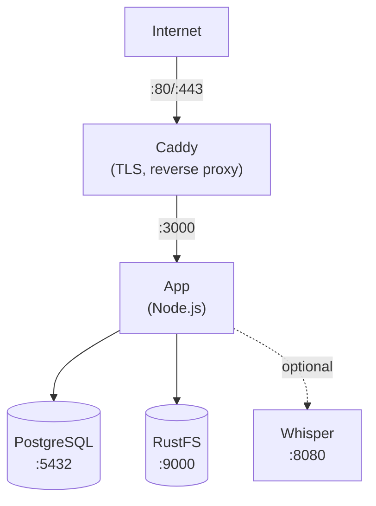

यह गाइड एक सर्वर पर Docker Compose के साथ Llamenos deploy करने में मदद करती है। आपको स्वचालित HTTPS, PostgreSQL डेटाबेस, ऑब्जेक्ट स्टोरेज, और वैकल्पिक transcription के साथ एक पूरी तरह कार्यात्मक हॉटलाइन मिलेगी — सभी Docker Compose द्वारा प्रबंधित।

## पूर्वापेक्षाएं

- एक Linux सर्वर (Ubuntu 22.04+, Debian 12+, या समान)
- Docker Compose v2 के साथ [Docker Engine](https://docs.docker.com/engine/install/) v24+
- अपने सर्वर के IP की ओर इशारा करते DNS के साथ एक domain name
- स्थानीय रूप से इंस्टॉल [Bun](https://bun.sh/) (admin keypair जनरेट करने के लिए)

## 1. रिपॉजिटरी क्लोन करें

```bash
git clone https://github.com/your-org/llamenos.git
cd llamenos
```

## 2. Admin keypair जनरेट करें

आपको admin account के लिए एक Nostr keypair चाहिए। इसे अपनी local machine पर चलाएं (या सर्वर पर यदि Bun इंस्टॉल है):

```bash
bun install
bun run bootstrap-admin
```

**nsec** (आपके admin login credential) को सुरक्षित रूप से सहेजें। **hex public key** कॉपी करें — आपको अगले चरण में इसकी आवश्यकता होगी।

## 3. एनवायरनमेंट कॉन्फ़िगर करें

```bash
cd deploy/docker
cp .env.example .env
```

`.env` को अपनी values के साथ संपादित करें:

```env
# Required
ADMIN_PUBKEY=your_hex_public_key_from_step_2
DOMAIN=hotline.yourdomain.com

# PostgreSQL password (generate a strong one)
PG_PASSWORD=$(openssl rand -base64 24)

# Hotline display name (shown in IVR prompts)
HOTLINE_NAME=Your Hotline

# Voice provider (optional — can configure via admin UI)
TWILIO_ACCOUNT_SID=your_sid
TWILIO_AUTH_TOKEN=your_token
TWILIO_PHONE_NUMBER=+1234567890

# RustFS credentials (change from defaults!)
STORAGE_ACCESS_KEY=your-access-key
STORAGE_SECRET_KEY=your-secret-key-min-8-chars
```

> **महत्वपूर्ण**: `PG_PASSWORD`, `STORAGE_ACCESS_KEY`, और `STORAGE_SECRET_KEY` के लिए मजबूत, अद्वितीय पासवर्ड सेट करें।

## 4. अपना domain कॉन्फ़िगर करें

अपना domain सेट करने के लिए `Caddyfile` संपादित करें:

```
hotline.yourdomain.com {
    reverse_proxy app:3000
    encode gzip
    header {
        Strict-Transport-Security "max-age=63072000; includeSubDomains; preload"
        X-Content-Type-Options "nosniff"
        X-Frame-Options "DENY"
        Referrer-Policy "no-referrer"
    }
}
```

Caddy आपके domain के लिए Let's Encrypt TLS certificates स्वचालित रूप से प्राप्त और नवीनीकृत करता है। सुनिश्चित करें कि आपके firewall में ports 80 और 443 खुले हैं।

## 5. सेवाएं शुरू करें

```bash
docker compose up -d
```

यह चार core services शुरू करता है:

| Service | उद्देश्य | Port |
|---------|---------|------|
| **app** | Llamenos एप्लिकेशन | 3000 (आंतरिक) |
| **postgres** | PostgreSQL डेटाबेस | 5432 (आंतरिक) |
| **caddy** | Reverse proxy + TLS | 80, 443 |
| **rustfs** | फ़ाइल/रिकॉर्डिंग storage | 9000, 9001 (आंतरिक) |

सब कुछ चल रहा है यह जाँचें:

```bash
docker compose ps
docker compose logs app --tail 50
```

health endpoint सत्यापित करें:

```bash
curl https://hotline.yourdomain.com/api/health
# → {"status":"ok"}
```

## 6. पहला लॉगिन

अपने browser में `https://hotline.yourdomain.com` खोलें। चरण 2 से admin nsec के साथ लॉग इन करें। setup wizard आपको इनके माध्यम से मार्गदर्शन करेगा:

1. **अपनी हॉटलाइन का नामकरण** — ऐप के लिए display name
2. **चैनल चुनना** — Voice, SMS, WhatsApp, Signal, और/या Reports सक्षम करें
3. **प्रदाता कॉन्फ़िगर करना** — प्रत्येक चैनल के लिए credentials दर्ज करें
4. **समीक्षा और समाप्ति**

## 7. Webhooks कॉन्फ़िगर करें

अपने telephony provider के webhooks को अपने domain पर point करें। विवरण के लिए provider-specific guides देखें:

- **Voice** (सभी providers): `https://hotline.yourdomain.com/telephony/incoming`
- **SMS**: `https://hotline.yourdomain.com/api/messaging/sms/webhook`
- **WhatsApp**: `https://hotline.yourdomain.com/api/messaging/whatsapp/webhook`
- **Signal**: `https://hotline.yourdomain.com/api/messaging/signal/webhook` पर forward करने के लिए bridge कॉन्फ़िगर करें

## वैकल्पिक: Transcription सक्षम करें

Whisper transcription service को अतिरिक्त RAM (4 GB+) की आवश्यकता है। `transcription` profile के साथ इसे सक्षम करें:

```bash
docker compose --profile transcription up -d
```

यह CPU पर `base` model का उपयोग करते हुए एक `faster-whisper-server` container शुरू करता है। तेज़ transcription के लिए:

- **बड़ा model उपयोग करें**: `docker-compose.yml` संपादित करें और `WHISPER__MODEL` को `Systran/faster-whisper-small` या `Systran/faster-whisper-medium` में बदलें
- **GPU acceleration उपयोग करें**: `WHISPER__DEVICE` को `cuda` में बदलें और whisper service में GPU resources जोड़ें

## वैकल्पिक: Asterisk सक्षम करें

स्व-होस्टेड SIP telephony के लिए (देखें [Asterisk setup](/docs/setup-asterisk)):

```bash
# Set the bridge shared secret
echo "BRIDGE_SECRET=$(openssl rand -hex 32)" >> .env

docker compose --profile asterisk up -d
```

## वैकल्पिक: Signal सक्षम करें

Signal messaging के लिए (देखें [Signal setup](/docs/setup-signal)):

```bash
docker compose --profile signal up -d
```

आपको signal-cli container के माध्यम से Signal number register करना होगा। निर्देशों के लिए [Signal setup guide](/docs/setup-signal) देखें।

## अपडेट करना

नवीनतम images pull करें और restart करें:

```bash
docker compose pull
docker compose up -d
```

आपका डेटा Docker volumes (`postgres-data`, `rustfs-data`, आदि) में persist होता है और container restarts और image updates के बाद भी बना रहता है।

## बैकअप

### PostgreSQL

Database backups के लिए `pg_dump` उपयोग करें:

```bash
docker compose exec postgres pg_dump -U llamenos llamenos > backup-$(date +%Y%m%d).sql
```

Restore करने के लिए:

```bash
docker compose exec -T postgres psql -U llamenos llamenos < backup-20250101.sql
```

### RustFS storage

RustFS अपलोड की गई फ़ाइलें, recordings, और attachments store करता है:

```bash
# Using the RustFS client (mc)
docker compose exec rustfs mc alias set local http://localhost:9000 $STORAGE_ACCESS_KEY $STORAGE_SECRET_KEY
docker compose exec rustfs mc mirror local/llamenos /tmp/rustfs-backup
docker compose cp rustfs:/tmp/rustfs-backup ./rustfs-backup-$(date +%Y%m%d)
```

### स्वचालित बैकअप

Production के लिए, एक cron job सेट करें:

```bash
# /etc/cron.d/llamenos-backup
0 3 * * * root cd /path/to/llamenos/deploy/docker && docker compose exec -T postgres pg_dump -U llamenos llamenos | gzip > /backups/llamenos-$(date +\%Y\%m\%d).sql.gz 2>&1 | logger -t llamenos-backup
```

## मॉनिटरिंग

### Health checks

ऐप `/api/health` पर एक health endpoint expose करता है। Docker Compose में built-in health checks हैं। किसी भी HTTP uptime checker के साथ बाहरी रूप से monitor करें।

### Logs

```bash
# All services
docker compose logs -f

# Specific service
docker compose logs -f app

# Last 100 lines
docker compose logs --tail 100 app
```

### Resource usage

```bash
docker stats
```

## समस्या निवारण

### ऐप शुरू नहीं होगा

```bash
# Check logs for errors
docker compose logs app

# Verify .env is loaded
docker compose config

# Check PostgreSQL is healthy
docker compose ps postgres
docker compose logs postgres
```

### Certificate समस्याएं

Caddy को ACME challenges के लिए ports 80 और 443 खुले चाहिए। इसके साथ सत्यापित करें:

```bash
# Check Caddy logs
docker compose logs caddy

# Verify ports are accessible
curl -I http://hotline.yourdomain.com
```

### RustFS connection errors

ऐप शुरू होने से पहले सुनिश्चित करें कि RustFS service healthy है:

```bash
docker compose ps rustfs
docker compose logs rustfs
```

## Service architecture



## अगले चरण

- [Admin Guide](/docs/admin-guide) — हॉटलाइन कॉन्फ़िगर करें
- [Self-Hosting Overview](/docs/self-hosting) — deployment options की तुलना करें
- [Kubernetes Deployment](/docs/deploy-kubernetes) — Helm पर migrate करें
