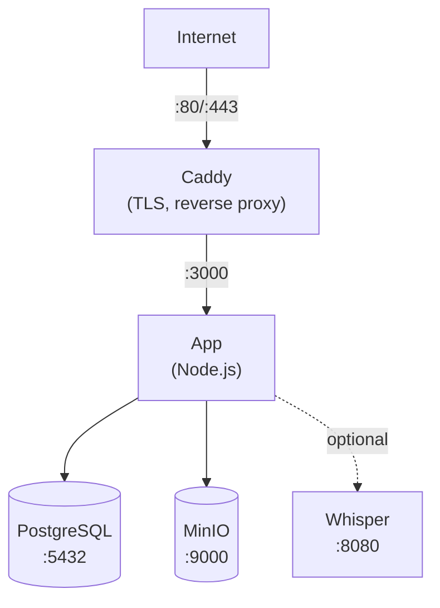

Gid sa a akonpanye ou nan deplwaman Llamenos ak Docker Compose sou yon sèl sèvè. W ap genyen yon liy dirèk ki fonksyone nèt ak HTTPS otomatik, baz done PostgreSQL, estokaj objè, ak transkripsyon opsyonèl — tout sa jere pa Docker Compose.

## Kondisyon prealab

- Yon sèvè Linux (Ubuntu 22.04+, Debian 12+, oswa menm jan)
- [Docker Engine](https://docs.docker.com/engine/install/) v24+ ak Docker Compose v2
- Yon non domèn ak DNS ki pointe sou IP sèvè ou a
- [Bun](https://bun.sh/) enstale lokalman (pou jenere pè kle administratè a)

## 1. Klone depo a

```bash
git clone https://github.com/your-org/llamenos-platform.git
cd llamenos-platform
```

## 2. Jenere pè kle administratè a

Ou bezwen yon pè kle Nostr pou kont administratè a. Egzekite sa sou machin lokal ou (oswa sou sèvè a si Bun enstale):

```bash
bun install
bun run bootstrap-admin
```

Sere **nsec** la (enfòmasyon koneksyon administratè) an sekirite. Kopye **kle piblik hex** la — w ap bezwen li nan pwochen etap la.

## 3. Konfigire anviwonman an

```bash
cd deploy/docker
cp .env.example .env
```

Modifye `.env` ak valè ou yo:

```env
# Obligatwa
ADMIN_PUBKEY=your_hex_public_key_from_step_2
DOMAIN=hotline.yourdomain.com

# Modpas PostgreSQL (jenere yon ki fò)
PG_PASSWORD=$(openssl rand -base64 24)

# Non liy dirèk la (afiche nan envit IVR)
HOTLINE_NAME=Your Hotline

# Founisè vwa (opsyonèl — ka konfigire nan entèfas admin)
TWILIO_ACCOUNT_SID=your_sid
TWILIO_AUTH_TOKEN=your_token
TWILIO_PHONE_NUMBER=+1234567890

# Kalifikasyon MinIO (chanje valè pa defo yo!)
MINIO_ACCESS_KEY=your-access-key
MINIO_SECRET_KEY=your-secret-key-min-8-chars
```

> **Enpòtan**: Mete modpas fò ak inik pou `PG_PASSWORD`, `MINIO_ACCESS_KEY`, ak `MINIO_SECRET_KEY`.

## 4. Konfigire domèn ou a

Modifye `Caddyfile` pou defini domèn ou a:

```
hotline.yourdomain.com {
    reverse_proxy app:3000
    encode gzip
    header {
        Strict-Transport-Security "max-age=63072000; includeSubDomains; preload"
        X-Content-Type-Options "nosniff"
        X-Frame-Options "DENY"
        Referrer-Policy "no-referrer"
    }
}
```

Caddy jwenn ak renouvle sètifika TLS Let's Encrypt otomatikman pou domèn ou a. Asire pò 80 ak 443 ouvè nan firewall ou a.

## 5. Kòmanse sèvis yo

```bash
docker compose up -d
```

Sa kòmanse kat sèvis prensipal:

| Sèvis | Objektif | Pò |
|-------|---------|-----|
| **app** | Aplikasyon Llamenos | 3000 (entèn) |
| **postgres** | Baz done PostgreSQL | 5432 (entèn) |
| **caddy** | Reverse proxy + TLS | 80, 443 |
| **minio** | Estokaj fichye/anrejistreman | 9000, 9001 (entèn) |

Verifye tout bagay ap mache:

```bash
docker compose ps
docker compose logs app --tail 50
```

Verifye pwen finisman sante a:

```bash
curl https://hotline.yourdomain.com/api/health
# → {"status":"ok"}
```

## 6. Premye koneksyon

Ouvri `https://hotline.yourdomain.com` nan navigatè ou. Konekte ak nsec administratè a nan etap 2. Asistan konfigirasyon an ap gide ou nan:

1. **Bay liy dirèk ou yon non** — non ki afiche nan aplikasyon an
2. **Chwazi chanèl yo** — aktive Vwa, SMS, WhatsApp, Signal, ak/oswa Rapò
3. **Konfigire founisè yo** — antre kalifikasyon pou chak chanèl
4. **Revize ak fini**

## 7. Konfigire webhook yo

Dirije webhook founisè telefoni ou a sou domèn ou. Gade gid espesifik pou chak founisè pou detay:

- **Vwa** (tout founisè): `https://hotline.yourdomain.com/telephony/incoming`
- **SMS**: `https://hotline.yourdomain.com/api/messaging/sms/webhook`
- **WhatsApp**: `https://hotline.yourdomain.com/api/messaging/whatsapp/webhook`
- **Signal**: Konfigire bridge la pou transfere nan `https://hotline.yourdomain.com/api/messaging/signal/webhook`

## Opsyonèl: Aktive transkripsyon

Sèvis transkripsyon Whisper a mande plis RAM (4 Go+). Aktive li ak pwofil `transcription`:

```bash
docker compose --profile transcription up -d
```

Sa kòmanse yon kontenè `faster-whisper-server` ki itilize modèl `base` sou CPU. Pou transkripsyon pi vit:

- **Itilize yon modèl pi gwo**: Modifye `docker-compose.yml` epi chanje `WHISPER__MODEL` an `Systran/faster-whisper-small` oswa `Systran/faster-whisper-medium`
- **Itilize akelerasyon GPU**: Chanje `WHISPER__DEVICE` an `cuda` epi ajoute resous GPU nan sèvis whisper la

## Opsyonèl: Aktive Asterisk

Pou telefoni SIP otojere (gade [Konfigirasyon Asterisk](/docs/deploy/providers/asterisk)):

```bash
# Defini sekrè pataje bridge la
echo "BRIDGE_SECRET=$(openssl rand -hex 32)" >> .env

docker compose --profile asterisk up -d
```

## Opsyonèl: Aktive Signal

Pou mesajri Signal (gade [Konfigirasyon Signal](/docs/deploy/providers/signal)):

```bash
docker compose --profile signal up -d
```

W ap bezwen anrejistre nimewo Signal la nan kontenè signal-cli a. Gade [gid konfigirasyon Signal](/docs/deploy/providers/signal) pou enstriksyon.

## Miz a jou

Tire dènye imaj yo epi redmare:

```bash
docker compose pull
docker compose up -d
```

Done ou yo sere nan volim Docker (`postgres-data`, `minio-data`, elatriye) epi yo siviv redemaraj kontenè ak miz a jou imaj.

## Sovgad

### PostgreSQL

Itilize `pg_dump` pou sovgad baz done:

```bash
docker compose exec postgres pg_dump -U llamenos llamenos > backup-$(date +%Y%m%d).sql
```

Pou restore:

```bash
docker compose exec -T postgres psql -U llamenos llamenos < backup-20250101.sql
```

### Estokaj MinIO

MinIO estoke fichye ki telechaje, anrejistreman, ak atachman:

```bash
# Itilize kliyan MinIO a (mc)
docker compose exec minio mc alias set local http://localhost:9000 $MINIO_ACCESS_KEY $MINIO_SECRET_KEY
docker compose exec minio mc mirror local/llamenos /tmp/minio-backup
docker compose cp minio:/tmp/minio-backup ./minio-backup-$(date +%Y%m%d)
```

### Sovgad otomatize

Pou pwodiksyon, mete yon travay cron:

```bash
# /etc/cron.d/llamenos-backup
0 3 * * * root cd /path/to/llamenos/deploy/docker && docker compose exec -T postgres pg_dump -U llamenos llamenos | gzip > /backups/llamenos-$(date +\%Y\%m\%d).sql.gz 2>&1 | logger -t llamenos-backup
```

## Siveyans

### Verifikasyon sante

Aplikasyon an ekspoze yon pwen finisman sante sou `/api/health`. Docker Compose gen verifikasyon sante entegre. Siveye deyò ak nenpòt zouti siveyans HTTP.

### Jounal

```bash
# Tout sèvis yo
docker compose logs -f

# Sèvis espesifik
docker compose logs -f app

# Dènye 100 liy
docker compose logs --tail 100 app
```

### Itilizasyon resous

```bash
docker stats
```

## Depannaj

### Aplikasyon an pa kòmanse

```bash
# Verifye jounal yo pou erè
docker compose logs app

# Verifye .env chaje
docker compose config

# Verifye PostgreSQL an bon sante
docker compose ps postgres
docker compose logs postgres
```

### Pwoblèm sètifika

Caddy bezwen pò 80 ak 443 ouvè pou defi ACME. Verifye ak:

```bash
# Verifye jounal Caddy
docker compose logs caddy

# Verifye pò yo aksesib
curl -I http://hotline.yourdomain.com
```

### Erè koneksyon MinIO

Asire sèvis MinIO a an bon sante anvan aplikasyon an kòmanse:

```bash
docker compose ps minio
docker compose logs minio
```

## Achitekti sèvis yo



## Pwochen etap yo

- [Gid pou Administratè](/docs/admin-guide) — konfigire liy dirèk la
- [Apèsi Ebèjman Pa Ou Menm](/docs/deploy/self-hosting) — konpare opsyon deplwaman
- [Deplwaman Kubernetes](/docs/deploy/kubernetes) — migre sou Helm
