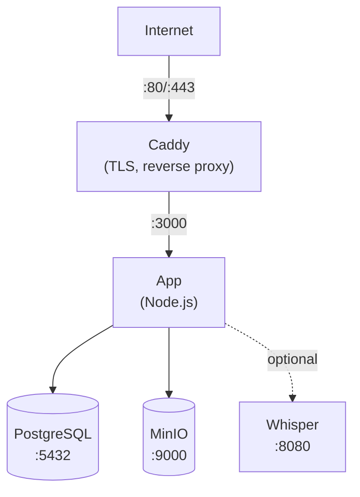

이 가이드는 단일 서버에서 Docker Compose를 사용하여 Llamenos를 배포하는 과정을 안내합니다. 자동 HTTPS, PostgreSQL 데이터베이스, 오브젝트 스토리지 및 선택적 음성 변환 기능을 포함한 완전한 핫라인을 Docker Compose로 관리합니다.

## 사전 요구 사항

- Linux 서버 (Ubuntu 22.04+, Debian 12+ 또는 유사)
- [Docker Engine](https://docs.docker.com/engine/install/) v24+ 및 Docker Compose v2
- 서버 IP를 가리키는 도메인 이름
- [Bun](https://bun.sh/) 로컬 설치 (관리자 키 쌍 생성용)

## 1. 저장소 복제

```bash
git clone https://github.com/your-org/llamenos.git
cd llamenos
```

## 2. 관리자 키 쌍 생성

관리자 계정에 Nostr 키 쌍이 필요합니다. 로컬 머신(또는 Bun이 설치된 서버)에서 실행하세요:

```bash
bun install
bun run bootstrap-admin
```

**nsec**(관리자 로그인 자격 증명)을 안전하게 저장하세요. **16진수 공개 키**를 복사하세요 — 다음 단계에서 필요합니다.

## 3. 환경 설정

```bash
cd deploy/docker
cp .env.example .env
```

`.env` 파일을 다음 값으로 편집하세요:

```env
# 필수
ADMIN_PUBKEY=your_hex_public_key_from_step_2
DOMAIN=hotline.yourdomain.com

# PostgreSQL 비밀번호 (강력한 비밀번호 생성)
PG_PASSWORD=$(openssl rand -base64 24)

# 핫라인 표시 이름 (IVR 프롬프트에 표시됨)
HOTLINE_NAME=Your Hotline

# 음성 서비스 제공업체 (선택 사항 — 관리자 UI에서 설정 가능)
TWILIO_ACCOUNT_SID=your_sid
TWILIO_AUTH_TOKEN=your_token
TWILIO_PHONE_NUMBER=+1234567890

# MinIO 자격 증명 (기본값에서 변경하세요!)
MINIO_ACCESS_KEY=your-access-key
MINIO_SECRET_KEY=your-secret-key-min-8-chars
```

> **중요**: `PG_PASSWORD`, `MINIO_ACCESS_KEY`, `MINIO_SECRET_KEY`에 강력하고 고유한 비밀번호를 설정하세요.

## 4. 도메인 설정

`Caddyfile`을 편집하여 도메인을 설정하세요:

```
hotline.yourdomain.com {
    reverse_proxy app:3000
    encode gzip
    header {
        Strict-Transport-Security "max-age=63072000; includeSubDomains; preload"
        X-Content-Type-Options "nosniff"
        X-Frame-Options "DENY"
        Referrer-Policy "no-referrer"
    }
}
```

Caddy는 도메인의 Let's Encrypt TLS 인증서를 자동으로 발급하고 갱신합니다. 방화벽에서 포트 80과 443이 열려 있는지 확인하세요.

## 5. 서비스 시작

```bash
docker compose up -d
```

이 명령으로 네 가지 핵심 서비스가 시작됩니다:

| 서비스 | 용도 | 포트 |
|--------|------|------|
| **app** | Llamenos 애플리케이션 | 3000 (내부) |
| **postgres** | PostgreSQL 데이터베이스 | 5432 (내부) |
| **caddy** | 리버스 프록시 + TLS | 80, 443 |
| **minio** | 파일/녹음 저장소 | 9000, 9001 (내부) |

모든 서비스가 실행 중인지 확인하세요:

```bash
docker compose ps
docker compose logs app --tail 50
```

건강 상태 엔드포인트를 확인하세요:

```bash
curl https://hotline.yourdomain.com/api/health
# → {"status":"ok"}
```

## 6. 첫 로그인

브라우저에서 `https://hotline.yourdomain.com`을 여세요. 2단계에서 받은 관리자 nsec으로 로그인하세요. 설정 마법사가 다음 과정을 안내합니다:

1. **핫라인 이름 지정** — 앱에 표시할 이름
2. **채널 선택** — 음성, SMS, WhatsApp, Signal 및/또는 신고 기능 활성화
3. **제공업체 설정** — 각 채널의 자격 증명 입력
4. **검토 및 완료**

## 7. 웹훅 설정

전화 서비스 제공업체의 웹훅을 도메인으로 설정하세요. 자세한 내용은 각 제공업체 가이드를 참조하세요:

- **음성** (모든 제공업체): `https://hotline.yourdomain.com/telephony/incoming`
- **SMS**: `https://hotline.yourdomain.com/api/messaging/sms/webhook`
- **WhatsApp**: `https://hotline.yourdomain.com/api/messaging/whatsapp/webhook`
- **Signal**: 브리지가 `https://hotline.yourdomain.com/api/messaging/signal/webhook`으로 전달하도록 설정

## 선택 사항: 음성 변환 활성화

Whisper 음성 변환 서비스는 추가 RAM(4 GB 이상)이 필요합니다. `transcription` 프로파일로 활성화하세요:

```bash
docker compose --profile transcription up -d
```

이 명령은 CPU에서 `base` 모델을 사용하는 `faster-whisper-server` 컨테이너를 시작합니다. 더 빠른 음성 변환을 위해:

- **더 큰 모델 사용**: `docker-compose.yml`에서 `WHISPER__MODEL`을 `Systran/faster-whisper-small` 또는 `Systran/faster-whisper-medium`으로 변경
- **GPU 가속 사용**: `WHISPER__DEVICE`를 `cuda`로 변경하고 whisper 서비스에 GPU 리소스를 추가

## 선택 사항: Asterisk 활성화

자체 호스팅 SIP 전화 서비스([Asterisk 설정](/docs/deploy/providers/asterisk) 참조):

```bash
# 브리지 공유 시크릿 설정
echo "BRIDGE_SECRET=$(openssl rand -hex 32)" >> .env

docker compose --profile asterisk up -d
```

## 선택 사항: Signal 활성화

Signal 메시징([Signal 설정](/docs/deploy/providers/signal) 참조):

```bash
docker compose --profile signal up -d
```

signal-cli 컨테이너를 통해 Signal 번호를 등록해야 합니다. 자세한 내용은 [Signal 설정 가이드](/docs/deploy/providers/signal)를 참조하세요.

## 업데이트

최신 이미지를 가져와 재시작하세요:

```bash
docker compose pull
docker compose up -d
```

데이터는 Docker 볼륨(`postgres-data`, `minio-data` 등)에 유지되며 컨테이너 재시작 및 이미지 업데이트 후에도 보존됩니다.

## 백업

### PostgreSQL

데이터베이스 백업에 `pg_dump`를 사용하세요:

```bash
docker compose exec postgres pg_dump -U llamenos llamenos > backup-$(date +%Y%m%d).sql
```

복원하려면:

```bash
docker compose exec -T postgres psql -U llamenos llamenos < backup-20250101.sql
```

### MinIO 스토리지

MinIO는 업로드된 파일, 녹음 및 첨부 파일을 저장합니다:

```bash
# MinIO 클라이언트(mc) 사용
docker compose exec minio mc alias set local http://localhost:9000 $MINIO_ACCESS_KEY $MINIO_SECRET_KEY
docker compose exec minio mc mirror local/llamenos /tmp/minio-backup
docker compose cp minio:/tmp/minio-backup ./minio-backup-$(date +%Y%m%d)
```

### 자동 백업

프로덕션 환경에서는 cron 작업을 설정하세요:

```bash
# /etc/cron.d/llamenos-backup
0 3 * * * root cd /path/to/llamenos/deploy/docker && docker compose exec -T postgres pg_dump -U llamenos llamenos | gzip > /backups/llamenos-$(date +\%Y\%m\%d).sql.gz 2>&1 | logger -t llamenos-backup
```

## 모니터링

### 건강 상태 확인

앱은 `/api/health`에서 건강 상태 엔드포인트를 제공합니다. Docker Compose에는 내장 건강 상태 확인이 있습니다. HTTP 업타임 모니터링 도구로 외부에서 모니터링하세요.

### 로그

```bash
# 모든 서비스
docker compose logs -f

# 특정 서비스
docker compose logs -f app

# 마지막 100줄
docker compose logs --tail 100 app
```

### 리소스 사용량

```bash
docker stats
```

## 문제 해결

### 앱이 시작되지 않는 경우

```bash
# 오류 로그 확인
docker compose logs app

# .env 로드 여부 확인
docker compose config

# PostgreSQL 정상 상태 확인
docker compose ps postgres
docker compose logs postgres
```

### 인증서 문제

Caddy는 ACME 챌린지를 위해 포트 80과 443이 열려 있어야 합니다. 다음으로 확인하세요:

```bash
# Caddy 로그 확인
docker compose logs caddy

# 포트 접근 가능 여부 확인
curl -I http://hotline.yourdomain.com
```

### MinIO 연결 오류

앱 시작 전에 MinIO 서비스가 정상인지 확인하세요:

```bash
docker compose ps minio
docker compose logs minio
```

## 서비스 아키텍처



## 다음 단계

- [관리자 가이드](/docs/admin-guide) — 핫라인 설정
- [자체 호스팅 개요](/docs/deploy/self-hosting) — 배포 옵션 비교
- [Kubernetes 배포](/docs/deploy/kubernetes) — Helm으로 마이그레이션
