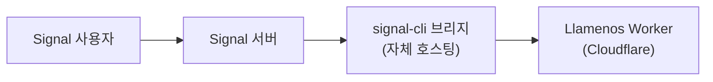

Llamenos는 자체 호스팅 [signal-cli-rest-api](https://github.com/bbernhard/signal-cli-rest-api) 브리지를 통해 Signal 메시징을 지원합니다. Signal은 모든 메시징 채널 중 가장 강력한 개인정보 보호를 제공하므로, 민감한 위기 대응 시나리오에 이상적입니다.

## 사전 요구 사항

- 브리지용 Linux 서버 또는 VM (Asterisk와 같은 서버이거나 별도 서버 가능)
- 브리지 서버에 Docker 설치
- Signal 등록용 전용 전화번호
- 브리지에서 Cloudflare Worker로의 네트워크 접근

## 아키텍처



signal-cli 브리지는 사용자 인프라에서 실행되며 HTTP 웹훅을 통해 Worker로 메시지를 전달합니다. 이는 Signal에서 애플리케이션까지의 전체 메시지 경로를 사용자가 제어한다는 것을 의미합니다.

## 1. signal-cli 브리지 배포

signal-cli-rest-api Docker 컨테이너를 실행하세요:

```bash
docker run -d \
  --name signal-cli \
  --restart unless-stopped \
  -p 8080:8080 \
  -v signal-cli-data:/home/.local/share/signal-cli \
  -e MODE=json-rpc \
  bbernhard/signal-cli-rest-api:latest
```

## 2. 전화번호 등록

전용 전화번호로 브리지를 등록하세요:

```bash
# SMS로 인증 코드 요청
curl -X POST http://localhost:8080/v1/register/+1234567890

# 받은 코드로 인증
curl -X POST http://localhost:8080/v1/register/+1234567890/verify/123456
```

## 3. 웹훅 전달 설정

들어오는 메시지를 Worker로 전달하도록 브리지를 설정하세요:

```bash
curl -X PUT http://localhost:8080/v1/about \
  -H "Content-Type: application/json" \
  -d '{
    "webhook": {
      "url": "https://your-worker.your-domain.com/api/messaging/signal/webhook",
      "headers": {
        "Authorization": "Bearer your-webhook-secret"
      }
    }
  }'
```

## 4. 관리자 설정에서 Signal 활성화

**관리자 설정 > 메시징 채널** (또는 설정 마법사)로 이동하여 **Signal**을 활성화하세요.

다음을 입력하세요:
- **Bridge URL** — signal-cli 브리지의 URL (예: `https://signal-bridge.example.com:8080`)
- **Bridge API Key** — 브리지에 대한 요청 인증을 위한 bearer 토큰
- **Webhook Secret** — 들어오는 웹훅을 검증하는 데 사용되는 시크릿 (3단계에서 설정한 것과 일치해야 함)
- **Registered Number** — Signal에 등록된 전화번호

## 5. 테스트

등록된 전화번호로 Signal 메시지를 보내세요. 대화가 **대화** 탭에 나타나야 합니다.

## 건강 상태 모니터링

Llamenos는 signal-cli 브리지 건강 상태를 모니터링합니다:
- 브리지의 `/v1/about` 엔드포인트에 대한 주기적 건강 상태 확인
- 브리지에 접근할 수 없는 경우 우아한 성능 저하 — 다른 채널은 계속 작동
- 브리지가 다운되면 관리자 알림

## 음성 메시지 음성 변환

Signal 음성 메시지는 클라이언트측 Whisper (WASM, `@huggingface/transformers`)를 사용하여 자원봉사자의 브라우저에서 직접 변환할 수 있습니다. 오디오는 기기를 떠나지 않으며 — 변환 텍스트는 대화 뷰에서 음성 메시지와 함께 암호화되어 저장됩니다. 자원봉사자는 개인 설정에서 음성 변환을 활성화하거나 비활성화할 수 있습니다.

## 보안 참고 사항

- Signal은 사용자와 signal-cli 브리지 사이에 종단 간 암호화를 제공합니다
- 브리지는 웹훅으로 전달하기 위해 메시지를 복호화합니다 — 브리지 서버는 평문에 접근할 수 있습니다
- 웹훅 인증은 constant-time 비교를 사용하는 bearer 토큰을 사용합니다
- 브리지를 Asterisk 서버(해당하는 경우)와 같은 네트워크에 유지하여 노출을 최소화하세요
- 브리지는 Docker 볼륨에 메시지 기록을 로컬에 저장합니다 — 저장 시 암호화를 고려하세요
- 최대 개인정보 보호를 위해: Asterisk(음성)와 signal-cli(메시징) 모두를 자체 인프라에서 호스팅하세요

## 문제 해결

- **브리지가 메시지를 수신하지 않는 경우**: `GET /v1/about`으로 전화번호가 올바르게 등록되었는지 확인하세요
- **웹훅 전달 실패**: 브리지 서버에서 웹훅 URL에 접근 가능한지, authorization 헤더가 일치하는지 확인하세요
- **등록 문제**: 일부 전화번호는 기존 Signal 계정에서 먼저 연결 해제해야 할 수 있습니다
