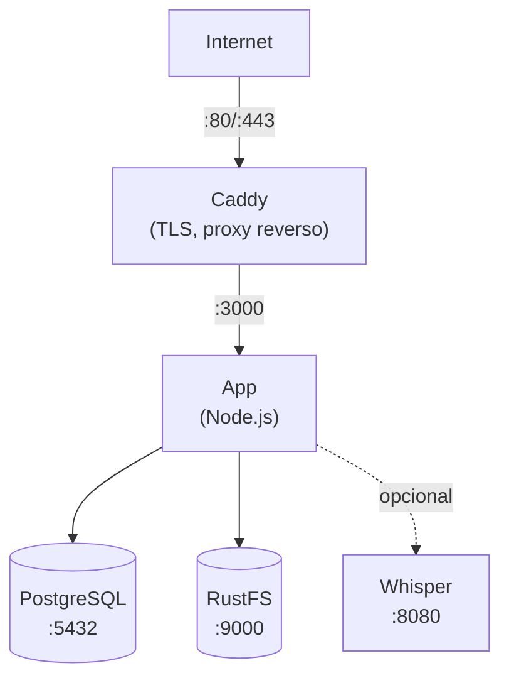

Este guia orienta voce na implantacao do Llamenos com Docker Compose em um unico servidor. Voce tera uma linha direta totalmente funcional com HTTPS automatico, banco de dados PostgreSQL, armazenamento de objetos e transcricao opcional -- tudo gerenciado pelo Docker Compose.

## Pre-requisitos

- Um servidor Linux (Ubuntu 22.04+, Debian 12+ ou similar)
- [Docker Engine](https://docs.docker.com/engine/install/) v24+ com Docker Compose v2
- Um nome de dorustfs com DNS apontando para o IP do seu servidor
- [Bun](https://bun.sh/) instalado localmente (para gerar o par de chaves do administrador)

## 1. Clonar o repositorio

```bash
git clone https://github.com/your-org/llamenos.git
cd llamenos
```

## 2. Gerar o par de chaves do administrador

Voce precisa de um par de chaves Nostr para a conta de administrador. Execute isso na sua maquina local (ou no servidor se o Bun estiver instalado):

```bash
bun install
bun run bootstrap-admin
```

Guarde o **nsec** (sua credencial de login de administrador) com seguranca. Copie a **chave publica hexadecimal** -- voce precisara dela no proximo passo.

## 3. Configurar o ambiente

```bash
cd deploy/docker
cp .env.example .env
```

Edite o `.env` com seus valores:

```env
# Obrigatorio
ADMIN_PUBKEY=sua_chave_publica_hex_do_passo_2
DOMAIN=hotline.seudorustfs.com

# Senha do PostgreSQL (gere uma forte)
PG_PASSWORD=$(openssl rand -base64 24)

# Nome da linha (exibido nos prompts IVR)
HOTLINE_NAME=Sua Linha

# Provedor de voz (opcional -- pode configurar pela interface de administracao)
TWILIO_ACCOUNT_SID=seu_sid
TWILIO_AUTH_TOKEN=seu_token
TWILIO_PHONE_NUMBER=+1234567890

# Credenciais do RustFS (altere os valores padrao!)
STORAGE_ACCESS_KEY=sua-chave-de-acesso
STORAGE_SECRET_KEY=sua-chave-secreta-min-8-chars
```

> **Importante**: Defina senhas fortes e unicas para `PG_PASSWORD`, `STORAGE_ACCESS_KEY` e `STORAGE_SECRET_KEY`.

## 4. Configurar seu dorustfs

Edite o `Caddyfile` para definir seu dorustfs:

```
hotline.seudorustfs.com {
    reverse_proxy app:3000
    encode gzip
    header {
        Strict-Transport-Security "max-age=63072000; includeSubDomains; preload"
        X-Content-Type-Options "nosniff"
        X-Frame-Options "DENY"
        Referrer-Policy "no-referrer"
    }
}
```

O Caddy obtem e renova automaticamente os certificados TLS do Let's Encrypt para seu dorustfs. Certifique-se de que as portas 80 e 443 estejam abertas no seu firewall.

## 5. Iniciar os servicos

```bash
docker compose up -d
```

Isso inicia quatro servicos principais:

| Servico | Funcao | Porta |
|---------|--------|-------|
| **app** | Aplicacao Llamenos | 3000 (interna) |
| **postgres** | Banco de dados PostgreSQL | 5432 (interna) |
| **caddy** | Proxy reverso + TLS | 80, 443 |
| **rustfs** | Armazenamento de arquivos/gravacoes | 9000, 9001 (interna) |

Verifique se tudo esta em execucao:

```bash
docker compose ps
docker compose logs app --tail 50
```

Verifique o endpoint de saude:

```bash
curl https://hotline.seudorustfs.com/api/health
# → {"status":"ok"}
```

## 6. Primeiro login

Abra `https://hotline.seudorustfs.com` no seu navegador. Faca login com o nsec de administrador do passo 2. O assistente de configuracao ira guia-lo pelas etapas:

1. **Nomear sua linha** -- nome de exibicao do aplicativo
2. **Escolher canais** -- ativar Voz, SMS, WhatsApp, Signal e/ou Reportes
3. **Configurar provedores** -- inserir credenciais de cada canal
4. **Revisar e finalizar**

## 7. Configurar webhooks

Aponte os webhooks do seu provedor de telefonia para o seu dorustfs. Consulte os guias especificos de cada provedor para detalhes:

- **Voz** (todos os provedores): `https://hotline.seudorustfs.com/telephony/incoming`
- **SMS**: `https://hotline.seudorustfs.com/api/messaging/sms/webhook`
- **WhatsApp**: `https://hotline.seudorustfs.com/api/messaging/whatsapp/webhook`
- **Signal**: Configure o bridge para encaminhar para `https://hotline.seudorustfs.com/api/messaging/signal/webhook`

## Opcional: Ativar transcricao

O servico de transcricao Whisper requer RAM adicional (4 GB+). Ative-o com o perfil `transcription`:

```bash
docker compose --profile transcription up -d
```

Isso inicia um container `faster-whisper-server` usando o modelo `base` em CPU. Para transcricao mais rapida:

- **Usar um modelo maior**: Edite `docker-compose.yml` e altere `WHISPER__MODEL` para `Systran/faster-whisper-small` ou `Systran/faster-whisper-medium`
- **Usar aceleracao GPU**: Altere `WHISPER__DEVICE` para `cuda` e adicione recursos de GPU ao servico whisper

## Opcional: Ativar Asterisk

Para telefonia SIP auto-hospedada (veja [configuracao do Asterisk](/docs/setup-asterisk)):

```bash
# Definir o segredo compartilhado do bridge
echo "BRIDGE_SECRET=$(openssl rand -hex 32)" >> .env

docker compose --profile asterisk up -d
```

## Opcional: Ativar Signal

Para mensagens Signal (veja [configuracao do Signal](/docs/setup-signal)):

```bash
docker compose --profile signal up -d
```

Voce precisara registrar o numero do Signal pelo container signal-cli. Consulte o [guia de configuracao do Signal](/docs/setup-signal) para instrucoes.

## Atualizacao

Baixe as imagens mais recentes e reinicie:

```bash
docker compose pull
docker compose up -d
```

Seus dados sao persistidos em volumes Docker (`postgres-data`, `rustfs-data`, etc.) e sobrevivem a reinicializacoes de containers e atualizacoes de imagens.

## Backups

### PostgreSQL

Use `pg_dump` para backups do banco de dados:

```bash
docker compose exec postgres pg_dump -U llamenos llamenos > backup-$(date +%Y%m%d).sql
```

Para restaurar:

```bash
docker compose exec -T postgres psql -U llamenos llamenos < backup-20250101.sql
```

### Armazenamento RustFS

O RustFS armazena arquivos enviados, gravacoes e anexos:

```bash
# Usando o cliente RustFS (mc)
docker compose exec rustfs mc alias set local http://localhost:9000 $STORAGE_ACCESS_KEY $STORAGE_SECRET_KEY
docker compose exec rustfs mc mirror local/llamenos /tmp/rustfs-backup
docker compose cp rustfs:/tmp/rustfs-backup ./rustfs-backup-$(date +%Y%m%d)
```

### Backups automatizados

Para producao, configure um cron job:

```bash
# /etc/cron.d/llamenos-backup
0 3 * * * root cd /path/to/llamenos/deploy/docker && docker compose exec -T postgres pg_dump -U llamenos llamenos | gzip > /backups/llamenos-$(date +\%Y\%m\%d).sql.gz 2>&1 | logger -t llamenos-backup
```

## Monitoramento

### Verificacoes de saude

O aplicativo expoe um endpoint de saude em `/api/health`. O Docker Compose possui verificacoes de saude integradas. Monitore externamente com qualquer verificador de uptime HTTP.

### Logs

```bash
# Todos os servicos
docker compose logs -f

# Servico especifico
docker compose logs -f app

# Ultimas 100 linhas
docker compose logs --tail 100 app
```

### Uso de recursos

```bash
docker stats
```

## Solucao de problemas

### O aplicativo nao inicia

```bash
# Verificar logs em busca de erros
docker compose logs app

# Verificar se o .env esta carregado
docker compose config

# Verificar se o PostgreSQL esta saudavel
docker compose ps postgres
docker compose logs postgres
```

### Problemas com certificado

O Caddy precisa das portas 80 e 443 abertas para os desafios ACME. Verifique com:

```bash
# Verificar logs do Caddy
docker compose logs caddy

# Verificar se as portas estao acessiveis
curl -I http://hotline.seudorustfs.com
```

### Erros de conexao com RustFS

Certifique-se de que o servico RustFS esteja saudavel antes de o aplicativo iniciar:

```bash
docker compose ps rustfs
docker compose logs rustfs
```

## Arquitetura dos servicos



## Proximos passos

- [Guia do administrador](/docs/admin-guide) -- configurar a linha
- [Visao geral do auto-hospedagem](/docs/self-hosting) -- comparar opcoes de implantacao
- [Implantacao no Kubernetes](/docs/deploy-kubernetes) -- migrar para Helm
