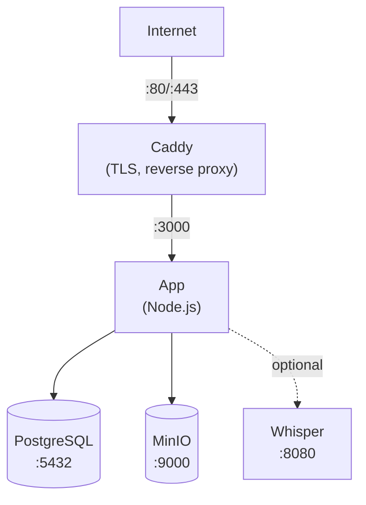

Это руководство поможет вам развернуть Llamenos с помощью Docker Compose на одном сервере. Вы получите полнофункциональную горячую линию с автоматическим HTTPS, базой данных PostgreSQL, объектным хранилищем и опциональной транскрипцией — всё под управлением Docker Compose.

## Предварительные требования

- Сервер Linux (Ubuntu 22.04+, Debian 12+ или аналогичный)
- [Docker Engine](https://docs.docker.com/engine/install/) v24+ с Docker Compose v2
- Доменное имя с DNS, указывающим на IP вашего сервера
- [Bun](https://bun.sh/), установленный локально (для генерации пары ключей администратора)

## 1. Клонирование репозитория

```bash
git clone https://github.com/your-org/llamenos.git
cd llamenos
```

## 2. Генерация пары ключей администратора

Вам потребуется пара ключей Nostr для учётной записи администратора. Выполните это на локальном компьютере (или на сервере, если установлен Bun):

```bash
bun install
bun run bootstrap-admin
```

Сохраните **nsec** (учётные данные для входа администратора) в надёжном месте. Скопируйте **шестнадцатеричный публичный ключ** — он понадобится на следующем шаге.

## 3. Настройка переменных окружения

```bash
cd deploy/docker
cp .env.example .env
```

Отредактируйте `.env`, указав ваши значения:

```env
# Required
ADMIN_PUBKEY=your_hex_public_key_from_step_2
DOMAIN=hotline.yourdomain.com

# PostgreSQL password (generate a strong one)
PG_PASSWORD=$(openssl rand -base64 24)

# Hotline display name (shown in IVR prompts)
HOTLINE_NAME=Your Hotline

# Voice provider (optional — can configure via admin UI)
TWILIO_ACCOUNT_SID=your_sid
TWILIO_AUTH_TOKEN=your_token
TWILIO_PHONE_NUMBER=+1234567890

# MinIO credentials (change from defaults!)
MINIO_ACCESS_KEY=your-access-key
MINIO_SECRET_KEY=your-secret-key-min-8-chars
```

> **Важно**: Установите надёжные уникальные пароли для `PG_PASSWORD`, `MINIO_ACCESS_KEY` и `MINIO_SECRET_KEY`.

## 4. Настройка домена

Отредактируйте `Caddyfile`, указав ваш домен:

```
hotline.yourdomain.com {
    reverse_proxy app:3000
    encode gzip
    header {
        Strict-Transport-Security "max-age=63072000; includeSubDomains; preload"
        X-Content-Type-Options "nosniff"
        X-Frame-Options "DENY"
        Referrer-Policy "no-referrer"
    }
}
```

Caddy автоматически получает и обновляет TLS-сертификаты Let's Encrypt для вашего домена. Убедитесь, что порты 80 и 443 открыты в вашем брандмауэре.

## 5. Запуск сервисов

```bash
docker compose up -d
```

Запускаются четыре основных сервиса:

| Сервис | Назначение | Порт |
|---------|---------|------|
| **app** | Приложение Llamenos | 3000 (внутренний) |
| **postgres** | База данных PostgreSQL | 5432 (внутренний) |
| **caddy** | Обратный прокси + TLS | 80, 443 |
| **minio** | Хранилище файлов/записей | 9000, 9001 (внутренний) |

Проверьте, что всё запущено:

```bash
docker compose ps
docker compose logs app --tail 50
```

Проверьте эндпоинт состояния:

```bash
curl https://hotline.yourdomain.com/api/health
# → {"status":"ok"}
```

## 6. Первый вход

Откройте `https://hotline.yourdomain.com` в браузере. Войдите с nsec администратора из шага 2. Мастер настройки проведёт вас через следующие шаги:

1. **Название горячей линии** — отображаемое имя для приложения
2. **Выбор каналов** — включите голос, SMS, WhatsApp, Signal и/или отчёты
3. **Настройка поставщиков** — введите учётные данные для каждого канала
4. **Проверка и завершение**

## 7. Настройка вебхуков

Укажите вебхуки вашего провайдера телефонии на ваш домен. Подробности смотрите в руководствах по конкретным провайдерам:

- **Голос** (все провайдеры): `https://hotline.yourdomain.com/telephony/incoming`
- **SMS**: `https://hotline.yourdomain.com/api/messaging/sms/webhook`
- **WhatsApp**: `https://hotline.yourdomain.com/api/messaging/whatsapp/webhook`
- **Signal**: Настройте мост для перенаправления на `https://hotline.yourdomain.com/api/messaging/signal/webhook`

## Опционально: Включение транскрипции

Сервис транскрипции Whisper требует дополнительной оперативной памяти (4 ГБ+). Включите его с помощью профиля `transcription`:

```bash
docker compose --profile transcription up -d
```

Это запустит контейнер `faster-whisper-server` с моделью `base` на CPU. Для более быстрой транскрипции:

- **Используйте модель большего размера**: Отредактируйте `docker-compose.yml` и измените `WHISPER__MODEL` на `Systran/faster-whisper-small` или `Systran/faster-whisper-medium`
- **Используйте ускорение GPU**: Измените `WHISPER__DEVICE` на `cuda` и добавьте ресурсы GPU для сервиса whisper

## Опционально: Включение Asterisk

Для самостоятельно размещённой SIP-телефонии (см. [Настройка Asterisk](/docs/setup-asterisk)):

```bash
# Set the bridge shared secret
echo "BRIDGE_SECRET=$(openssl rand -hex 32)" >> .env

docker compose --profile asterisk up -d
```

## Опционально: Включение Signal

Для обмена сообщениями через Signal (см. [Настройка Signal](/docs/setup-signal)):

```bash
docker compose --profile signal up -d
```

Вам потребуется зарегистрировать номер Signal через контейнер signal-cli. Инструкции см. в [руководстве по настройке Signal](/docs/setup-signal).

## Обновление

Загрузите последние образы и перезапустите:

```bash
docker compose pull
docker compose up -d
```

Ваши данные хранятся в томах Docker (`postgres-data`, `minio-data` и др.) и сохраняются при перезапуске контейнеров и обновлении образов.

## Резервное копирование

### PostgreSQL

Используйте `pg_dump` для резервного копирования базы данных:

```bash
docker compose exec postgres pg_dump -U llamenos llamenos > backup-$(date +%Y%m%d).sql
```

Для восстановления:

```bash
docker compose exec -T postgres psql -U llamenos llamenos < backup-20250101.sql
```

### Хранилище MinIO

MinIO хранит загруженные файлы, записи и вложения:

```bash
# Using the MinIO client (mc)
docker compose exec minio mc alias set local http://localhost:9000 $MINIO_ACCESS_KEY $MINIO_SECRET_KEY
docker compose exec minio mc mirror local/llamenos /tmp/minio-backup
docker compose cp minio:/tmp/minio-backup ./minio-backup-$(date +%Y%m%d)
```

### Автоматическое резервное копирование

Для производственной среды настройте задание cron:

```bash
# /etc/cron.d/llamenos-backup
0 3 * * * root cd /path/to/llamenos/deploy/docker && docker compose exec -T postgres pg_dump -U llamenos llamenos | gzip > /backups/llamenos-$(date +\%Y\%m\%d).sql.gz 2>&1 | logger -t llamenos-backup
```

## Мониторинг

### Проверки состояния

Приложение предоставляет эндпоинт состояния на `/api/health`. Docker Compose имеет встроенные проверки состояния. Следите за ним извне с помощью любого HTTP-монитора доступности.

### Журналы

```bash
# All services
docker compose logs -f

# Specific service
docker compose logs -f app

# Last 100 lines
docker compose logs --tail 100 app
```

### Использование ресурсов

```bash
docker stats
```

## Устранение неполадок

### Приложение не запускается

```bash
# Check logs for errors
docker compose logs app

# Verify .env is loaded
docker compose config

# Check PostgreSQL is healthy
docker compose ps postgres
docker compose logs postgres
```

### Проблемы с сертификатом

Caddy требует, чтобы порты 80 и 443 были открыты для ACME-запросов. Проверьте:

```bash
# Check Caddy logs
docker compose logs caddy

# Verify ports are accessible
curl -I http://hotline.yourdomain.com
```

### Ошибки подключения MinIO

Убедитесь, что сервис MinIO работает исправно перед запуском приложения:

```bash
docker compose ps minio
docker compose logs minio
```

## Архитектура сервисов



## Следующие шаги

- [Руководство администратора](/docs/admin-guide) — настройка горячей линии
- [Обзор самостоятельного хостинга](/docs/self-hosting) — сравнение вариантов развёртывания
- [Развёртывание в Kubernetes](/docs/deploy-kubernetes) — миграция на Helm

Это руководство проведёт вас через развёртывание Llamenos с помощью Docker Compose на одном сервере. Вы получите полностью функциональную горячую линию с автоматическим HTTPS, базой данных PostgreSQL, объектным хранилищем и опциональной транскрипцией — всё под управлением Docker Compose.

## Предварительные требования

- Linux-сервер (Ubuntu 22.04+, Debian 12+ или аналогичный)
- [Docker Engine](https://docs.docker.com/engine/install/) v24+ с Docker Compose v2
- Доменное имя с DNS, указывающим на IP вашего сервера
- [Bun](https://bun.sh/), установленный локально (для генерации ключевой пары администратора)

## 1. Клонирование репозитория

```bash
git clone https://github.com/your-org/llamenos.git
cd llamenos
```

## 2. Генерация ключевой пары администратора

Вам нужна ключевая пара Nostr для учётной записи администратора. Выполните на локальной машине (или на сервере, если Bun установлен):

```bash
bun install
bun run bootstrap-admin
```

Сохраните **nsec** (ваши учётные данные для входа администратора) в безопасном месте. Скопируйте **шестнадцатеричный открытый ключ** — он понадобится на следующем шаге.

## 3. Настройка окружения

```bash
cd deploy/docker
cp .env.example .env
```

Отредактируйте `.env` с вашими значениями:

```env
# Обязательные
ADMIN_PUBKEY=your_hex_public_key_from_step_2
DOMAIN=hotline.yourdomain.com

# Пароль PostgreSQL (сгенерируйте надёжный)
PG_PASSWORD=$(openssl rand -base64 24)

# Отображаемое имя горячей линии (показывается в IVR-сообщениях)
HOTLINE_NAME=Your Hotline

# Провайдер голосовой связи (необязательно — можно настроить через UI администратора)
TWILIO_ACCOUNT_SID=your_sid
TWILIO_AUTH_TOKEN=your_token
TWILIO_PHONE_NUMBER=+1234567890

# Учётные данные MinIO (измените значения по умолчанию!)
MINIO_ACCESS_KEY=your-access-key
MINIO_SECRET_KEY=your-secret-key-min-8-chars
```

> **Важно**: Установите надёжные уникальные пароли для `PG_PASSWORD`, `MINIO_ACCESS_KEY` и `MINIO_SECRET_KEY`.

## 4. Настройка домена

Отредактируйте `Caddyfile` для настройки вашего домена:

```
hotline.yourdomain.com {
    reverse_proxy app:3000
    encode gzip
    header {
        Strict-Transport-Security "max-age=63072000; includeSubDomains; preload"
        X-Content-Type-Options "nosniff"
        X-Frame-Options "DENY"
        Referrer-Policy "no-referrer"
    }
}
```

Caddy автоматически получает и обновляет TLS-сертификаты Let's Encrypt для вашего домена. Убедитесь, что порты 80 и 443 открыты в вашем файрволе.

## 5. Запуск сервисов

```bash
docker compose up -d
```

Это запускает четыре основных сервиса:

| Сервис | Назначение | Порт |
|--------|-----------|------|
| **app** | Приложение Llamenos | 3000 (внутренний) |
| **postgres** | База данных PostgreSQL | 5432 (внутренний) |
| **caddy** | Обратный прокси + TLS | 80, 443 |
| **minio** | Хранилище файлов/записей | 9000, 9001 (внутренний) |

Проверьте, что всё работает:

```bash
docker compose ps
docker compose logs app --tail 50
```

Проверьте endpoint здоровья:

```bash
curl https://hotline.yourdomain.com/api/health
# → {"status":"ok"}
```

## 6. Первый вход

Откройте `https://hotline.yourdomain.com` в браузере. Войдите с nsec администратора из шага 2. Мастер настройки проведёт вас через:

1. **Название горячей линии** — отображаемое имя для приложения
2. **Выбор каналов** — включение голосовой связи, SMS, WhatsApp, Signal и/или отчётов
3. **Настройка провайдеров** — ввод учётных данных для каждого канала
4. **Проверка и завершение**

## 7. Настройка вебхуков

Настройте вебхуки вашего провайдера телефонии на ваш домен. Подробности в руководствах по конкретным провайдерам:

- **Голос** (все провайдеры): `https://hotline.yourdomain.com/telephony/incoming`
- **SMS**: `https://hotline.yourdomain.com/api/messaging/sms/webhook`
- **WhatsApp**: `https://hotline.yourdomain.com/api/messaging/whatsapp/webhook`
- **Signal**: Настройте мост для пересылки на `https://hotline.yourdomain.com/api/messaging/signal/webhook`

## Опционально: Включение транскрипции

Сервис транскрипции Whisper требует дополнительной оперативной памяти (4 ГБ+). Включите его с профилем `transcription`:

```bash
docker compose --profile transcription up -d
```

Это запускает контейнер `faster-whisper-server` с моделью `base` на CPU. Для ускорения транскрипции:

- **Используйте модель большего размера**: В `docker-compose.yml` измените `WHISPER__MODEL` на `Systran/faster-whisper-small` или `Systran/faster-whisper-medium`
- **Используйте ускорение GPU**: Измените `WHISPER__DEVICE` на `cuda` и добавьте ресурсы GPU к сервису whisper

## Опционально: Включение Asterisk

Для самостоятельного хостинга SIP-телефонии (см. [Настройка Asterisk](/docs/setup-asterisk)):

```bash
# Установите общий секрет моста
echo "BRIDGE_SECRET=$(openssl rand -hex 32)" >> .env

docker compose --profile asterisk up -d
```

## Опционально: Включение Signal

Для обмена сообщениями через Signal (см. [Настройка Signal](/docs/setup-signal)):

```bash
docker compose --profile signal up -d
```

Вам нужно зарегистрировать номер Signal через контейнер signal-cli. Подробности в [руководстве по настройке Signal](/docs/setup-signal).

## Обновление

Загрузите последние образы и перезапустите:

```bash
docker compose pull
docker compose up -d
```

Данные сохраняются в томах Docker (`postgres-data`, `minio-data` и др.) и сохраняются при перезапуске контейнеров и обновлении образов.

## Резервное копирование

### PostgreSQL

Используйте `pg_dump` для резервного копирования базы данных:

```bash
docker compose exec postgres pg_dump -U llamenos llamenos > backup-$(date +%Y%m%d).sql
```

Для восстановления:

```bash
docker compose exec -T postgres psql -U llamenos llamenos < backup-20250101.sql
```

### Хранилище MinIO

MinIO хранит загруженные файлы, записи и вложения:

```bash
# Используя клиент MinIO (mc)
docker compose exec minio mc alias set local http://localhost:9000 $MINIO_ACCESS_KEY $MINIO_SECRET_KEY
docker compose exec minio mc mirror local/llamenos /tmp/minio-backup
docker compose cp minio:/tmp/minio-backup ./minio-backup-$(date +%Y%m%d)
```

### Автоматическое резервное копирование

Для продакшена настройте cron-задание:

```bash
# /etc/cron.d/llamenos-backup
0 3 * * * root cd /path/to/llamenos/deploy/docker && docker compose exec -T postgres pg_dump -U llamenos llamenos | gzip > /backups/llamenos-$(date +\%Y\%m\%d).sql.gz 2>&1 | logger -t llamenos-backup
```

## Мониторинг

### Проверки здоровья

Приложение предоставляет endpoint здоровья по адресу `/api/health`. Docker Compose имеет встроенные проверки здоровья. Мониторьте извне с помощью любого HTTP-мониторинга доступности.

### Логи

```bash
# Все сервисы
docker compose logs -f

# Конкретный сервис
docker compose logs -f app

# Последние 100 строк
docker compose logs --tail 100 app
```

### Использование ресурсов

```bash
docker stats
```

## Устранение неполадок

### Приложение не запускается

```bash
# Проверьте логи на наличие ошибок
docker compose logs app

# Проверьте загрузку .env
docker compose config

# Проверьте состояние PostgreSQL
docker compose ps postgres
docker compose logs postgres
```

### Проблемы с сертификатами

Caddy требует открытых портов 80 и 443 для ACME-запросов. Проверьте:

```bash
# Проверьте логи Caddy
docker compose logs caddy

# Проверьте доступность портов
curl -I http://hotline.yourdomain.com
```

### Ошибки подключения MinIO

Убедитесь, что сервис MinIO работает до запуска приложения:

```bash
docker compose ps minio
docker compose logs minio
```

## Архитектура сервисов


## Следующие шаги

- [Руководство администратора](/docs/admin-guide) — настройка горячей линии
- [Обзор самостоятельного хостинга](/docs/self-hosting) — сравнение вариантов развёртывания
- [Развёртывание в Kubernetes](/docs/deploy-kubernetes) — миграция на Helm
