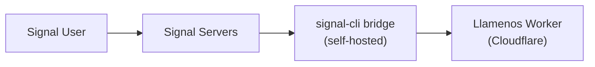

Sinusuportahan ng Llamenos ang Signal messaging sa pamamagitan ng self-hosted na [signal-cli-rest-api](https://github.com/bbernhard/signal-cli-rest-api) bridge. Ang Signal ay nag-aalok ng pinakamatibay na privacy guarantee sa lahat ng messaging channel, kaya perpekto ito para sa sensitibong mga sitwasyon ng crisis response.

## Mga kinakailangan

- Isang Linux server o VM para sa bridge (maaaring pareho ng server ng Asterisk, o hiwalay)
- Naka-install na Docker sa bridge server
- Isang dedikadong numero ng telepono para sa Signal registration
- Network access mula sa bridge papunta sa iyong Cloudflare Worker

## Arkitektura



Ang signal-cli bridge ay tumatakbo sa iyong infrastructure at nagfo-forward ng mga mensahe sa iyong Worker sa pamamagitan ng HTTP webhooks. Ibig sabihin nito, kontrolado mo ang buong daan ng mensahe mula sa Signal hanggang sa iyong application.

## 1. I-deploy ang signal-cli bridge

Patakbuhin ang signal-cli-rest-api Docker container:

```bash
docker run -d \
  --name signal-cli \
  --restart unless-stopped \
  -p 8080:8080 \
  -v signal-cli-data:/home/.local/share/signal-cli \
  -e MODE=json-rpc \
  bbernhard/signal-cli-rest-api:latest
```

## 2. I-register ang numero ng telepono

I-register ang bridge gamit ang isang dedikadong numero ng telepono:

```bash
# Humiling ng verification code sa pamamagitan ng SMS
curl -X POST http://localhost:8080/v1/register/+1234567890

# I-verify gamit ang code na natanggap mo
curl -X POST http://localhost:8080/v1/register/+1234567890/verify/123456
```

## 3. I-configure ang webhook forwarding

I-set up ang bridge para i-forward ang mga papasok na mensahe sa iyong Worker:

```bash
curl -X PUT http://localhost:8080/v1/about \
  -H "Content-Type: application/json" \
  -d '{
    "webhook": {
      "url": "https://your-worker.your-domain.com/api/messaging/signal/webhook",
      "headers": {
        "Authorization": "Bearer your-webhook-secret"
      }
    }
  }'
```

## 4. I-enable ang Signal sa admin settings

Mag-navigate sa **Admin Settings > Messaging Channels** (o gamitin ang setup wizard) at i-toggle ang **Signal** na naka-on.

Ilagay ang mga sumusunod:
- **Bridge URL** — ang URL ng iyong signal-cli bridge (hal. `https://signal-bridge.example.com:8080`)
- **Bridge API Key** — isang bearer token para sa pag-authenticate ng mga request sa bridge
- **Webhook Secret** — ang secret na ginagamit para i-validate ang mga papasok na webhook (kailangang pareho ng na-configure sa hakbang 3)
- **Registered Number** — ang numero ng telepono na naka-register sa Signal

## 5. Pagsubok

Magpadala ng Signal message sa iyong registered na numero ng telepono. Dapat lumabas ang conversation sa **Conversations** tab.

## Health monitoring

Mino-monitor ng Llamenos ang kalusugan ng signal-cli bridge:
- Periodic na health checks sa `/v1/about` endpoint ng bridge
- Graceful degradation kung hindi maabot ang bridge — patuloy na gumagana ang ibang mga channel
- Mga alerto sa admin kapag nag-down ang bridge

## Transcription ng voice message

Ang mga Signal voice message ay maaaring i-transcribe nang direkta sa browser ng volunteer gamit ang client-side Whisper (WASM sa pamamagitan ng `@huggingface/transformers`). Hindi kailanman umalis ang audio sa device — ang transcript ay naka-encrypt at nakaimbak kasama ang voice message sa conversation view. Maaaring i-enable o i-disable ng mga volunteer ang transcription sa kanilang personal settings.

## Mga tala sa seguridad

- Ang Signal ay nagbibigay ng end-to-end encryption sa pagitan ng user at ng signal-cli bridge
- Dine-decrypt ng bridge ang mga mensahe para i-forward ang mga ito bilang webhooks — ang bridge server ay may plaintext access
- Gumagamit ang webhook authentication ng bearer tokens na may constant-time comparison
- Panatilihin ang bridge sa parehong network ng iyong Asterisk server (kung applicable) para sa minimal na exposure
- Iniimbak ng bridge ang message history nang lokal sa Docker volume nito — isaalang-alang ang encryption at rest
- Para sa pinakamataas na privacy: i-self-host ang parehong Asterisk (voice) at signal-cli (messaging) sa iyong sariling infrastructure

## Troubleshooting

- **Hindi nakakatanggap ng mensahe ang bridge**: Suriin na naka-register nang tama ang numero ng telepono gamit ang `GET /v1/about`
- **Mga pagkabigo sa webhook delivery**: I-verify na maabot ang webhook URL mula sa bridge server at tugma ang authorization header
- **Mga isyu sa registration**: Maaaring kailanganin ng ilang numero ng telepono na i-unlink muna mula sa isang umiiral na Signal account
