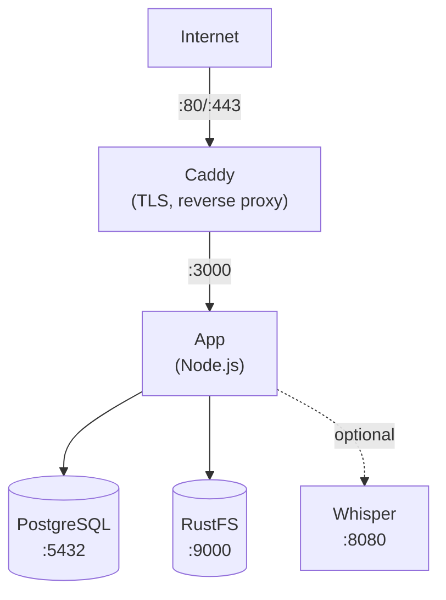

Hướng dẫn này sẽ giúp bạn triển khai Llamenos với Docker Compose trên một máy chủ duy nhất. Bạn sẽ có một hệ thống đường dây nóng hoạt động đầy đủ với HTTPS tự động, cơ sở dữ liệu PostgreSQL, lưu trữ đối tượng và tính năng chuyển đổi giọng nói tùy chọn — tất cả được quản lý bởi Docker Compose.

## Yêu cầu tiên quyết

- Một máy chủ Linux (Ubuntu 22.04+, Debian 12+ hoặc tương đương)
- [Docker Engine](https://docs.docker.com/engine/install/) v24+ với Docker Compose v2
- Một tên miền với DNS trỏ đến IP máy chủ của bạn
- [Bun](https://bun.sh/) được cài đặt trên máy cục bộ (để tạo cặp khóa quản trị)

## 1. Clone kho mã nguồn

```bash
git clone https://github.com/your-org/llamenos.git
cd llamenos
```

## 2. Tạo cặp khóa quản trị

Bạn cần một cặp khóa Nostr cho tài khoản quản trị. Chạy lệnh này trên máy cục bộ (hoặc trên máy chủ nếu đã cài Bun):

```bash
bun install
bun run bootstrap-admin
```

Lưu **nsec** (thông tin đăng nhập quản trị của bạn) một cách an toàn. Sao chép **khóa công khai hex** — bạn sẽ cần nó ở bước tiếp theo.

## 3. Cấu hình môi trường

```bash
cd deploy/docker
cp .env.example .env
```

Chỉnh sửa `.env` với các giá trị của bạn:

```env
# Bắt buộc
ADMIN_PUBKEY=your_hex_public_key_from_step_2
DOMAIN=hotline.yourdomain.com

# Mật khẩu PostgreSQL (tạo một mật khẩu mạnh)
PG_PASSWORD=$(openssl rand -base64 24)

# Tên hiển thị đường dây nóng (hiển thị trong lời nhắc IVR)
HOTLINE_NAME=Your Hotline

# Nhà cung cấp dịch vụ thoại (tùy chọn — có thể cấu hình qua giao diện quản trị)
TWILIO_ACCOUNT_SID=your_sid
TWILIO_AUTH_TOKEN=your_token
TWILIO_PHONE_NUMBER=+1234567890

# Thông tin RustFS (hãy thay đổi giá trị mặc định!)
STORAGE_ACCESS_KEY=your-access-key
STORAGE_SECRET_KEY=your-secret-key-min-8-chars
```

> **Quan trọng**: Đặt mật khẩu mạnh và duy nhất cho `PG_PASSWORD`, `STORAGE_ACCESS_KEY` và `STORAGE_SECRET_KEY`.

## 4. Cấu hình tên miền

Chỉnh sửa `Caddyfile` để đặt tên miền của bạn:

```
hotline.yourdomain.com {
    reverse_proxy app:3000
    encode gzip
    header {
        Strict-Transport-Security "max-age=63072000; includeSubDomains; preload"
        X-Content-Type-Options "nosniff"
        X-Frame-Options "DENY"
        Referrer-Policy "no-referrer"
    }
}
```

Caddy tự động lấy và gia hạn chứng chỉ TLS Let's Encrypt cho tên miền của bạn. Đảm bảo cổng 80 và 443 được mở trong tường lửa.

## 5. Khởi động các dịch vụ

```bash
docker compose up -d
```

Lệnh này khởi động bốn dịch vụ cốt lõi:

| Dịch vụ | Mục đích | Cổng |
|---------|---------|------|
| **app** | Ứng dụng Llamenos | 3000 (nội bộ) |
| **postgres** | Cơ sở dữ liệu PostgreSQL | 5432 (nội bộ) |
| **caddy** | Reverse proxy + TLS | 80, 443 |
| **rustfs** | Lưu trữ file/bản ghi | 9000, 9001 (nội bộ) |

Kiểm tra tất cả đang chạy:

```bash
docker compose ps
docker compose logs app --tail 50
```

Xác minh endpoint kiểm tra sức khỏe:

```bash
curl https://hotline.yourdomain.com/api/health
# → {"status":"ok"}
```

## 6. Đăng nhập lần đầu

Mở `https://hotline.yourdomain.com` trong trình duyệt. Đăng nhập bằng nsec quản trị từ bước 2. Trình hướng dẫn thiết lập sẽ hướng dẫn bạn:

1. **Đặt tên đường dây nóng** — tên hiển thị cho ứng dụng
2. **Chọn kênh** — bật Voice, SMS, WhatsApp, Signal và/hoặc Báo cáo
3. **Cấu hình nhà cung cấp** — nhập thông tin xác thực cho mỗi kênh
4. **Xem lại và hoàn tất**

## 7. Cấu hình webhook

Trỏ webhook của nhà cung cấp dịch vụ điện thoại đến tên miền của bạn. Xem hướng dẫn cụ thể cho từng nhà cung cấp:

- **Voice** (tất cả nhà cung cấp): `https://hotline.yourdomain.com/telephony/incoming`
- **SMS**: `https://hotline.yourdomain.com/api/messaging/sms/webhook`
- **WhatsApp**: `https://hotline.yourdomain.com/api/messaging/whatsapp/webhook`
- **Signal**: Cấu hình bridge chuyển tiếp đến `https://hotline.yourdomain.com/api/messaging/signal/webhook`

## Tùy chọn: Bật chuyển đổi giọng nói

Dịch vụ chuyển đổi giọng nói Whisper yêu cầu thêm RAM (4 GB+). Bật nó với profile `transcription`:

```bash
docker compose --profile transcription up -d
```

Lệnh này khởi động container `faster-whisper-server` sử dụng mô hình `base` trên CPU. Để chuyển đổi nhanh hơn:

- **Sử dụng mô hình lớn hơn**: Chỉnh sửa `docker-compose.yml` và thay đổi `WHISPER__MODEL` thành `Systran/faster-whisper-small` hoặc `Systran/faster-whisper-medium`
- **Sử dụng GPU**: Thay đổi `WHISPER__DEVICE` thành `cuda` và thêm tài nguyên GPU cho dịch vụ whisper

## Tùy chọn: Bật Asterisk

Cho dịch vụ SIP tự lưu trữ (xem [Thiết lập Asterisk](/docs/setup-asterisk)):

```bash
# Đặt bridge shared secret
echo "BRIDGE_SECRET=$(openssl rand -hex 32)" >> .env

docker compose --profile asterisk up -d
```

## Tùy chọn: Bật Signal

Cho tin nhắn Signal (xem [Thiết lập Signal](/docs/setup-signal)):

```bash
docker compose --profile signal up -d
```

Bạn cần đăng ký số Signal qua container signal-cli. Xem [hướng dẫn thiết lập Signal](/docs/setup-signal) để biết chi tiết.

## Cập nhật

Kéo image mới nhất và khởi động lại:

```bash
docker compose pull
docker compose up -d
```

Dữ liệu của bạn được lưu trữ trong Docker volumes (`postgres-data`, `rustfs-data`, v.v.) và được giữ lại khi khởi động lại container và cập nhật image.

## Sao lưu

### PostgreSQL

Sử dụng `pg_dump` để sao lưu cơ sở dữ liệu:

```bash
docker compose exec postgres pg_dump -U llamenos llamenos > backup-$(date +%Y%m%d).sql
```

Để khôi phục:

```bash
docker compose exec -T postgres psql -U llamenos llamenos < backup-20250101.sql
```

### Lưu trữ RustFS

RustFS lưu trữ các file đã tải lên, bản ghi và tệp đính kèm:

```bash
# Sử dụng RustFS client (mc)
docker compose exec rustfs mc alias set local http://localhost:9000 $STORAGE_ACCESS_KEY $STORAGE_SECRET_KEY
docker compose exec rustfs mc mirror local/llamenos /tmp/rustfs-backup
docker compose cp rustfs:/tmp/rustfs-backup ./rustfs-backup-$(date +%Y%m%d)
```

### Sao lưu tự động

Cho môi trường production, thiết lập cron job:

```bash
# /etc/cron.d/llamenos-backup
0 3 * * * root cd /path/to/llamenos/deploy/docker && docker compose exec -T postgres pg_dump -U llamenos llamenos | gzip > /backups/llamenos-$(date +\%Y\%m\%d).sql.gz 2>&1 | logger -t llamenos-backup
```

## Giám sát

### Kiểm tra sức khỏe

Ứng dụng cung cấp endpoint kiểm tra sức khỏe tại `/api/health`. Docker Compose có kiểm tra sức khỏe tích hợp. Giám sát bên ngoài bằng bất kỳ công cụ theo dõi HTTP nào.

### Nhật ký

```bash
# Tất cả dịch vụ
docker compose logs -f

# Dịch vụ cụ thể
docker compose logs -f app

# 100 dòng cuối
docker compose logs --tail 100 app
```

### Sử dụng tài nguyên

```bash
docker stats
```

## Khắc phục sự cố

### Ứng dụng không khởi động được

```bash
docker compose logs app
docker compose config
docker compose ps postgres
docker compose logs postgres
```

### Vấn đề chứng chỉ

Caddy cần cổng 80 và 443 mở cho ACME challenges:

```bash
docker compose logs caddy
curl -I http://hotline.yourdomain.com
```

### Lỗi kết nối RustFS

```bash
docker compose ps rustfs
docker compose logs rustfs
```

## Kiến trúc dịch vụ



## Bước tiếp theo

- [Hướng dẫn quản trị viên](/docs/admin-guide) — cấu hình đường dây nóng
- [Tổng quan tự lưu trữ](/docs/self-hosting) — so sánh các tùy chọn triển khai
- [Triển khai Kubernetes](/docs/deploy-kubernetes) — chuyển sang Helm
