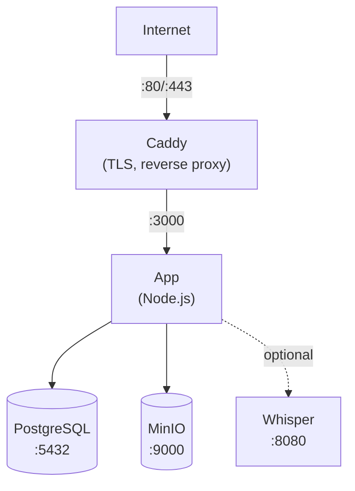

本指南将引导您使用 Docker Compose 在单台服务器上部署 Llamenos。您将拥有一个功能完整的热线系统，包含自动 HTTPS、PostgreSQL 数据库、对象存储以及可选的语音转文字功能——全部由 Docker Compose 管理。

## 前置条件

- 一台 Linux 服务器（Ubuntu 22.04+、Debian 12+ 或类似系统）
- [Docker Engine](https://docs.docker.com/engine/install/) v24+ 以及 Docker Compose v2
- 一个已将 DNS 指向服务器 IP 的域名
- 本地安装了 [Bun](https://bun.sh/)（用于生成管理员密钥对）

## 1. 克隆仓库

```bash
git clone https://github.com/rhonda-rodododo/llamenos-platform.git
cd llamenos-platform
```

## 2. 生成管理员密钥对

您需要一个 Nostr 密钥对作为管理员账户。在本地机器（或已安装 Bun 的服务器）上运行：

```bash
bun install
bun run bootstrap-admin
```

安全保存 **nsec**（您的管理员登录凭据）。复制**十六进制公钥**——您将在下一步中使用它。

## 3. 配置环境

```bash
cd deploy/docker
cp .env.example .env
```

编辑 `.env` 文件，填入您的值：

```env
# 必填
ADMIN_PUBKEY=your_hex_public_key_from_step_2
DOMAIN=hotline.yourdomain.com

# PostgreSQL 密码（生成一个强密码）
PG_PASSWORD=$(openssl rand -base64 24)

# 热线显示名称（在 IVR 提示中显示）
HOTLINE_NAME=Your Hotline

# 语音服务提供商（可选——可通过管理界面配置）
TWILIO_ACCOUNT_SID=your_sid
TWILIO_AUTH_TOKEN=your_token
TWILIO_PHONE_NUMBER=+1234567890

# MinIO 凭据（请修改默认值！）
MINIO_ACCESS_KEY=your-access-key
MINIO_SECRET_KEY=your-secret-key-min-8-chars
```

> **重要**：请为 `PG_PASSWORD`、`MINIO_ACCESS_KEY` 和 `MINIO_SECRET_KEY` 设置强且唯一的密码。

## 4. 配置您的域名

编辑 `Caddyfile` 以设置您的域名：

```
hotline.yourdomain.com {
    reverse_proxy app:3000
    encode gzip
    header {
        Strict-Transport-Security "max-age=63072000; includeSubDomains; preload"
        X-Content-Type-Options "nosniff"
        X-Frame-Options "DENY"
        Referrer-Policy "no-referrer"
    }
}
```

Caddy 会自动为您的域名获取和续期 Let's Encrypt TLS 证书。请确保防火墙中开放了 80 和 443 端口。

## 5. 启动服务

```bash
docker compose up -d
```

这将启动四个核心服务：

| 服务 | 用途 | 端口 |
|------|------|------|
| **app** | Llamenos 应用程序 | 3000（内部） |
| **postgres** | PostgreSQL 数据库 | 5432（内部） |
| **caddy** | 反向代理 + TLS | 80, 443 |
| **minio** | 文件/录音存储 | 9000, 9001（内部） |

检查所有服务是否正在运行：

```bash
docker compose ps
docker compose logs app --tail 50
```

验证健康检查端点：

```bash
curl https://hotline.yourdomain.com/api/health
# → {"status":"ok"}
```

## 6. 首次登录

在浏览器中打开 `https://hotline.yourdomain.com`。使用第 2 步中的管理员 nsec 登录。设置向导将引导您完成：

1. **命名您的热线** —— 应用程序的显示名称
2. **选择频道** —— 启用语音、SMS、WhatsApp、Signal 和/或报告
3. **配置提供商** —— 输入每个频道的凭据
4. **检查并完成**

## 7. 配置 Webhook

将您的电话服务提供商的 Webhook 指向您的域名。请参阅各提供商的具体指南了解详情：

- **语音**（所有提供商）：`https://hotline.yourdomain.com/telephony/incoming`
- **SMS**：`https://hotline.yourdomain.com/api/messaging/sms/webhook`
- **WhatsApp**：`https://hotline.yourdomain.com/api/messaging/whatsapp/webhook`
- **Signal**：配置桥接器转发到 `https://hotline.yourdomain.com/api/messaging/signal/webhook`

## 可选：启用语音转文字

Whisper 语音转文字服务需要额外的内存（4 GB+）。使用 `transcription` 配置文件启用它：

```bash
docker compose --profile transcription up -d
```

这将启动一个使用 CPU 上 `base` 模型的 `faster-whisper-server` 容器。要加快转录速度：

- **使用更大的模型**：编辑 `docker-compose.yml`，将 `WHISPER__MODEL` 更改为 `Systran/faster-whisper-small` 或 `Systran/faster-whisper-medium`
- **使用 GPU 加速**：将 `WHISPER__DEVICE` 更改为 `cuda`，并为 whisper 服务添加 GPU 资源

## 可选：启用 Asterisk

如需自托管 SIP 电话服务（请参阅 [Asterisk 配置](/docs/deploy/providers/asterisk)）：

```bash
# 设置桥接共享密钥
echo "BRIDGE_SECRET=$(openssl rand -hex 32)" >> .env

docker compose --profile asterisk up -d
```

## 可选：启用 Signal

如需 Signal 消息功能（请参阅 [Signal 配置](/docs/deploy/providers/signal)）：

```bash
docker compose --profile signal up -d
```

您需要通过 signal-cli 容器注册 Signal 号码。请参阅 [Signal 配置指南](/docs/deploy/providers/signal)了解详细说明。

## 更新

拉取最新镜像并重启：

```bash
docker compose pull
docker compose up -d
```

您的数据保存在 Docker 卷（`postgres-data`、`minio-data` 等）中，在容器重启和镜像更新时不会丢失。

## 备份

### PostgreSQL

使用 `pg_dump` 进行数据库备份：

```bash
docker compose exec postgres pg_dump -U llamenos llamenos > backup-$(date +%Y%m%d).sql
```

恢复：

```bash
docker compose exec -T postgres psql -U llamenos llamenos < backup-20250101.sql
```

### MinIO 存储

MinIO 存储上传的文件、录音和附件：

```bash
# 使用 MinIO 客户端 (mc)
docker compose exec minio mc alias set local http://localhost:9000 $MINIO_ACCESS_KEY $MINIO_SECRET_KEY
docker compose exec minio mc mirror local/llamenos /tmp/minio-backup
docker compose cp minio:/tmp/minio-backup ./minio-backup-$(date +%Y%m%d)
```

### 自动备份

对于生产环境，设置定时任务：

```bash
# /etc/cron.d/llamenos-backup
0 3 * * * root cd /path/to/llamenos/deploy/docker && docker compose exec -T postgres pg_dump -U llamenos llamenos | gzip > /backups/llamenos-$(date +\%Y\%m\%d).sql.gz 2>&1 | logger -t llamenos-backup
```

## 监控

### 健康检查

应用程序在 `/api/health` 暴露健康检查端点。Docker Compose 内置健康检查功能。使用任何 HTTP 可用性监控工具进行外部监控。

### 日志

```bash
# 所有服务
docker compose logs -f

# 特定服务
docker compose logs -f app

# 最后 100 行
docker compose logs --tail 100 app
```

### 资源使用

```bash
docker stats
```

## 故障排除

### 应用程序无法启动

```bash
# 检查错误日志
docker compose logs app

# 验证 .env 是否已加载
docker compose config

# 检查 PostgreSQL 是否健康
docker compose ps postgres
docker compose logs postgres
```

### 证书问题

Caddy 需要 80 和 443 端口开放以进行 ACME 验证。使用以下命令验证：

```bash
# 检查 Caddy 日志
docker compose logs caddy

# 验证端口是否可访问
curl -I http://hotline.yourdomain.com
```

### MinIO 连接错误

确保 MinIO 服务在应用程序启动前处于健康状态：

```bash
docker compose ps minio
docker compose logs minio
```

## 服务架构



## 后续步骤

- [管理员指南](/docs/admin-guide) —— 配置热线
- [自托管概览](/docs/deploy/self-hosting) —— 比较部署选项
- [Kubernetes 部署](/docs/deploy/kubernetes) —— 迁移到 Helm
