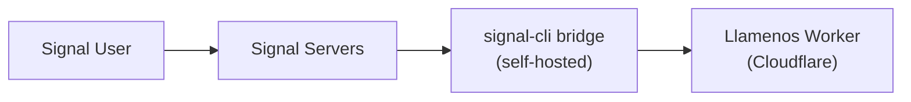

Llamenos 通过自托管的 [signal-cli-rest-api](https://github.com/bbernhard/signal-cli-rest-api) 桥接支持 Signal 消息功能。Signal 在所有消息频道中提供最强的隐私保障，是敏感危机响应场景的理想选择。

## 前置条件

- 一台用于桥接的 Linux 服务器或虚拟机（可以与 Asterisk 在同一台服务器上，或单独部署）
- 桥接服务器上已安装 Docker
- 用于 Signal 注册的专用电话号码
- 桥接器到 Cloudflare Worker 的网络访问

## 架构



signal-cli 桥接运行在您的基础设施上，通过 HTTP Webhook 将消息转发到您的 Worker。这意味着您控制着从 Signal 到应用程序的整个消息路径。

## 1. 部署 signal-cli 桥接

运行 signal-cli-rest-api Docker 容器：

```bash
docker run -d \
  --name signal-cli \
  --restart unless-stopped \
  -p 8080:8080 \
  -v signal-cli-data:/home/.local/share/signal-cli \
  -e MODE=json-rpc \
  bbernhard/signal-cli-rest-api:latest
```

## 2. 注册电话号码

使用专用电话号码注册桥接：

```bash
# 通过 SMS 请求验证码
curl -X POST http://localhost:8080/v1/register/+1234567890

# 使用收到的验证码进行验证
curl -X POST http://localhost:8080/v1/register/+1234567890/verify/123456
```

## 3. 配置 Webhook 转发

设置桥接器将收到的消息转发到您的 Worker：

```bash
curl -X PUT http://localhost:8080/v1/about \
  -H "Content-Type: application/json" \
  -d '{
    "webhook": {
      "url": "https://your-worker.your-domain.com/api/messaging/signal/webhook",
      "headers": {
        "Authorization": "Bearer your-webhook-secret"
      }
    }
  }'
```

## 4. 在管理设置中启用 Signal

导航到**管理设置 > 消息频道**（或使用设置向导），切换启用 **Signal**。

输入以下信息：
- **桥接 URL** —— 您的 signal-cli 桥接的 URL（例如 `https://signal-bridge.example.com:8080`）
- **桥接 API 密钥** —— 用于桥接请求验证的 Bearer token
- **Webhook 密钥** —— 用于验证传入 Webhook 的密钥（必须与第 3 步中的配置一致）
- **注册号码** —— 在 Signal 上注册的电话号码

## 5. 测试

向您的注册电话号码发送一条 Signal 消息。对话应出现在**对话**选项卡中。

## 健康监控

Llamenos 监控 signal-cli 桥接的健康状态：
- 定期对桥接的 `/v1/about` 端点进行健康检查
- 桥接不可达时优雅降级——其他频道继续正常工作
- 桥接宕机时向管理员发出警报

## 语音消息转录

Signal 语音消息可以在志愿者的浏览器中使用客户端 Whisper（通过 `@huggingface/transformers` 的 WASM）直接转录。音频永远不会离开设备——转录文本被加密并与语音消息一起存储在对话视图中。志愿者可以在个人设置中启用或禁用转录。

## 安全说明

- Signal 在用户和 signal-cli 桥接之间提供端到端加密
- 桥接在转发 Webhook 时解密消息——桥接服务器可以访问明文
- Webhook 身份验证使用常量时间比较的 Bearer token
- 将桥接保持在与 Asterisk 服务器（如适用）相同的网络上，以最小化暴露
- 桥接将消息历史存储在 Docker 卷中——请考虑静态加密
- 为获得最大隐私：在您自己的基础设施上同时自托管 Asterisk（语音）和 signal-cli（消息）

## 故障排除

- **桥接未收到消息**：使用 `GET /v1/about` 检查电话号码是否正确注册
- **Webhook 投递失败**：验证 Webhook URL 是否可从桥接服务器访问，以及 Authorization header 是否匹配
- **注册问题**：某些电话号码可能需要先从现有 Signal 账户解除关联
