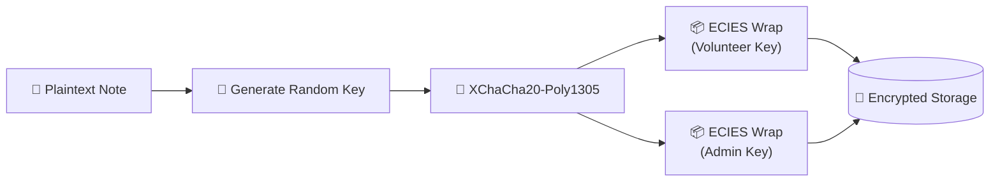
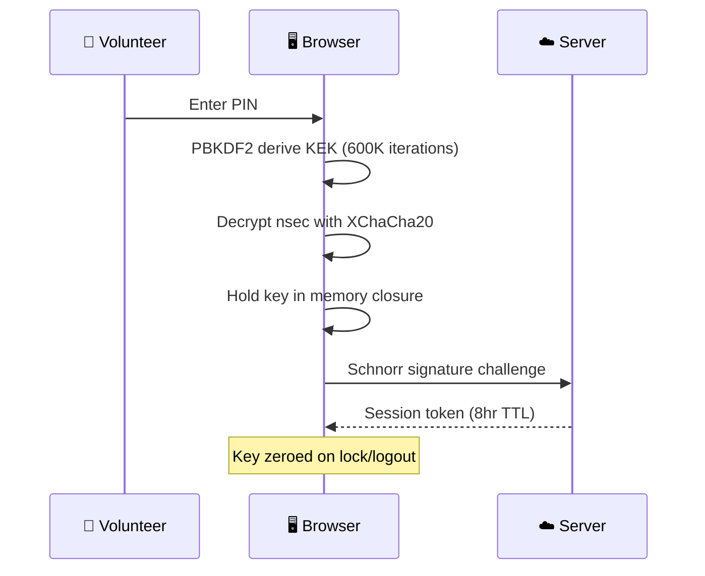
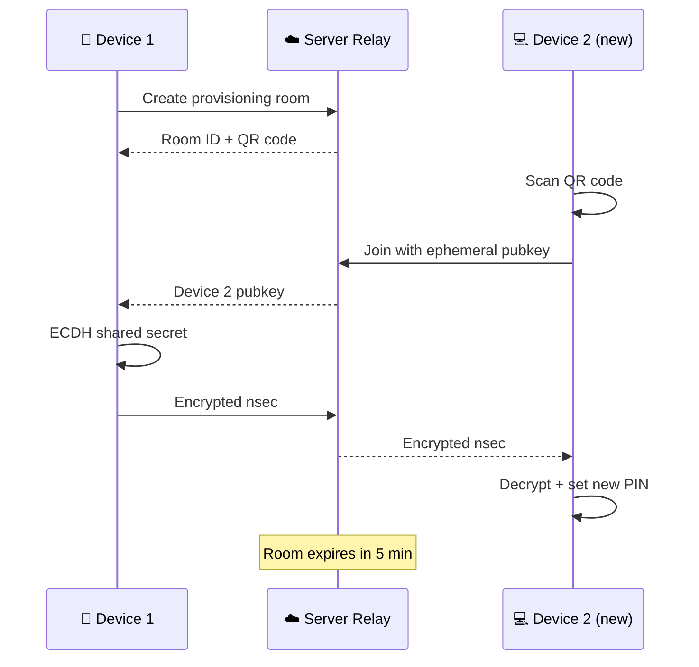

## What is encrypted end-to-end

<strong>Call notes (with forward secrecy)</strong>

Each note is encrypted with a unique random 32-byte key using XChaCha20-Poly1305. That per-note key is then wrapped via ECIES (ephemeral ECDH on secp256k1) for each authorized reader — one envelope for the volunteer, one for the admin. Both can decrypt independently using their private keys. Because each note uses a fresh random key, compromising the identity key does not retroactively reveal past notes.

<strong>Call transcripts</strong>

After transcription, the resulting text is encrypted using the same ECIES scheme before storage. The stored transcript is ciphertext only. Both the volunteer and admin receive independently encrypted copies.

<strong>Custom field values</strong>

Admin-defined custom fields (text, number, select, checkbox, textarea) are encrypted alongside note content using the same ECIES encryption. Field definitions (names, types, options) are stored in plaintext for the form UI, but all user-entered values are encrypted before leaving the browser.

<strong>Draft notes</strong>

In-progress notes are auto-saved as encrypted drafts in the browser's localStorage. They're encrypted with the volunteer's public key before storage. Drafts are cleaned from localStorage on logout.

<strong>Encrypted reports</strong>

Reports submitted by the reporter role are encrypted using the same ECIES scheme. The report body is encrypted client-side before upload — the server stores only ciphertext. Report titles are stored in plaintext to allow triage and status tracking. File attachments are encrypted separately before upload. Both the reporter and admin receive independently encrypted copies.

## What the server never sees

- Note content (free-text and custom field values)
- Transcript text after encryption
- Report body content and file attachments
- Volunteer and reporter secret keys (nsec) — never stored in plaintext; PIN-encrypted at rest, held only in memory when unlocked
- Per-note encryption keys — each note uses a fresh random key; the identity key alone cannot decrypt stored notes
- Draft note content (stored locally in the browser)

## Messaging channels

<strong>SMS, WhatsApp, and Signal message content</strong>

Text messages sent via SMS, WhatsApp, or Signal are processed by the respective messaging provider (your telephony provider for SMS, Meta for WhatsApp, or the signal-cli bridge for Signal). Message content passes through these intermediaries. Llamenos stores conversation messages server-side for the threaded conversation view. Unlike notes and reports, messaging content is not end-to-end encrypted between the browser and server — it arrives via provider webhooks and is stored as received.

## Honest limitations

<strong>Voice calls traverse the PSTN and your telephony provider</strong>

When using a cloud provider (Twilio, SignalWire, Vonage, or Plivo), Llamenos routes calls through the public switched telephone network (PSTN) via that provider's infrastructure. This means the provider processes call audio in real time and can technically access it during transit. This is an inherent limitation of PSTN-based cloud telephony. For maximum privacy, Llamenos also supports self-hosted Asterisk with SIP trunks, which eliminates the third-party provider entirely.

<strong>Transcription requires server-side audio access</strong>

Call recordings are transcribed server-side using Cloudflare Workers AI (Whisper). During transcription, the server has transient access to the audio. After transcription completes, the text is immediately encrypted and the audio reference is discarded. The window of plaintext access is minimized but exists.

<strong>Call metadata is visible to the server</strong>

Timestamps, call durations, routing decisions, queue positions, and which volunteer answered — all of this is operational metadata that the server needs to function. Phone numbers are stored for ban list matching but are not included in WebSocket broadcasts to volunteers. Caller identity is redacted from real-time updates.

## Local key protection

<strong>PIN-encrypted key store</strong>

Your secret key (nsec) is encrypted in the browser's localStorage using PBKDF2-SHA256 (600,000 iterations) to derive a key-encryption key, then XChaCha20-Poly1305 to encrypt the nsec. The raw key is never stored in sessionStorage, cookies, or any browser-accessible location. When you enter your PIN, the key is decrypted into a JavaScript closure variable — it exists only in memory and is zeroed on lock or logout.

<strong>Device linking protocol</strong>

Adding a new device uses an ephemeral ECDH key exchange. The new device generates a temporary secp256k1 keypair and displays a QR code. The primary device scans it, computes a shared secret via ECDH, encrypts the nsec with XChaCha20-Poly1305, and sends it through a single-use relay room. The new device decrypts, prompts for a new PIN, and stores the key locally. The relay room expires after 5 minutes and is deleted after one use.

<strong>Recovery keys</strong>

During onboarding, a 128-bit recovery key is generated and displayed in Base32 format. This key encrypts a backup copy of the nsec (PBKDF2 + XChaCha20-Poly1305). The raw nsec is never shown to users — they receive only the recovery key. A mandatory encrypted backup file must be downloaded before proceeding.

## Threat model

Llamenos is designed to protect crisis hotline volunteers and callers against:

1. **Database breach** — An attacker who obtains the database gets only ciphertext for notes and transcripts. Without volunteer or admin private keys, the content is unreadable.
2. **Server compromise** — A compromised server can see call metadata and has transient access to audio during transcription, but cannot read stored notes or transcripts.
3. **Network surveillance** — All connections use TLS. WebSocket connections are authenticated. The server enforces HSTS and strict CSP headers.
4. **Volunteer impersonation** — Authentication uses BIP-340 Schnorr signatures. Without the volunteer's private key, login is impossible. WebAuthn passkeys add hardware-backed second factor.
5. **Insider threat (volunteer)** — Volunteers can only decrypt their own notes. They cannot see other volunteers' notes, personal information, or admin-only data.
6. **XSS / browser extension** — The secret key is never in sessionStorage or global scope. It exists only in a closure variable, zeroed on lock. An XSS attack during an unlocked session could sign requests, but cannot extract the key for offline use.
7. **Device seizure** — A seized device yields only the PIN-encrypted key blob. Without the PIN (and the 600,000-iteration PBKDF2 derivation), the key is unrecoverable. Per-note forward secrecy means even recovering the identity key does not reveal past notes.

No system is perfectly secure. The goal is to minimize the trust surface and be transparent about what remains.

## What we're working toward

<strong>WebRTC in-browser calling</strong>

Moving voice calls from PSTN/cloud providers to WebRTC allows direct browser-to-browser audio, eliminating the telephony provider from the voice path entirely. Llamenos already supports WebRTC calling for volunteers — when combined with a self-hosted Asterisk setup, the entire voice path can bypass third-party infrastructure.

<strong>Client-side transcription</strong>

Running Whisper (or a similar model) directly in the browser via WebAssembly or WebGPU would eliminate server-side audio access entirely. The transcript would be generated locally and encrypted before upload.

<strong>Reproducible builds</strong>

Deterministic builds that allow anyone to verify the deployed code matches the open-source repository, ensuring no server-side modifications have been introduced.

## Verify it yourself

Llamenos is fully open source. Every encryption operation, every API endpoint, every client-side check — it's all in the repository. Read the code, audit the crypto, file issues. [github.com/rhonda-rodododo/llamenos](https://github.com/rhonda-rodododo/llamenos)
